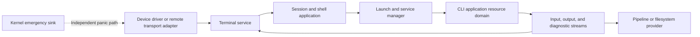

# Windvale console, shell, and CLI architecture

## Status

Accepted future architecture under [Decision 0191](../Decisions/0191-Windvale-Console-Shell-And-Cli-Architecture.md). Proposed [Decision 0198](../Decisions/0198-Next-Integrated-Architecture-Defaults.md) adds recommended first semantic records for review. No terminal-input service, shell, standard-input stream, pipeline, redirection, job-control, or Windvale OS CLI application contract is implemented yet. Current behavior remains the bounded hosted output and argument contracts plus the qualified Probe-40 OS baseline.

The focused [Windvale shell product and architecture](Windvale-Shell.md) guide
elaborates the intended cross-host shell experience, command naming and aliases,
discovery, portable ownership boundary, Workbench transition, and staged delivery
without changing this document's accepted terminal, launch, or authority split.
Its accepted [Shell 1 contract](../../Specifications/Windvale-Shell-1.md) and
[implementation-readiness plan](../Project/Windvale-Shell-Implementation-Readiness.md)
select a reviewable parser candidate while keeping absent terminal, launch,
stream, browser, and Windvale OS prerequisites explicit.

## Recommendation

Windvale should provide a small capability-native command environment rather than reproduce POSIX shell semantics, PowerShell's object/runtime model, or a privileged kernel monitor. The design has four independent layers:

1. device drivers or authorized transport adapters handle serial, keyboard, display, or remote transport;
2. a terminal service owns presentation, input decoding, editing, and terminal sessions;
3. a shell application resolves and composes commands; and
4. ordinary CLI applications execute through immutable launch plans inside bounded resource domains.

The kernel retains only its independent early-boot and terminal-panic sink. It owns scheduling, process, memory, endpoint, capability, and teardown mechanisms but no general command parser, command registry, path policy, history, scripting language, or terminal presentation policy.

## Existing foundation

The first hosted contracts already establish useful behavior to preserve:

- [Hosted resources](../../Specifications/Hosted-Resources.md) provide bounded immutable arguments, separate normal and diagnostic output, strict UTF-8, and host-independent LF output.
- [Seed CLI](../../Specifications/Seed-CLI.md) separates launcher options from application arguments with `--`, grants capabilities individually, separates standard output from diagnostics, and assigns stable usage and failure exits.
- [Decision 0173](../Decisions/0173-Windvale-Process-Service-And-Driver-Architecture.md) selects clean spawn, resource domains, a minimal service manager, and isolated normal-console output.
- [Decision 0181](../Decisions/0181-Next-Windvale-Os-Mechanism-Contracts.md) selects the first output-only polled COM1 service while retaining the kernel emergency sink.
- Qualified Probe 40 retains three fixed protected processes and a ready/wait dispatcher, adds Probe 39's private preemption proof, and supplies fixed generation-safe memory objects with non-tail release and reuse. It does not yet supply a general scheduler, resource domains, dynamic launch, terminal input, general streams, or sessions.

Future Windvale OS contracts extend this foundation. They do not retroactively reinterpret `console.write`, `console.write_line`, `diagnostic.write_line`, opaque hosted resource names, or current host process-result mappings.

The command parser, resolver client, launch-plan builder, status rendering, and other capability-free or semantic shell logic should remain reusable where practical. Windows and Linux may later bind those contracts to native terminal, process, and filesystem adapters while Windvale OS binds them to services and endpoints. Reuse is a positive per-part property, not a requirement that device handling, launch mechanics, or platform extensions share one implementation.

## Device and terminal boundary

### Preserve the emergency path

The kernel emergency sink remains deliberately smaller than the ordinary console. It emits bounded early-boot and fatal diagnostics through the exact configured machine adapter even when user-space drivers, services, scheduling policy, or the shell have failed. It does not accept arbitrary application commands.

An experimental recovery monitor may temporarily expose a fixed read-only command set before the permanent shell exists. It must be labeled as a development or recovery mechanism, use explicit limits, and never become the application CLI or a source of ambient kernel authority.

### Isolate normal device access

The first ordinary device path remains a supervised output-only serial driver with exact COM1 port authority. Serial input, keyboard input, framebuffer output, graphical terminals, and authenticated remote transports become separate measured driver or adapter slices. A driver owns device mechanics, not terminal sessions or shell policy.

### Give presentation to a terminal service

The terminal service owns bounded session state, strict UTF-8 decoding, basic line discipline, cursor movement, resize notification, foreground attachment, input routing, output rendering, and bounded scrollback. It translates serial escape sequences, key events, graphical input, or remote protocol messages into one versioned terminal contract. Shell-specific completion, command history, and prompt policy remain with the shell.

Ordinary CLI programs receive standard streams and do not parse scan codes or terminal escape sequences. An interactive full-screen application requests a separate terminal-control or terminal-surface capability for typed input events, dimensions, cursor operations, color, and display updates. ANSI compatibility may be an adapter; ANSI byte sequences do not define Windvale terminal semantics.

Terminal input, child completion, cancellation, deadlines, resize, and provider loss should compose through the future bounded wait-set or event-stream direction accepted by [Decision 0182](../Decisions/0182-Browser-And-WebAssembly-Product-Direction.md). Providers do not call application callbacks reentrantly.

## Shell and session boundary

The shell is an ordinary Windvale application. A first development session may be single-user, but the shell still receives only explicit capabilities for its terminal, command resolver, process launch and observation, current directory, history store, and selected system operations.

There is no implicitly omnipotent root shell. Administrative work uses separately authorized, auditable, and preferably time-bounded capabilities. A shell role, session identity, process parent, executable name, or command spelling grants no authority.

The shell may retain private session state:

- one current-directory capability and a provider-supplied display identity;
- shell variables and aliases;
- the most recent structured command or pipeline result;
- foreground and later background job references; and
- bounded optional history and configuration state.

That state is not ambient process inheritance. A child receives only the immutable launch inputs and rights-limited capabilities selected for that launch. Secrets use dedicated secret capabilities rather than general environment variables or command history. Persistent history requires its own storage authority, bounded retention, and a way for sensitive input to opt out before text is recorded.

## Command resolution and launch

Command resolution is a user-space service contract over installed package metadata. It returns an exact package identity, module digest, entry point, platform/profile requirements, and declared capability set. It does not scan an ambient `PATH`, execute the current directory implicitly, infer authority from a filename extension, or permit a replacement race between resolution and admission.

The service manager launches the exact resolved image from an immutable plan containing:

- package, module, entry-point, verifier, and runtime identities;
- the bounded ordered argument snapshot;
- input, output, and diagnostic stream bindings;
- an optional current-directory capability and optional immutable environment snapshot;
- exact approved capability instances, each rights-reduced independently;
- resource-domain membership and CPU, memory, handle, endpoint, stream, and output limits;
- terminal attachment, cancellation, supervision, and completion policy; and
- platform scope, authority level, and required or optional provider evidence.

The plan is validated completely before the process becomes runnable. The shell does not pass all of its own capabilities to a child. Application requirements, user or package approval, concrete provider grants, and runtime binding remain separate decisions.

Arguments remain ordinary immutable launch data. A future environment snapshot is optional, bounded, immutable, explicitly selected, and declared by the consumer; it is not an ambient global dictionary. The current location is a directory capability rather than merely a process-global path string.

## Standard streams and pipelines

Future process launch binds three distinct streams:

- standard input is a bounded readable byte stream;
- standard output is a bounded writable byte stream; and
- diagnostic output is a separate bounded writable byte stream.

The exact capability identities remain an implementation decision. The semantic contract must define chunk bounds, ordering, partial progress, backpressure, end of stream, peer closure, cancellation, provider loss, and teardown. Output is not transactional; exact progress and indeterminate completion follow the broader Windvale mutation rules.

The existing text console functions remain convenient library operations. An adapter encodes their strict-UTF-8 text into the bound normal or diagnostic output stream and preserves Windvale's LF rule. Programs that need binary input or output use byte-stream contracts directly. Programs that need terminal dimensions, cursor control, or key events require the separate terminal capability and cannot infer interactivity from a stream handle.

The first pipeline operator connects one process's standard output to the next process's standard input through a bounded byte stream. Diagnostic output remains independently bound unless the user explicitly redirects it. Every stage belongs to one aggregate resource domain and publishes its own structured completion. Closing, broken peer, cancellation, and forced teardown must wake all affected waiters and release every stream endpoint.

Typed record pipelines remain a later explicit extension. They require a real consumer, versioned schema identity, compatibility checks before launch, bounded framing, and no content sniffing. Byte streams remain the universal base.

Filesystem redirection uses directory-relative file capabilities. Input and replacement/truncating output can follow exact open/read/write contracts once implemented. Append waits for a separately specified append interface; `Writeˉat` must not silently acquire append or atomicity semantics. Shell redirection never turns a native path or host handle into Windvale's portable definition.

## Recommended first stream and terminal contracts

The first byte-stream interface should be directional. A readable endpoint cannot write, and a writable endpoint cannot read. The initial pipeline has one reader and one writer; fan-in, fan-out, seeking, append, datagrams, terminal control, and typed records are different interfaces.

A read requests a nonzero bounded maximum and returns exactly one of:

- nonempty `Data` owned by the caller;
- `End` after the writer closed normally and all accepted bytes were consumed;
- `Cancelled` or `Deadline` before a value was published;
- `Peerˉlost` when continuity is no longer knowable; or
- a stable provider failure.

A successful read consumes exactly the returned prefix. If a provider disappears after consuming bytes but before publishing the reply, the stream closes as peer-lost; the runtime never repeats the request and invents duplicate or reordered input.

A write reports `Completed`, `Partial` with an exact accepted prefix, `Rejected` with zero progress, or `Indeterminate` with bounded minimum and maximum accepted progress when the provider cannot prove the commit point. The caller may retry only the exact unaccepted suffix after `Partial`; it must not retry an indeterminate mutation without an interface-specific idempotency key. Local in-kernel or same-service streams should be designed so they never need the indeterminate result, while host or remote adapters preserve it when reality requires it.

Closing the write side is a graceful end-of-stream operation. Abort, cancellation, peer loss, provider replacement, and domain teardown are distinct. Every wait is interruptible, every buffer and queue is bounded, and a small reserved control capacity permits close and failure to progress under data backpressure.

The first terminal event family should contain typed `Text`, `Key`, `Resize`, `Interrupt`, `Endˉinput`, and `Disconnect` values. Text is strict UTF-8 and nonempty; keys and modifiers are Windvale enums rather than scan codes or ANSI bytes; dimensions are bounded positive character counts. Resize may be coalesced to the newest value, but text, key, interrupt, end-input, and disconnect ordering cannot be rewritten. Terminal-control output remains a separate capability from byte-stream output.

The [process launch and supervision guide](Process-Launch-And-Supervision.md) defines the recommended two-level immutable launch plan. For console use, the semantic plan binds the exact command identity, arguments, three streams, directory capability, optional environment snapshot, selected terminal/session, complete reduced grants, resource domain, cancellation, observer, and completion destination.

## Shell grammar

The first shell grammar is small, bounded, and separate from Windvale source syntax. It supports only the interactions justified by an implemented command path:

- a command plus ordered arguments;
- explicit literal and quoted arguments;
- `--` to end command option processing;
- sequencing;
- pipelines and redirection after standard streams exist;
- later success/failure chaining; and
- later variables whose expansion produces exactly one argument.

The initial grammar has no implicit glob expansion, post-expansion word splitting, command substitution, `eval`, shell functions, loops, unrestricted startup scripts, or hidden command execution. File matching is an explicit command or library operation. Substantial automation is an ordinary verified Windvale program, which avoids growing a second general-purpose language with different authority and failure rules.

The recommended grammar grows in explicit versions:

- Shell 1 admits whitespace-separated words, unquoted words, literal single-quoted text, double-quoted text with a small fixed escape set, and `--`. It has no expansion or operators.
- Shell 2 adds unquoted `;`, `|`, `<`, `>`, and a distinct diagnostic redirection after streams and files exist. It then adds `&&` and `||` only with structured completion semantics.
- Shell 3 may add `${Name}` expansion, but one expansion always produces exactly one argument. It never triggers word splitting, globbing, or command execution.

Outside a quoted word, operator punctuation is reserved and must be quoted to become data. The grammar has explicit command-byte, word-count, nesting, pipeline-stage, and redirection limits. The first form has no comments, backticks, `$()`, here-documents, functions, aliases that contain syntax, or line continuation. Exact escape spellings remain part of the focused Shell 1 specification rather than an implementation accident.

A Windvale language REPL is a separate tool and process. The shell does not interpret Windvale expressions as commands or give evaluated source its own authority.

## CLI conventions

Windvale-controlled public CLI boundaries follow the existing hosted tool style:

- lowercase ASCII command names;
- `-` between command words;
- `--long-option` options, with short options only for exceptionally stable and common cases;
- `--help`, `--version`, and `--` conventions;
- strict UTF-8 arguments and diagnostics with explicit bounds;
- standard output for requested data and diagnostic output for errors or progress;
- a stable explicit machine format such as a versioned JSON or later typed-record schema; and
- deterministic option parsing that does not depend on locale, terminal, filesystem order, or provider discovery order.

Windvale source implementations retain the official U+02C9 naming convention, such as `Commandˉparse`. Requiring U+02C9 in interactive command names would make serial recovery, keyboard entry, and external automation unnecessarily fragile. User aliases may exist later, but canonical command identities remain inspectable.

Human-readable output may evolve. Machine-readable output has an explicit schema/version and must not be mixed with progress or diagnostics. A program's numeric result is distinct from launcher failure, capability denial, trap, fault, cancellation, or forced termination.

## Commands and administration

Keep shell built-ins limited to operations that must mutate the shell session itself: help, exit, clear, current-location binding, shell-variable management, foreground cancellation, and later job selection. Built-ins use the same provider and capability rules as external applications.

System information, process and service inspection, capability inspection, module verification, package resolution, directory and file operations, log inspection, shutdown, restart, and future VM management are separate applications. Each receives only the observation or mutation capabilities it needs. A system command must not become privileged merely because the shell shipped it.

The recommended first built-ins are only `help`, `exit`, `clear`, and current-location or shell-variable operations that must mutate session state. A first external recovery catalog should prefer explicit ASCII names such as `system-info`, `process-list`, `service-list`, `capability-list`, `module-verify`, `package-info`, `directory-list`, `file-read`, and `file-write`. Shipping a command creates no authority; each application still needs exact grants.

The resolver should provide a way to inspect the exact command identity and required authority before launch. Package installation or session policy may preapprove ordinary rights. Exceptional or administrative rights require an explicit authorization flow; an interactive prompt alone is not the security boundary.

## Completion, cancellation, and jobs

Process completion is structured rather than encoded only as a shell integer. It distinguishes normal application completion, verifier or launch rejection, capability refusal, language trap, process fault, cooperative cancellation, forced termination, and provider loss. A numeric application result remains available for program and host-container compatibility.

The shell records every pipeline stage's completion and chooses one simple displayed status policy. Accepted Decision 0191 leaves the exact default open until pipelines exist; proposed Decision 0198 selects the all-stage rule below for review. Stage results are never discarded internally.

The recommended default is simpler than a configurable `pipefail`: a pipeline succeeds only when every stage completes normally with application result zero. The primary displayed failure is the lowest-index non-successful stage, while the structured result retains every stage in order. There is no mode in which a successful final formatter hides an earlier launch failure, trap, fault, or capability denial.

Windvale does not adopt POSIX signals as the foundation. An interrupt key requests typed cancellation of the foreground job. Forced termination is a separate authorized operation with deterministic resource-domain teardown. Background jobs, suspension, resume, terminal reassignment, priorities, and multiple interactive sessions follow only after preemption, dynamic launch, observation, cancellation, and cleanup are qualified.

## Stability and failure containment

- Every input, argument, command line, stream buffer, terminal batch, history store, scrollback, job table, and diagnostic has an explicit limit.
- Terminal and shell work consumes resource-domain CPU and memory budgets; neither may monopolize recovery resources.
- Stream writers honor backpressure and wake with an exact failure when a reader, terminal, or provider exits.
- Shell failure does not terminate the terminal service or kernel. A service manager may attach a replacement shell to a surviving session through a new generation.
- Terminal-service failure does not remove the kernel emergency sink.
- Command-resolution and package identities are immutable between admission and launch.
- Provider restart, device removal, stale capability, and terminal disconnect remain observable rather than silently rebound.
- Remote access follows the small one-connection/one-session direction in [Decision 0193](../Decisions/0193-Simple-Windvale-Remote-Terminal-Protocol.md) and the [remote-terminal guide](Remote-Terminal-Protocol.md). It waits for the user-space network, secure-transport, identity, and authorization prerequisites accepted by [Decision 0192](../Decisions/0192-Capability-Oriented-User-Space-Network-Stack.md), then authenticates into the same session and capability model; networking is not embedded in the shell.

## Implementation sequence

1. Retain qualified Probe 40 as the scheduler and fixed memory-object baseline; add one flat resource domain and clean dynamic process launch from immutable plans.
2. Isolate ordinary serial output while retaining the kernel emergency sink.
3. Add one bounded serial-input path and the first terminal session with strict UTF-8, editing, interrupt, end-of-input, and disconnect events.
4. Add one single-session shell with exact command resolution, immutable arguments, capability approval, foreground launch, structured completion, and no pipelines.
5. Add standard byte streams, bounded pipelines, cancellation, and complete resource-domain teardown.
6. Add directory-relative input and replacement-output redirection plus separate filesystem tools.
7. Add bounded history/configuration, background jobs, and explicit environment snapshots only after their consumers and cleanup rules are measured.
8. Add graphical terminals; add the single-session `WVTS/1` remote adapter only after the network service, secure transport, peer identity, entropy, authorization, and teardown contracts are qualified.
9. Consider typed pipelines, richer terminal surfaces, multi-user login, and compatibility shells only from measured product needs.

An earlier fixed recovery console is permitted when it advances bring-up, but it does not satisfy the permanent-shell gate.

## Deliberately open details

The architecture does not yet freeze:

- terminal, stream, session, job, cancellation, environment, or launch-plan wire encodings;
- the exact serial-input device and escape-decoding profile;
- shell quoting punctuation, variable spelling, chaining operators, or command-file extension;
- the initial canonical command catalog or optional alias policy;
- current-directory display syntax or filesystem namespace presentation;
- the binary layouts of the recommended stream, terminal, process-result, and pipeline-status records;
- the first machine-readable output schema;
- the first typed-pipeline consumer or schema negotiation; or
- multi-user login, identity-directory, audit-retention, or administrative-authorization UI beyond Decision 0193's first provisioned single-session profile.

These are focused implementation questions. They do not reopen the accepted boundaries: the shell stays outside the kernel, command execution remains clean-spawn and capability-bound, standard streams remain explicit, scripting stays smaller than a second general language, and the emergency sink remains independent.
