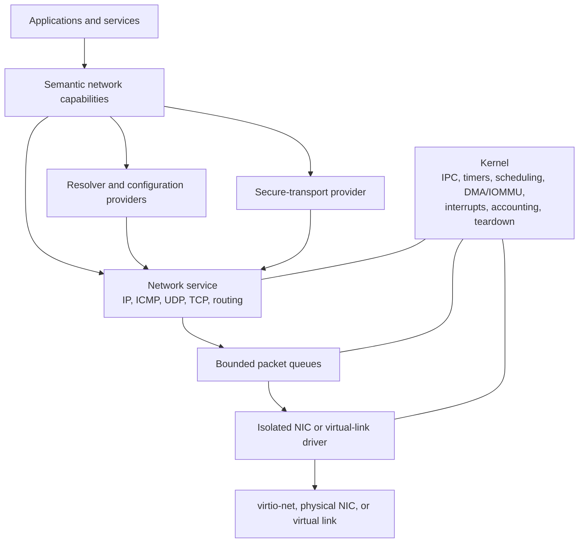

# Windvale network-stack architecture

## Status

Accepted future architecture under [Decision 0192](../Decisions/0192-Capability-Oriented-User-Space-Network-Stack.md). Proposed [Decision 0198](../Decisions/0198-Next-Integrated-Architecture-Defaults.md) adds a recommended first link-port and device profile for review. Windvale OS does not yet implement a NIC driver, packet transport, IP stack, resolver, TCP, secure transport, or application network capability. The qualified QEMU machine deliberately has no network device. This document defines direction and staged evidence, not current behavior or a stable network ABI.

## Recommendation

Windvale should implement established Internet protocols in one bounded user-space network service behind an isolated NIC driver. The kernel supplies only the privileged mechanisms needed to schedule, isolate, account for, and safely move packets. Applications use semantic, rights-limited network capabilities rather than syscalls, raw service messages, native handles, or an ambient POSIX socket namespace.

This is a deliberate middle ground. Putting TCP/IP in the kernel would make complex, adversarial packet parsing part of the most trusted failure domain. Splitting Ethernet, IP, UDP, and TCP into separate processes immediately would add multiple context switches to every packet and distribute connection state before there is evidence that the isolation is worth the cost. One network service plus an isolated device driver keeps the kernel small without making the first data path impractical.

Windvale writes its own stack so the OS, capability model, validation, lifecycle, and resource semantics remain Windvale-owned. It does not invent replacements for Ethernet, ARP, IP, ICMP, UDP, TCP, DNS, DHCP, or TLS. A mature external stack may serve as a development oracle or temporary explicitly named bootstrap, but it does not define Windvale semantics and must not become an undeclared permanent product dependency.

## Responsibility boundaries

### Kernel mechanisms

The kernel owns:

- interrupt delivery, thread scheduling, monotonic clock and timer primitives;
- endpoints, bounded copied messages, shared-memory objects, wait and notification mechanisms;
- page ownership, approved pinning and mapping, DMA/IOMMU enforcement, and checked teardown;
- process, capability, resource-domain, CPU, memory, handle, queue, and recovery-reserve accounting; and
- generation-safe peer loss, device removal, revocation, and cleanup evidence.

The kernel does not parse Ethernet frames, IP options, IPv6 extension headers, TCP state, DNS names, DHCP messages, certificates, or terminal protocols. It does not choose routes, configure interfaces, retry connections, or decide which peer an application may contact.

Transport timers are network-service state built over kernel monotonic-time and bounded-wait primitives. Civil wall time is not suitable for retransmission, lease-expiry scheduling, or connection deadlines.

### Isolated link and NIC drivers

A driver owns only the mechanics of one granted device or virtual link:

- device discovery handoff, initialization, feature negotiation, and reset;
- exact MMIO or port ranges, interrupt binding, queue programming, and link state;
- approved RX/TX DMA buffers and completion processing; and
- bounded packet submission, completion, cancellation, and failure reporting.

It receives no routing, DNS, application-policy, certificate, package, filesystem, or terminal-session authority. The kernel constrains DMA through exact memory and IOMMU ownership where the platform provides the required guarantees. Driver failure cleanup first stops new submissions and interrupts, revokes DMA, resets or quarantines the device, closes endpoints, invalidates generations, wakes waiters, and only then releases buffers or permits restart.

### One network service initially

The first network service owns Ethernet, ARP, IPv4, ICMPv4, IPv6, ICMPv6, Neighbor Discovery, route and interface state, UDP, TCP, packet reassembly, transport timers, and connection tables. Keeping these protocols in one process initially avoids copying or switching at each layer and keeps related state changes atomic inside one failure domain.

This placement is not a promise that every network responsibility stays in one process. Configuration, name resolution, secure transport, packet filtering, or virtual-network policy may move into separate providers when key ownership, independent restart, authority reduction, update cadence, or measured containment justifies the boundary. A split must not require the kernel to interpret the protocol or silently change application semantics.

### Resolver, configuration, and secure transport

Applications ask a resolver provider for names and service identities; they do not send ambient DNS packets. Address configuration and route mutation require separate administrative capabilities. Static configuration arrives first, followed by DHCPv4 and IPv6 autoconfiguration only after their state, lifetimes, rollback, and provider-loss behavior are specified.

TLS remains outside the kernel and above the transport service. A secure-connection provider requires exact peer-identity policy, secure entropy, trust-store access, civil-time policy where certificate validation needs it, key protection, protocol/version policy, and bounded handshake evidence. The recommended separation and delivery order are defined in [Identity, time, entropy, and trust](Identity-Time-Entropy-And-Trust.md). Windvale should use qualified cryptographic primitives and standard test vectors rather than create new cryptography. QUIC remains a later transport over qualified UDP, TLS, timers, loss recovery, and congestion control.

## Standards and protocol profile

The implementation follows published wire protocols. The baseline references are:

- [RFC 1122](https://www.rfc-editor.org/info/rfc1122/) for Internet-host layer responsibilities;
- [RFC 9293](https://www.rfc-editor.org/info/rfc9293/) for the current consolidated TCP base specification;
- [RFC 5681](https://www.rfc-editor.org/info/rfc5681/) for baseline TCP congestion control;
- [RFC 8085](https://www.rfc-editor.org/info/rfc8085/) for UDP application responsibilities;
- [RFC 8200](https://www.rfc-editor.org/info/rfc8200/) for IPv6;
- [RFC 4861](https://www.rfc-editor.org/info/rfc4861/) and [RFC 4862](https://www.rfc-editor.org/info/rfc4862/) for IPv6 Neighbor Discovery and stateless address autoconfiguration;
- [RFC 2131](https://www.rfc-editor.org/info/rfc2131/) for DHCPv4 and [RFC 1035](https://www.rfc-editor.org/info/rfc1035/) for the DNS base protocol; and
- [RFC 9846](https://www.rfc-editor.org/info/rfc9846/) for the current TLS 1.3 specification when secure transport is added.

The public address and transport model is dual-stack from its first contract. It uses nominal variants for IPv4 and IPv6 addresses, explicit prefixes and transport ports, stable interface identities, and IPv6 scope or zone identity where required. It never exposes a native `sockaddr`, host byte order, operating-system handle, or provider-specific option as the shared semantic type.

Implementation may begin with static IPv4 because it supplies a small deterministic QEMU proof. The transport and application interfaces must remain IP-version-neutral, and IPv6 link-local addressing, ICMPv6, Neighbor Discovery, Duplicate Address Detection, and SLAAC should be qualified before the network API is accepted as a general host profile. IPv4-only implementation evidence must not turn into an IPv4-only public API.

The initial stack is a host, not a router. Forwarding, bridging, NAT, multicast services, VPNs, tunnels, service discovery, and dynamic routing remain later privileged facilities. Inbound listening is denied unless an exact listener capability is granted.

The first experimental profile may reject fragmented traffic explicitly and avoid generating fragments under its fixed link MTU. A general host profile must add bounded reassembly, per-source and aggregate limits, expiry, overlap policy, and deterministic cleanup. Reassembly is never an unbounded allocation path. Path-MTU discovery and source packetization should avoid fragmentation where practical.

## Application-facing capability model

Windvale's semantic API expresses intent instead of exporting a broad socket syscall. The first capability families should cover these concepts without freezing their exact source names yet:

- resolve a name and service under an exact resolution policy;
- connect a reliable byte stream to an authorized peer;
- create a bounded datagram channel with exact local and remote filtering;
- listen and accept under an explicit local binding and admission policy;
- connect a secure authenticated stream under an exact peer and trust policy; and
- separately administer interfaces, routes, raw packets, capture, forwarding, or virtual networks.

A library requirement is not a grant. Application admission approves the exact transitive requirements, and the launcher binds independently rights-reduced provider instances. A grant can constrain names, address prefixes, ports, transport, interface, outbound or listen direction, multicast or broadcast, connection count, bandwidth, packet rate, queued bytes, deadlines, and lifetime. A general outbound grant does not imply listening, and VM management does not imply any network attachment.

Name authorization and connection selection form one security decision. Resolving an approved name and then handing an application an unrestricted numeric-address capability would create a rebinding and time-of-check/time-of-use gap. A resolver/connect provider should bind the authorized name, selected addresses, resolution evidence, peer identity where available, and resulting connection authority together. Address and route changes remain observable; they do not silently broaden a live grant.

Operation results are exact:

- a stream write reports how many bytes the local provider accepted, not whether the remote application received or committed them;
- a datagram send distinguishes rejection from local acceptance, while network delivery remains unknown unless the application protocol supplies an acknowledgement;
- partial local acceptance is reported exactly;
- timeout, cancellation, link loss, route loss, peer closure, reset, stale provider generation, and provider restart are distinct outcomes; and
- an uncertain application-level mutation is not retried merely because the transport reconnects.

Windows and Linux adapters may implement the same semantic capabilities with native host sockets, resolver APIs, or supervised providers. Windvale OS binds them to protected services and endpoints. Host mechanisms may differ; declared operation behavior, limits, failure classes, and capability authority do not.

A POSIX-socket compatibility library may be added for a named compatibility product. It remains an adapter above Windvale capabilities and cannot make ambient descriptors, process-global network state, native option numbers, or unrestricted raw sockets the Windvale definition.

## Packet and stream data planes

Begin with bounded copying. A driver receives into a fixed DMA pool, validates device completion and length, and copies or transfers a bounded packet through a checked service boundary. The network service treats every byte as untrusted, validates every header and derived offset with checked arithmetic, and delivers application payload through ordinary capability objects.

Copying is intentionally not part of application semantics. After ownership and teardown are proven, a measured fast path may use versioned shared-memory rings containing buffer identity, generation, offset, length, flags, ownership state, and immutable completion evidence. Rings carry no raw physical pointers. Every producer and consumer validates bounds independently, and queue exhaustion has an exact backpressure or drop result.

Use fixed or bounded packet, fragment, connection, timer, DNS-cache, and application-buffer pools. Reserve enough kernel, driver, and service capacity to report and recover from exhaustion. The system must not allocate without bound per packet, TCP connection, fragment sequence, DNS response, or retransmission.

The network service should be event-driven, batch RX and TX work, and use one bounded state machine per flow rather than one thread per connection. Multiqueue, RSS, checksum offload, segmentation offload, larger MTUs, interrupt moderation, zero-copy, and service sharding arrive only after the unaccelerated path is correct and measurements identify the bottleneck. Offloads must not weaken validation or make packet ownership ambiguous.

## First device and reusable link boundary

The first QEMU device should be modern `virtio-net`, following the [Virtio 1.3 specification](https://docs.oasis-open.org/virtio/virtio/v1.3/virtio-v1.3.html). The initial profile uses one RX queue, one TX queue, a standard Ethernet MTU, and the smallest required feature set. It disables multiqueue, RSS, jumbo frames, checksum and segmentation offloads, and optional control features until each has independent validation and performance evidence.

Bounded polling is acceptable only as a bring-up experiment. Interrupt-driven receive and transmit completion, link-state reporting, reset, peer loss, and complete buffer reclamation are required before the driver is considered usable.

The network service consumes a versioned link-port capability rather than knowing the device family. The same boundary should eventually support:

- deterministic simulated links and loopback;
- QEMU `virtio-net`;
- future physical NIC drivers;
- a Hyper-V synthetic network adapter;
- virtual NICs presented to or received from Windvale-hosted guests; and
- later bridges, switches, tunnels, or packet filters.

Loopback and a deterministic simulated link arrive before real hardware. They let packet parsers, protocol state machines, application capabilities, timers, and failure behavior run identically on Windows and Linux without making the host network or public Internet part of qualification.

Future VM networking uses separately authorized virtual-link attachments. A VM-management capability grants no host network, bridge, NAT, capture, or physical-NIC authority. A privileged user-space network-fabric service may later connect virtual ports through switching, routing, NAT, or filtering policy. A guest is disconnected by default until an explicit attachment is approved.

### Recommended `LinkPort 1` contract

The first version is copied and event-driven. It exposes no DMA address, virtqueue descriptor, PCI field, host socket, or native interface index. Its semantic records are:

- an immutable link snapshot containing interface identity and generation, link state, MTU, address evidence, supported operation limits, driver/provider generation, and reset reason;
- a receive batch containing one or more immutable frame byte values plus link generation and bounded arrival-order identities;
- a transmit submission containing caller-selected correlation identity and one or more immutable frames;
- a transmit completion for every accepted correlation identity, distinguishing completed local device submission, rejected, cancelled, reset, removed, and indeterminate device completion; and
- link-change, queue-space, provider-loss, and reset-complete events available through the common bounded wait mechanism.

Receive ownership crosses the service boundary only after the driver has validated device completion and copied the exact frame bytes out of its DMA pool. The network service then owns the copy. Transmit acceptance means the driver copied the exact submitted bytes into its admitted device queue or DMA pool; it does not mean the Ethernet peer or remote application received them. Link reset increments the generation, completes or fails every accepted submission exactly once, discards partial receive assemblies, and invalidates stale observations.

The copied interface is the semantic baseline even after a shared ring exists. A later `LinkPort 2` may transfer buffer identities through a versioned ring, but it must preserve the same frame, generation, completion, backpressure, reset, and teardown results.

### Recommended first `virtio-net` profile

The first usable profile is modern virtio over the selected Q35 PCI transport, with `VIRTIO_F_VERSION_1`, one receive queue, one transmit queue, the standard Ethernet MTU, and only the smallest link-status or stable-address features justified by the device. It does not negotiate legacy mode, multiqueue, RSS, a control queue, mergeable receive buffers, jumbo MTU, checksum offload, segmentation offload, guest offload control, or promiscuous policy.

Descriptor counts, fixed DMA-buffer counts, interrupt moderation, and batch limits are selected by one focused measurement and then recorded in the device profile. The driver validates every offered feature, queue size, descriptor chain, used length, status transition, notification, and completion. Bounded polling is bring-up evidence only; interrupt-driven RX/TX completion, link change, reset, and full buffer reclamation are required for the usable gate.

Device isolation claims must report the DMA boundary honestly. A virtual or physical IOMMU should restrict the driver/device to the exact queue and packet pool for the first usable isolated-driver claim. A bring-up run without IOMMU enforcement may prove packet mechanics against QEMU but cannot claim containment against a compromised DMA-capable driver. If the chosen QEMU profile cannot supply the required virtual-IOMMU evidence, retain that run as an explicitly weaker development profile rather than weaken the architecture.

## Security, failure containment, and policy

Every frame, packet, option, extension header, fragment, checksum, transport segment, DNS message, configuration reply, certificate, shared descriptor, and device completion is untrusted input. Parsing uses checked arithmetic, bounded iteration, maximum header-chain depth, exact length agreement, and explicit rejection. Diagnostics are bounded and avoid dumping packet payloads, credentials, keys, or unrelated guest traffic by default.

Resource domains impose limits on interfaces, listeners, connections, half-open connections, datagrams, packet and byte rates, queued bytes, shared buffers, fragments, timers, DNS entries, captures, and diagnostic work. ICMP responses, error generation, retransmission, connection attempts, and control traffic are rate-limited so hostile input cannot amplify work indefinitely.

The normal policy is no inbound listener, raw packet access, capture, forwarding, address change, route change, or promiscuous mode without a separate exact grant. Production ephemeral ports and transport secrets use secure entropy; deterministic seeded entropy is a separately named test provider and is never a silent fallback.

Isolation preserves distinct consequences:

- compromise of the network service must not grant MMIO, unrestricted DMA, or arbitrary device reset;
- compromise of a NIC driver remains constrained by exact device and IOMMU ownership and does not acquire application connection policy;
- application compromise remains constrained by its bound connection, listener, or datagram capability; and
- failure of the driver or network service does not remove the kernel emergency console or prevent bounded system recovery.

Packet capture is a separate privileged capability with interface, direction, filter, byte, duration, retention, and export limits. Network observability identifies provider generation, interface, route decision, protocol state, resource pressure, and bounded failure evidence without granting packet contents automatically.

## Implementation and qualification sequence

1. Build from qualified Probe 40; add flat resource domains, dynamic process launch, service supervision, PCI discovery, interrupt delivery, shared memory, DMA/IOMMU ownership, and deterministic device teardown.
2. Implement capability-free packet parsers, serializers, checksums, route selection, protocol state machines, virtual clock, loopback, and a deterministic simulated link reusable on Windows and Linux.
3. Add one isolated modern `virtio-net` driver with fixed buffers, one RX/TX queue pair, bounded polling bring-up, then interrupt-driven completion and reset evidence.
4. Add Ethernet, ARP, static IPv4, ICMPv4, and UDP against an isolated deterministic peer. This is the first real packet gate, not a general application-network claim.
5. Add dual-stack routing plus IPv6 link-local addressing, ICMPv6, Neighbor Discovery, Duplicate Address Detection, and SLAAC.
6. Add static configuration records, then DHCPv4, DNS resolution and caching, route changes, address lifetimes, and provider-restart behavior.
7. Add a small correct TCP implementation with bounded connection state, retransmission, congestion control, path and peer failure, close, reset, and teardown evidence.
8. Bind semantic resolve, connect, datagram, listen, and accept capabilities to ordinary applications with exact grants, quotas, cancellation, and provider-generation behavior.
9. Add qualified TLS 1.3 secure connections only after entropy, trust, peer identity, key protection, civil-time policy, and cryptographic test-vector gates exist.
10. Add the one-connection/one-session `WVTS/1` direction accepted by [Decision 0193](../Decisions/0193-Simple-Windvale-Remote-Terminal-Protocol.md), then package/update clients, browser networking, VM virtual networks, QUIC, physical NICs, shared-ring fast paths, multiqueue, and offloads one measured consumer at a time.

The first device completion gate is one pinned QEMU guest using a modern single-queue `virtio-net` device to exchange exact bounded Ethernet, ARP, IPv4, ICMP, and UDP traffic with an isolated deterministic peer. The test covers malformed and oversized packets, queue exhaustion, loss, duplication, reordering, delay, link removal, interrupt storms, driver fault, provider loss, device reset, DMA revocation, and complete buffer reclamation. It neither reaches the public Internet nor claims TCP, DNS, secure transport, or remote-terminal support.

The later first application-network gate resolves or selects one authorized peer, connects through a rights-limited provider, exchanges bounded data, reports exact local progress and peer closure, survives rejected and malformed traffic, and tears down every connection, timer, queue, buffer, mapping, interrupt, and capability generation deterministically.

Deterministic protocol tests run outside the OS as well as in QEMU. They record virtual time and random seeds, inject packet loss, duplication, reordering, delay, corruption, MTU change, address change, route loss, buffer exhaustion, service exit, and driver restart, and use structural traces or exact packet bytes where the wire encoding is the contract. A mature independent stack may serve as a differential oracle. Live Internet reachability is smoke evidence only and never the reproducible qualification oracle.

## Deliberately open details

The architecture does not yet freeze:

- application capability names, signatures, records, or source-language syntax;
- binary encodings for the recommended `LinkPort 1` records, packet rings, streams, listeners, resolvers, routes, interfaces, and configuration;
- exact queue, buffer, packet, fragment, timer, connection, cache, rate, or diagnostic limits;
- the initial timer source, tick or deadline policy, retransmission algorithm, and congestion-control selection;
- source-address and route-selection policy, temporary IPv6 addressing, DHCPv6, encrypted DNS, multicast, or service discovery;
- bounded fragmentation and reassembly policy for the general host profile;
- TLS implementation/provider, trust-store format, certificate policy, key custody, and exact secure-stream binding;
- exact `virtio-net` queue and buffer counts, the first physical NIC, Hyper-V adapter, virtual switch, NAT, firewall-rule, tunnel, or packet-capture contract; or
- measured copy-to-shared-ring, batching, offload, multiqueue, RSS, or sharding thresholds.

These details require focused consumers and evidence. They do not reopen the accepted boundaries: Internet protocols remain standards-based, the kernel remains protocol-blind, drivers remain device-mechanism-only, ordinary applications receive semantic rights-limited capabilities, and remote terminal support waits for a qualified secure network path.
