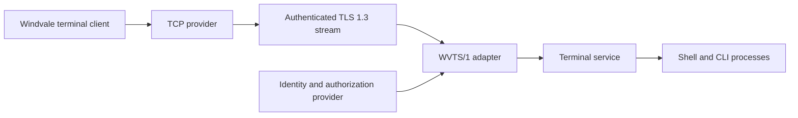

# Windvale remote-terminal protocol architecture

## Status

Accepted future architecture under [Decision 0193](../Decisions/0193-Simple-Windvale-Remote-Terminal-Protocol.md). Proposed [Decision 0198](../Decisions/0198-Next-Integrated-Architecture-Defaults.md) and the [identity, time, entropy, and trust guide](Identity-Time-Entropy-And-Trust.md) recommend the prerequisite provider split and a pinned mutual-identity first profile for review. No remote-terminal listener, TLS provider, `WVTS/1` codec, network terminal adapter, remote identity, or remote session is implemented. The exact wire encoding, limits, identifiers, and key-provisioning records remain experimental until a measured implementation and specification qualify them.

## Recommendation

Windvale should write a small terminal-session protocol but should not write a new transport, encryption scheme, or authentication primitive. The provisional `WVTS/1` protocol runs over an authenticated secure ordered byte-stream capability. Its first real network carrier is TCP protected by TLS 1.3. One connection owns one terminal session and one shell resource domain.



This preserves the boundaries accepted by the [console architecture](Console-Shell-And-Cli.md) and [network-stack architecture](Network-Stack.md). The network service moves reliable bytes, the TLS provider protects and authenticates the carrier, the remote adapter validates and translates `WVTS/1`, the terminal service owns presentation and input events, and the shell remains an ordinary capability-restricted application. Neither the kernel nor the shell listens on a network port or parses remote-session messages.

## First profile and non-goals

The first profile deliberately supports:

- one explicitly configured listener;
- one connection and one terminal session per connection;
- one newly created shell resource domain;
- strict UTF-8 text input and output;
- typed key, resize, interrupt, end-input, close, result, and error events;
- separate normal and diagnostic output channels; and
- bounded authentication, authorization, queues, frames, time, work, and teardown.

It has no multiplexed sessions, detach/resume, roaming, file transfer, clipboard transfer, port forwarding, agent forwarding, arbitrary environment import, remote command shortcut, public-key enrollment through the same connection, shell-language tunneling, graphical terminal surface, or terminal escape-sequence contract. A later feature requires a distinct capability and protocol revision; it is not inferred from a generic extension flag.

There is no production plaintext profile. Before TLS exists, the same codec and state machine may run through an in-memory stream, deterministic simulated provider, or build-restricted loopback test carrier. Such a carrier cannot bind a non-loopback interface or ship as a normal remote listener.

## Secure carrier and protocol selection

The real network carrier is a reliable ordered stream produced by TCP and protected by TLS 1.3. [RFC 9846](https://www.rfc-editor.org/info/rfc9846/) is the current TLS 1.3 specification and obsoletes RFC 8446. The remote-terminal profile defines when TLS begins, how the service identity is verified, which client identity evidence is accepted, and how closure maps to Windvale outcomes; TLS alone does not define application authorization. [RFC 9525](https://www.rfc-editor.org/info/rfc9525/) supplies current service-identity guidance for TLS applications.

TLS Application-Layer Protocol Negotiation identifies the terminal protocol before application data is accepted. The development identifier may be `wvts/1`; it remains private and experimental until the project either registers a public identifier or selects another publication-safe value under [RFC 7301](https://www.rfc-editor.org/info/rfc7301/). A peer that does not negotiate the exact supported protocol is rejected before any terminal message is parsed.

TLS 0-RTT application data is disabled. Terminal input and session creation are state-changing and must not be replayed. TLS connection resumption, if later enabled, creates a new `WVTS/1` connection and does not resume or silently recover a terminal session.

## Authentication and authorization

The first usable profile avoids passwords and public-PKI dependence. The recommended single first representation uses mutually authenticated small certificates whose subject-public-key digests are pinned. This matches ordinary Windows and Linux TLS-provider capabilities; RFC 7250 raw public keys remain a possible later Windvale-native profile rather than a parallel first implementation. Provisioning installs:

- one exact server certificate or public-key identity pinned by the client;
- one exact client certificate or public-key identity allow-listed by the machine; and
- one policy mapping that authenticated client identity to an exact rights-limited remote-session profile.

TLS authenticates the server and requests client authentication. Authentication proves possession of an approved key; it does not grant a shell by itself. A separate authorization provider checks the current identity generation, revocation state, listener, source policy if any, session count, resource ceilings, allowed shell identity, and exact additional capabilities before it creates a terminal-session grant.

There is no automatically omnipotent remote administrator. A provisioned client receives only the profile approved for that key. Key enrollment, replacement, revocation, recovery, and audit use separate local or administrative capabilities. Failure to obtain identity, authorization, terminal, launch, or resource-domain grants rejects the connection without creating a partial shell.

Authentication evidence identifies the peer and exact trust-policy generation. A separate immutable authorization record binds that identity to the listener, remote-session profile, reduced capabilities, resource ceilings, monotonic expiry where used, and revocation behavior. TLS connection state, key handles, identity records, authorization decisions, session grants, and shell capabilities remain separate objects with separate generations.

The listener is disabled unless an administrator binds an exact interface/address, transport port, server identity, client trust set, authorization policy, connection limit, and resource budget. A general network-listen capability is not sufficient to create the remote terminal service.

## Session and frame model

One authenticated secure stream carries one `WVTS/1` session. Because the carrier is already ordered and reliable, `WVTS/1` does not add packet acknowledgements, retransmission, channel identifiers, or multiplexing. The connection itself identifies the session; the accepted response supplies one generation-safe session identity for diagnostics and lifecycle evidence.

The first candidate frame header is intentionally small:

```text
type       u8
flags      u8
reserved   u16
length     u32
payload    length bytes
```

Multi-byte integers use network byte order. Reserved bits and fields must be zero. Length is validated before allocation or payload access, and every profile has one fixed maximum frame payload selected by measurement; 16 KiB is the initial planning ceiling, not yet a stable contract. Unknown frame types, unsupported required flags, truncated headers, oversized lengths, invalid UTF-8, invalid enum values, and messages illegal in the current state close the protocol with a bounded error when a safe reply is possible.

The first semantic messages are:

| Message | Direction | Purpose |
| --- | --- | --- |
| `Hello` | Client to machine | Exact major version, optional minor features, terminal rows/columns, and client receive limit |
| `Accepted` or `Rejected` | Machine to client | Selected limits and session generation, or a stable bounded refusal |
| `Textˉinput` | Client to machine | Strict UTF-8 typed or pasted text |
| `Keyˉinput` | Client to machine | A canonical key and modifier record rather than a native scan code |
| `Resize` | Client to machine | Bounded character columns and rows |
| `Interrupt` | Client to machine | Typed foreground cancellation request rather than byte `0x03` |
| `Endˉinput` | Client to machine | Explicit terminal-input closure without closing the transport |
| `Output` | Machine to client | Strict UTF-8 normal or diagnostic output chunk |
| `Close` | Client to machine | Orderly request to end this remote session |
| `Closed` | Machine to client | Structured session/process completion and final provider status |
| `Error` | Either direction | Stable protocol/session code plus bounded diagnostic text |

`Hello` is the first application message and receives exactly one `Accepted` or `Rejected` response before other session traffic. The initial major version has a fixed required message set. Optional minor features are explicitly offered and accepted; an unsupported required feature rejects the session. Version negotiation never falls back to plaintext or a less secure carrier.

Text bytes are strict UTF-8, but control is typed. `Keyˉinput` uses Windvale-defined keys and modifiers rather than Windows virtual keys, Linux input codes, USB scan codes, ANSI escape bytes, or a host terminal's `TERM` value. The first line-oriented profile needs only a small measured key set. Rich cursor, color, mouse, clipboard, and graphical-surface operations wait for a separate terminal-surface extension.

Normal and diagnostic output remain distinct. Each channel preserves its own byte order; no semantic total order between channels is promised. A client may render frames in arrival order for interactive use, but machine-readable consumers retain the channel identity and structured completion separately.

## Flow control, limits, and failure

TCP and TLS provide transport flow control and protection, but every Windvale boundary remains independently bounded. The remote adapter has fixed input, output, diagnostic, control, and parser budgets; the terminal, shell, and each launched process remain inside their resource domains. When an application-output queue is full, producers block or receive the exact stream result accepted by the console contract. The adapter does not allocate without bound to keep reading the network.

A small reserved control budget lets `Rejected`, `Error`, `Close`, and `Closed` progress even when data queues are full. Control messages cannot carry arbitrary output or bypass rate limits. Input bytes, output bytes, frames, malformed messages, authentication attempts, session creations, interrupts, resize events, and diagnostic work are rate- and count-limited.

The first session lifetime is the connection lifetime:

1. authenticated carrier and authorization complete;
2. a complete terminal, shell launch plan, capability set, and resource domain are admitted atomically;
3. `Accepted` publishes the new session generation;
4. input and output flow while the carrier and providers remain live;
5. orderly close requests cancellation and bounded drain before `Closed`; and
6. transport loss, TLS failure, malformed input, authorization revocation, adapter failure, or terminal-provider loss stops new input, requests foreground cancellation, and performs bounded forced teardown when graceful completion does not finish.

Disconnect never leaves a silently detached shell in the first profile. Reconnection creates a new generation and a new shell. Provider loss is not reported as normal application completion. `Endˉinput`, `Interrupt`, orderly `Close`, TLS close, network loss, authorization revocation, and forced teardown remain distinct evidence.

## Client, compatibility, and later carriers

The first client should be an ordinary Windvale application that runs on Windows and Linux through native network/TLS adapters and renders the small line-oriented terminal contract. This validates the same framing, identity, limits, and lifecycle before Windvale OS hosts the server. Native host terminal behavior is contained in the client adapter and does not define `WVTS/1`.

SSH remains a later interoperability adapter, not the Windvale-native session definition. The SSH connection protocol includes multiplexed channels, pseudo-terminal modes, environment transfer, command execution, X11 forwarding, and TCP forwarding under [RFC 4254](https://www.rfc-editor.org/info/rfc4254/). A separately authorized SSH service may translate a deliberately bounded subset into the Windvale terminal service without granting forwarding or importing POSIX process semantics.

A browser client may later carry the same semantic messages through a secure WebSocket adapter under [RFC 6455](https://www.rfc-editor.org/info/rfc6455/). WebSocket, HTTP, and browser origin policy do not enter the base protocol. A future QUIC stream may also carry the protocol only after the network architecture qualifies QUIC independently. Changing carriers must not change terminal, authority, completion, or teardown semantics.

## Implementation and qualification sequence

1. Qualify the local terminal service, single-session shell, immutable launch plan, standard streams, cancellation, structured completion, resource-domain teardown, and provider-loss behavior.
2. Qualify network listen/connect, TCP, secure entropy, TLS 1.3, server and client identity verification, key protection, authorization, revocation, and bounded secure-stream closure.
3. Implement the `WVTS/1` codec and state machine as capability-free logic with deterministic split/coalesced reads, virtual time, malformed-frame, version, state, and resource-limit tests on Windows and Linux.
4. Bind the codec to in-memory and build-restricted loopback test streams; prove that no plaintext production listener exists.
5. Build the Windvale terminal client on Windows and Linux, then connect it to a hosted reference adapter using pinned test identities and one exact rights-limited session policy.
6. Add the Windvale OS remote adapter as an ordinary supervised service with one exact listener, secure-stream provider, identity/authorization provider, terminal-session grant, launch authority, and resource domain.
7. Qualify one isolated QEMU network between the client and Windvale OS, including fragmentation of stream reads, backpressure, malformed frames, authentication refusal, authorization refusal, abrupt loss, cancellation, service failure, revocation, and complete teardown.
8. Add physical-network evidence, key rotation, multiple concurrent sessions, SSH, WebSocket, richer terminal surfaces, detach/resume, or roaming only as separate measured revisions.

The first completion gate uses one pinned Windows or Linux client identity and one pinned Windvale OS server identity over an isolated network. It negotiates the exact protocol, creates one rights-limited session, exchanges text, key, resize, normal output, diagnostic output, interrupt, and end-input events, reports structured completion, closes TLS cleanly, and leaves no process, endpoint, timer, buffer, listener grant, identity reference, or session generation live. Negative cases prove that unauthenticated, unauthorized, replayed, malformed, oversized, out-of-state, stalled, and abruptly disconnected peers cannot create authority, exhaust recovery resources, or leave an orphan shell.

## Deliberately open details

The architecture does not yet freeze:

- the published protocol name, ALPN registration, transport port, URI, discovery, or service-advertisement rules;
- frame type numbers, flag assignments, exact payload records, fixed maximum, or minor-version negotiation encoding;
- the first canonical key/modifier set and whether line editing echoes from the terminal service or a later negotiated client presentation mode;
- exact cross-channel rendering policy, queue sizes, timeouts, rate limits, reserved control budget, and audit records;
- certificate or raw-public-key format, signature algorithms, provisioning package, key storage, rotation, revocation, recovery, and trust-policy encoding;
- the first rights-limited remote-session profiles and any interactive elevation ceremony;
- multiple sessions, detach/resume, reconnect, roaming, keepalive, idle timeout, or graceful-drain policy beyond the first connection-owned session;
- the bounded SSH subset, browser/WebSocket adapter, QUIC carrier, graphical terminal extension, or compatibility story; or
- the exact point at which a public protocol identifier and independent interoperability suite are required.

These details need implementation evidence. They do not reopen the accepted direction: one connection owns one first-profile session, the real network carrier is authenticated and encrypted, security primitives remain standard, the remote adapter is outside the kernel and shell, input control is typed, queues and frames are bounded, disconnect tears the session down, and compatibility protocols remain adapters.
