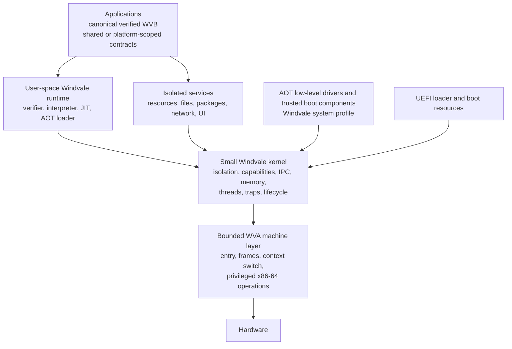

# Windvale OS architecture

## Status

Accepted long-lived architecture direction. [Decision 0084](../Decisions/0084-Minimal-Capability-Oriented-Windvale-Os-Architecture.md) records the kernel and service boundary; [Decision 0140](../Decisions/0140-Per-Module-Platform-Scope-And-Filesystem-Capabilities.md) records per-part platform scope and the application-library/provider boundary; [Decision 0171](../Decisions/0171-Future-Virtualization-And-Accelerator-Architecture.md) records the future VM-host, GPU, and accelerator boundary; [Decision 0173](../Decisions/0173-Windvale-Process-Service-And-Driver-Architecture.md) records the process, application, service, supervision, scheduling, and driver direction; [Decision 0181](../Decisions/0181-Next-Windvale-Os-Mechanism-Contracts.md) selects the next logical records, timer, allocator, serial, discovery, filesystem, provider, and accelerator evidence; [Decision 0191](../Decisions/0191-Windvale-Console-Shell-And-Cli-Architecture.md) separates the future terminal, shell, command, stream, and session layers; [Decision 0192](../Decisions/0192-Capability-Oriented-User-Space-Network-Stack.md) separates network mechanism, device, protocol, application, security, and virtual-network responsibilities; and [Decision 0193](../Decisions/0193-Simple-Windvale-Remote-Terminal-Protocol.md) selects the first simple authenticated remote-session boundary. Cross-host-qualified [Decision 0196](../Decisions/0196-First-Generation-Safe-Non-Tail-Memory-Object-Reclamation.md) supplies the first fixed generation-safe non-tail memory-object proof. Proposed [Decision 0198](../Decisions/0198-Next-Integrated-Architecture-Defaults.md) supplies successor defaults for resource domains, launch, console, network, trust, packages, and language contracts for review; it is not yet accepted or implemented. Implementation remains incremental, and current behavior is defined only by qualified specifications or explicitly labeled candidate evidence.

This document fixes ownership, trust, and portability rules. It intentionally does not freeze syscall numbers, binary layouts, scheduling policy, package or filesystem formats, or other details that still need measured experiments.

## Short answer: what the OS is written in

The durable Windvale OS is written primarily in Windvale source (`.wv`), not C#.

- Windvale system-profile source owns kernel policy, state, validation, runtime services, system services, and drivers wherever the language can express them safely.
- WVA assembly (`.wva`) owns the small irreducible machine layer: privileged entry and exit, register frames, control-register operations, interrupt publication, context switching, and architecture instructions not yet expressible in Windvale.
- C# and .NET supplied the qualified Stage 0 bootstrap but are absent from `main` under Decision 0558. The immutable recovery release preserves their exact source and provenance; forward OS construction and verification use Windvale, WVA, and pinned native tools.

Historical probes were assembled, linked, packaged, launched, and independently checked by Stage 0 C# tools. That describes their bootstrap provenance, not the current construction path or the implementation language of the resulting OS.

## Goals

Windvale OS should:

- run the same canonical verified WVB program identity used on Windows and Linux;
- make authority explicit through capabilities rather than ambient privilege;
- keep the privileged kernel small enough to understand, test, and replace in bounded slices;
- use the shared Windvale native backend and ABI rather than create a kernel-specific compiler or language dialect;
- isolate failures and resource use at process and service boundaries;
- keep architecture-specific mechanics behind explicit WVA and target-adapter contracts;
- validate modules, packages, memory requests, and executable publication before use;
- remain reproducible and diagnosable from boot through application exit.

The first OS is not required to provide a desktop, broad hardware support, POSIX compatibility, a production network stack, or a permanently stable public ABI.

## Durable shape

Windvale adopts a small capability-oriented kernel with isolated services around it. This is a mechanism boundary, not a commitment to either a pure academic microkernel or an expanding monolithic kernel.

Some boot-critical adapters still reside with the kernel because the qualified environment has only three fixed processes, separate resource and directory providers, one client, and one private fixed-preemption experiment rather than a general scheduler or service manager. The adapters remain named seams and move outside the kernel when process, IPC, scheduling, and capability evidence makes that safer and simpler. The design judges each move by trusted-code size, failure containment, performance, and implementation clarity rather than by a kernel-style label.

## Stable invariants

The following rules are intended to survive individual ABI and implementation revisions:

1. Canonical WVB is the program identity and cross-host distribution format. A particular module may use only shared contracts or may declare explicit platform-scoped requirements. Interpreted, JIT-compiled, cached, install-time, and AOT code are execution products of that identity, not different language semantics.
2. Kernel and low-level driver code is AOT. General JIT compilation never runs in the kernel; it runs in an ordinary process or an isolated authorized service.
3. The kernel grants no ambient filesystem, device, process, native-memory, or executable-publication authority.
4. Capabilities are unforgeable, rights-limited references to kernel-mediated objects. Raw host handles and persistent kernel pointers do not cross application or service boundaries.
5. Writable-or-executable discipline is mandatory. No accepted design requires a page to remain writable and executable.
6. Every loaded module, package, object, relocation, capability request, offset, length, and resource count is untrusted until validated within explicit limits.
7. CPU faults and Windvale runtime traps remain different contracts. A processor exception does not silently redefine a `WVR` language/runtime result.
8. Windows, Linux, and Windvale OS implement shared Windvale platform contracts and may expose explicit extensions. None of them defines language semantics, and an application is not required to support every environment when its platform scope is declared honestly.
9. Managed Stage 0 is archived recovery evidence only. Reintroducing C# or a direct `dotnet` path to `main` requires a new decision naming the failed native or recovery contract.
10. Running Windvale OS as a guest, using host hardware virtualization, and making Windvale OS a VM host are separate contracts and evidence claims. No selected execution engine silently changes guest semantics or grants device authority.
11. Guest and accelerator DMA never bypasses explicit ownership, generation, range, budget, and IOMMU enforcement. A missing isolation or reset guarantee disables the attachment rather than weakening the boundary.
12. Application, helper, service, driver, runtime, and VMM are explicit launch and supervision roles over one process/thread mechanism. A role label grants no authority, capability inheritance, or automatic scheduler priority.

## Kernel responsibilities

The kernel owns the mechanisms that require global authority or hardware privilege:

- early machine state after the boot handoff;
- CPU exception and interrupt entry, normalization, routing, and terminal kernel panic;
- physical-page ownership, virtual address spaces, mapping permissions, and isolation;
- process and thread lifecycle plus the minimum scheduling and waiting mechanisms;
- capability tables, rights reduction, revocation-safe identity, and kernel-object lifetime;
- bounded IPC endpoints and transfer of explicitly transferable capabilities;
- enforcement of executable-publication and verified-module admission policy;
- timers and interrupt bindings required for scheduling and device progress;
- when VM hosting is implemented, guest-memory, vCPU, entry/exit, interrupt, accounting, and teardown mechanisms that require hardware privilege;
- clean platform shutdown and deterministic diagnostic transport;
- minimal boot-device mechanisms until an isolated driver or service can own them.

The kernel should not normally own language compilation, package policy, filesystems, networking policy, shells, graphical environments, general application runtimes, or the optimizing compiler. These belong in isolated Windvale services or processes when practical.

The semantic WVB verifier is a trusted Windvale component, but it need not become permanent core-kernel policy. Initially, an AOT verifier can be included in the boot image so it can validate the first WVB before an ordinary process exists. Later it can run as an isolated trusted service while the kernel continues to enforce that executable admission is backed by an accepted verifier identity and result.

## Process, thread, and capability model

A process is conceptually a protection domain containing:

- an isolated virtual address space;
- one or more schedulable threads;
- a capability table;
- the identity of its verified module and selected runtime contract;
- explicit memory, instruction, handle, and other resource budgets;
- lifecycle, result, fault, and diagnostic state.

A thread is the schedulable execution context: registers, stack, thread-local runtime state, ready or wait state, and CPU accounting. Threads share the process capability table by default and do not manufacture authority. Process lifecycle and thread scheduling state remain distinct: a live multi-threaded process is not itself `running` merely because one of its threads is on a CPU. The current identical-looking process/thread state encodings remain internal experimental evidence, not the general model.

Application, helper, service, driver, runtime, and VMM are policy roles over these objects rather than separate kernel process classes. Capabilities and executable admission enforce authority; roles drive launch, supervision, diagnostics, and resource policy only. Capability-free libraries normally remain in their consumer, and multiple interfaces may share one service process when they have the same authority, budget, update boundary, and failure policy.

A generation-safe flat resource-domain or job object will account aggregate process, thread, memory, handle, endpoint, CPU, pinned-memory, and other limits for one application, service group, or future VM. Every process belongs to exactly one initial domain, but membership does not grant capabilities. Hierarchical jobs, sessions, and containers remain later policy.

The next physical-memory and accounting direction is detailed in [Memory objects and resource domains](Memory-Objects-And-Resource-Domains.md). Qualified Probe 40 already supplies the fixed deterministic page bitmap, ownership, generation, committed-object, zero-before-reuse, and non-tail-reuse baseline. Portable resource-domain policy 1 now implements immutable reserve/commit/release and idempotent-stop evidence for the measured process/page/endpoint set, without claiming live Probe integration or a public encoding. The guide retains separate rights-reduced mappings and recovery capacity outside ordinary budgets as successor contracts. The recommended launch transaction and supervision records are detailed in [Process launch and supervision](Process-Launch-And-Supervision.md); those mechanisms remain unimplemented.

This conceptual model is accepted. Cross-host-qualified protected-process [version 17](../../Specifications/Windvale-Protected-Process.md) pressures that representation with separate init, directory-provider, and interpreter roots; role-specific W^X extents; typed RO/NX resources; ordered grants; generation-safe same-root client reuse; two independently resolved service endpoints and capacity-one channels; a three-record ready/wait dispatcher; and closed lifecycle, fault, and result evidence. This fixed three-process representation is implementation evidence, not yet a stable public process or scheduler ABI.

A capability identifies a kernel-mediated object plus permitted operations. The current experiment gives the client fixed slots 0 and 1, generation 1, and machine references 65536 and 65537 for resource and directory service. Each reference resolves through its own `WVENDP01` to a kernel-only `WVCHAN04`; `WVPROC17` holds endpoint addresses rather than channel addresses. The kernel revalidates the reference, endpoint header and state, provider and exact current client generations, reduced rights, capacity, and channel binding before channel or resource mutation. The references still name a deliberately closed boot contract rather than a general object table. General capability allocation, transfer, names, ambient lookup, revocation APIs, and endpoint-generation rollover remain unimplemented. References cannot be recovered from raw addresses, and the current integer encoding remains internal and replaceable.

Application-library capability requirements are distinct from these internal object references. A library declares a versioned semantic requirement, the application explicitly approves its transitive requirements, init or a service manager grants a rights-limited instance, and the runtime binds the semantic operation to that instance. A required binding is established before process entry; an optional extension is reported absent before use. The binding may name an in-process provider on Windows or Linux and an IPC endpoint plus service-owned object on Windvale OS without changing the application-facing library contract. Binding does not promise permanent availability: revocation, stale generation, peer exit, service restart, and device removal remain explicit runtime outcomes.

Expected kernel-object families include processes, threads, resource domains, address spaces, memory objects, endpoints and their bounded queues, events or timers, executable publications, interrupt bindings, and exact device resources. This is a design inventory, not a commitment that every family is a public object or syscall.

Windvale's primary creation model is clean spawn from an immutable verified launch plan, not address-space cloning. The plan binds exact module/runtime identities, target and authority metadata, entry state, budgets, resource-domain membership, and initial capability instances. The kernel creates the process non-running and publishes it as runnable only after admission, mappings, budgets, references, and grants all validate. Parentage or supervision conveys lifecycle observation, not ambient capability inheritance. A later compatibility service may emulate a bounded process API without making POSIX `fork`, signals, current directories, environment state, or inherited native handles part of the Windvale foundation.

The recommended launch boundary uses two immutable records: a semantic user-space plan containing package, provider, stream, and supervision policy, and a smaller kernel admission plan containing only executable, mapping, domain, capability-transfer, budget, and initial-thread mechanisms. Resolution, authorization, reservation, private construction, and runnable publication form one transaction. Observation, cancellation, termination, inspection, and capability transfer remain different rights; a failed launch exposes no partial child.

## System calls and IPC

The system-call surface should be small, versioned, architecture-neutral at the semantic level, and concerned with mechanisms rather than high-level service policy. Likely operation families include:

- capability inspection, reduction, transfer, and close;
- memory creation, mapping, protection, sharing, and release;
- process, thread, and resource-domain creation, start, wait, stop, fault, and exit;
- endpoint creation, bounded send, bounded receive, reply, cancellation, and close;
- timer or event waiting;
- interrupt and device-resource binding for authorized drivers;
- verified executable admission and publication.

x86-64 entry, exit, register preservation, and context-switch mechanics belong in WVA. Windvale source owns validation, policy, state transitions, accounting, and diagnostics.

Requests must use checked buffer descriptors and capability references rather than expose native structure layouts. The kernel validates address ranges, arithmetic, access direction, length, alignment, rights, and resource budgets before use. IPC requires bounded message and queue sizes, defined backpressure, and explicit behavior when a peer exits.

Cross-host-qualified protected-process version 17 retains internal syscall numbers 1 through 7 for the fixed send, receive, exit, grant, service-receive, call, and reply experiment. It keeps ABI 22/context 7, three fixed process records, two capacity-one channels, four fixed resources, and two exact client generations. Separate resource and directory capability references resolve through two `WVENDP01` records before channel or resource mutation. The retained dispatcher scans the three validated records from a persistent cursor and selects only ready work. Qualified Probe 39 precedes that workload with a separate fixed involuntary-preemption experiment and does not change these syscall or `WVPROC17` contracts. Qualified Probe 40 replaces tail-order reclamation with three fixed generation-safe memory objects without changing the process record or syscall contract. These register assignments and record encodings are replaceable internal evidence. They are not a public ABI, dynamic object table, capability-transfer interface, process manager, general scheduler, or backpressure design.

## Memory and executable publication

The kernel owns physical pages, virtual mappings, protection changes, address-space isolation, and the final enforcement point for executable memory. A process runtime owns its language heap, roots, reclamation policy, and value representation within those mappings.

Physical page state, memory-object ownership, virtual mappings, and resource-domain charges are separate records. Probe 40 now supplies deterministic contiguous first-fit over a fixed bitmap plus checked owner, page-vector, and generation records. A successor generalizes object inventory or noncontiguous page-set selection only from dynamic launch or another measured consumer rather than adding a speculative buddy or slab implementation. Anonymous memory objects remain fixed-length and committed before publication. Demand paging, swap, copy-on-write, file backing, overcommit, huge pages, and NUMA placement remain later backing or policy contracts.

Executable publication follows a one-way discipline:

1. Accept canonical verified WVB or an authorized AOT artifact with complete identity and version inputs.
2. Validate native layout, relocations, bounds, architecture, ABI, and capabilities before publication.
3. Populate writable, non-executable memory.
4. Complete relocations and instruction-cache publication through the platform contract.
5. Remove write permission before granting execute permission.
6. Record ownership and lifetime so teardown, cache reuse, and fault attribution are deterministic.

JIT compilation occurs outside the kernel and receives only the minimum capability needed to request checked publication. Kernel code and low-level drivers use deterministic AOT images. No JIT service receives arbitrary kernel-memory access.

The Windows/Linux native path moved the allowed allocate/copy/seal/invoke/release state graph into Windvale under cross-host-qualified [Decision 0083](../Decisions/0083-Windvale-Owned-Native-Publication-Lifetime.md). Current hosted platform adapters perform the bounded OS memory calls without a managed owner. This remains a host publication contract, not the final Windvale OS publication boundary.

## Boot and trust chain

The first x86-64 path remains UEFI-based and evidence-driven. Qualified probes 24 through 32 establish interpretation, section-derived validation, runtime-supplied WVB, init ownership/grant, terminal cleanup, typed two-resource publication, generation-safe root reuse, two exact compiler-produced WVB modules, broader scalar/control-flow interpretation, and build-time native-stack proof:

1. A narrow loader validates its bounded inputs, captures the versioned handoff, loads the selected AOT kernel and boot resources, and exits boot services.
2. The kernel takes ownership of memory, its stack, exception state, page tables, and deterministic diagnostics. Firmware services are not used after the accepted exit boundary.
3. An AOT Windvale verifier/runtime component validates an embedded or image-contained canonical WVB module within explicit limits.
4. The kernel creates the first protected process, capability table, and resource budgets.
5. An init or service manager starts only the services authorized by the boot resource.
6. Ordinary modules execute through the same Windvale semantic and capability contracts used by the Windows and Linux hosts.

The boot container is a target artifact, not a replacement for WVB identity. Its package/resource format, integrity policy, measured-boot policy, and update scheme remain separate decisions.

## Services and drivers

Resource, package, filesystem, network, compiler, JIT, shell, and GUI policy belongs outside the kernel. Services communicate through bounded IPC and receive only declared capabilities. A service failure should not automatically become a kernel failure.

The first user process evolves into a minimal service manager and launcher rather than a permanent universal provider. It consumes the verified boot plan, starts authorized processes, binds required providers before entry, observes terminal outcomes, and applies explicit restart, degrade, recovery, or shutdown policy. Provider names, dependency graphs, readiness, draining, criticality, and restart rules remain user-space policy; the kernel enforces only process, endpoint, capability, memory, waiting, and lifecycle mechanisms. A provider is not published before initialization and endpoint binding complete. A restarted provider receives a new process generation and binding, and clients observe peer loss before any explicit rebind.

Services are isolation and policy boundaries, not an automatic one-interface-per-process rule. Interfaces with the same authority, aggregate budget, update boundary, and failure/restart policy may share a process. They split when least authority, independent progress, containment, or replacement produces measured value. Ordinary applications and their helpers belong to a flat aggregate resource domain so teardown and quotas cover the complete application without granting helpers implicit authority.

Platform libraries sit above these services. Ordinary applications call typed Windvale library contracts rather than syscalls or raw IPC. A Windvale OS runtime adapter validates values and messages, invokes the granted endpoint, validates the reply, and translates service lifecycle into the specified result. Mutating service protocols must preserve request correlation, exact progress, and indeterminate-completion evidence; neither the runtime nor service manager may blindly replay an uncertain mutation after restart. The kernel remains format-blind: it enforces endpoint identity, rights, buffer access, bounds, ownership, waiting, peer exit, and cleanup without interpreting file paths, resource names, window operations, or network protocols.

Small bounded copied messages remain the control plane. Independent endpoints must define queue and in-flight limits, correlation, peer generation, backpressure, close, and terminal behavior. Explicit capability transfer cannot amplify rights, may reduce them, and defines copy-versus-move ownership. High-throughput storage, network, display, VM, GPU, and accelerator data planes use checked shared-memory objects or bounded rings only after their ownership, layout, notification, resource, and teardown contracts are measured. Service role never authorizes a protocol or makes the kernel parse one.

[Decision 0145](../Decisions/0145-First-Capability-Bearing-Static-Library.md) historically implemented the first Stage 0 application-to-library authority chain without changing the kernel or WVB: a hosted application explicitly re-approved its platform library's transitive `file.read_bytes` requirement, the runtime granted it separately, and capability-free Foundation validated the resulting immutable store. The current native service projects retain the authority separation; the archived implementation is provenance, not a live owner.

[Decision 0153](../Decisions/0153-First-Versioned-Read-Only-Directory-Capability.md) defines that first typed filesystem instance above the kernel: one authorization binds one immutable directory snapshot, a Windvale platform library validates a single segment and decodes exact 3 KiB read-at chunks, and ordinary provider/lifecycle failures remain typed. Current Windvale service modules own request parsing, provider invocation policy, and strict `WVDR 1` envelope validation; the former Stage 0 oracle is archived.

[Decision 0154](../Decisions/0154-First-Windvale-Directory-Service-Ipc.md) adds the checked service boundary without changing those application semantics. Portable Windvale owns `WVDQ 1` parsing, invalid-name/limit non-invocation, exact `WVDR 1` validation, and structural no-reply policy. Resource and directory protocols now share one explicitly format-blind 4 KiB exchange oracle. The maximal 3,096-byte reply fits that transport but not Probe 34's 2,016/2,048-byte user windows, so the next guest probe must add a dedicated page-sized reply mapping and a distinct init-owned immutable directory snapshot rather than weakening the contract or reinterpreting `WVRS 1`.

[Decision 0155](../Decisions/0155-First-Immutable-Windvale-Directory-Snapshot.md) defines that distinct provider value as `WVDS 1`: one verified page with a fixed header, at most 64 ordered single-segment entries, exact packed names, zero alignment, and exact packed immutable file bytes. Portable Windvale verifies and reads the snapshot, then composes with the provider-independent `WVDQ 1` core. `WVDS 1` remains service-private and separate from package-oriented `WVRS 1`; the kernel will map and describe the page without learning either format. The canonical 3,184-byte fixture forces one maximal 3,096-byte reply before guest adoption changes process, memory, resource, and firmware identities.

[Decision 0159](../Decisions/0159-First-Guest-Directory-Service.md) implements that guest adoption as cross-host-qualified Probe 35. `WVKMEM14` adds a RO/NX init snapshot page plus dedicated RW/NX response pages for init and each rebuilt client; `WVPROC14` publishes the response address explicitly; and `WVRES006` attaches the complete snapshot identity only to init. Portable `Process-Foundation.wv` now binds both immutable service identities, both exchanges, the current page/profile/syscall budgets, and two-generation cleanup before publication. Syscalls 5 through 7 become service-generic while retaining one format-blind capacity-one copied-message contract. Both client generations complete the existing resource lookup, request `kernel.wv`, validate the maximal 3,096-byte reply and all 3,072 file bytes, then run the retained interpreter. The kernel still knows no directory names or response format. All 37 OS tests pass on Windows and digest-pinned Debian; all four pinned-QEMU scenarios pass on Windows.

Qualified [Decision 0165](../Decisions/0165-Contained-Windvale-Service-Failure.md) added Probe-36 containment without moving service policy into the kernel. One client sent a deliberately inconsistent directory envelope; init rejected it and faulted at CPL3. `WVCHAN04` closed the peer, cleared all transient copied-message and destination state, recorded init's fault, and woke the retained client exactly once with transport result `-1`. The client exited cleanly and lost both granted aliases before the kernel continued to shutdown. This was the smallest useful peer-loss contract, not a scheduler, endpoint registry, supervisor, restart mechanism, concurrent IPC design, or VFS. The portable policy was written in Windvale, the failure callers remained WVA, and the then-current Stage 0 coordinator seam has since moved to native construction.

Cross-host-qualified [Decision 0172](../Decisions/0172-First-Kernel-Owned-Service-Endpoint.md) adds Probe-37 endpoint identity without adding discovery policy. Each capability-bearing syscall now resolves `WVENDP01` before reaching `WVCHAN04`; the endpoint binds init reference `65537`, the current client reference, capacity, provider availability, and the kernel-only channel address. The first client contributes eight resolutions before an exact rebind to reference `131074`; normal provider exit closes at sixteen, and the retained service fault closes at six with status faulted. Portable Windvale owns these lifecycle predicates, existing WVA callers retain the same wire arguments, and the historical Stage 0 raw-record/x86-64 seam is preserved in the immutable recovery release. This is an object-resolution boundary, not a name registry, public creation API, transfer mechanism, or restart policy.

Cross-host-qualified [Decision 0176](../Decisions/0176-Third-Protected-Service-And-Ready-Wait-Dispatcher.md) advances that boundary to Probe 38. A third protected process owns the immutable directory snapshot and protocol, while init retains the resource provider. Resource and directory traffic resolve through separate endpoints and channels, and a persistent cursor selects every initial entry and explicit wake from validated ready process/thread state. A contained directory-provider fault closes only its endpoint and channel while init remains alive. This is still a fixed construction without timer preemption, dynamic process creation, a public run queue, general discovery, capability transfer, restart, or supervision.

Cross-host-qualified [Decision 0188](../Decisions/0188-First-Hpet-Calibrated-Local-Apic-Preemption-Proof.md) adds a separate private preemption proof without changing that qualified process contract. Supervisor-only paging maps the exact Q35 HPET and local-APIC windows; WVA validates and calibrates the profile, then four one-shot interrupts switch directory to init, init to client, client back to directory, and finally complete. Private normalized context and timer records preserve the measured state. HPET is the only admitted clocksource in this profile; a feature bit alone cannot select TSC. This is not a public timer API, run queue, priority or idle policy, delayed-tick contract, multiple-thread scheduler, SMP claim, or physical-machine qualification.

The filesystem is a family of capabilities rather than one kernel interface. A small shared core may cover only exact common semantics; atomic replacement, watching, links, permissions, memory mapping, sparse storage, transactions, and native OS facilities remain separate interfaces. Feature availability belongs to the granted filesystem or directory instance because volumes and remote stores on one OS can provide different guarantees. Application-visible file, directory, and watch references are typed capabilities; native handles, file descriptors, and kernel addresses remain provider details.

Decision 0181 selects the first source-facing core as directory-relative `Open`, bounded `Readˉat` and `Writeˉat`, `Setˉlength`, and `Close`, using Windvale naming and typed capabilities. Write results distinguish rejection, exact partial progress, completion, and indeterminate completion; `Writeˉall` remains library policy and cannot replay an indeterminate mutation. Offset width and exact provider protocols remain implementation gates.

Drivers are AOT system-profile Windvale modules with explicit authority for the exact MMIO ranges, port-I/O ranges, interrupts, DMA resources, and kernel operations they need. WVA supplies instructions that cannot safely be expressed in `.wv`; it does not own device policy. Early serial, timer, interrupt-controller, or boot-storage code may begin in the kernel to establish the first working machine, but each such adapter needs an isolation or retention rationale.

Moving a driver out of the kernel is valuable only when the process and IPC boundary actually contains its failures without creating unbounded copying, hidden shared memory, or a second authority model. DMA isolation and IOMMU policy require their own later threat and hardware evidence.

Driver failure cleanup first blocks new interrupts and submissions, revokes DMA/IOMMU access, resets or quarantines the device when possible, closes endpoints and wakes waiters, invalidates generations and mappings, and only then releases resources or permits restart. The recommended first isolated driver is ordinary console/serial output: retain the minimal kernel COM1 early-boot and panic sink, but grant normal port-I/O authority to a supervised AOT service. This proves device authority and containment without introducing DMA. Timer and interrupt-controller mechanisms remain kernel-owned initially because scheduling depends on them; storage and networking follow after shared-memory, interrupt, DMA, and teardown evidence exists.

That first service is output-only and polled, owns only the exact configured COM1 port range, and accepts bounded write batches. It has no input, interrupt, DMA, discovery, or arbitrary-port authority. Restart requires old-generation revocation and a fresh checked grant; the kernel emergency sink remains independent.

## Console sessions, shell, and CLI applications

[Decision 0191](../Decisions/0191-Windvale-Console-Shell-And-Cli-Architecture.md) and the [console architecture guide](Console-Shell-And-Cli.md) keep four responsibilities distinct. Drivers or authorized transport adapters own serial, keyboard, display, or remote transport mechanics. A terminal service owns bounded sessions, input decoding, editing, presentation, and terminal events. A shell is an ordinary capability-restricted application. CLI applications execute as verified processes through immutable launch plans and resource domains.

The kernel owns no general command parser, command registry, path policy, shell history, or terminal presentation. Its early-boot and terminal-panic sink remains independent of the ordinary driver, terminal, and shell path. A temporary fixed recovery monitor is permitted only as explicitly bounded bring-up evidence; it is not the permanent application CLI and grants no ambient authority.

Command resolution binds an exact package, module digest, entry point, platform/profile requirements, and declared capability set. It does not scan an ambient `PATH`, execute the current directory implicitly, or infer authority from a filename. The service manager validates arguments, stream bindings, current-directory or environment inputs, exact capability instances, resource ceilings, cancellation, supervision, and completion policy before making a child runnable. The shell does not pass all of its own rights to the child.

Future standard input, output, and diagnostic bindings are separate bounded byte streams with exact ordering, progress, backpressure, close, cancellation, provider-loss, and teardown behavior. Existing strict-UTF-8 console operations remain library conveniences over output streams. Terminal control and typed input events require a separate capability and are never inferred from a byte stream.

The first shell grammar stays smaller than a general language: explicit commands, arguments, quoting, and `--`, followed by sequencing, pipelines, redirection, status chaining, and one-argument variables only as their mechanisms arrive. It has no initial implicit globbing, word splitting, command substitution, `eval`, functions, loops, or unrestricted startup scripts. General automation uses verified Windvale source; a language REPL remains a separate tool.

Canonical CLI command names use lowercase ASCII and `-`, while their Windvale implementations retain U+02C9 source identifiers. Built-ins are limited to shell-session mutation. Inspection, filesystem, package, shutdown, and future VM operations are separate applications with exact capabilities. There is no automatically omnipotent root shell.

## Network stack and device boundary

[Decision 0192](../Decisions/0192-Capability-Oriented-User-Space-Network-Stack.md) and the [network-stack guide](Network-Stack.md) keep protocol parsing and policy outside the kernel without splitting every protocol into a separate process. The kernel supplies interrupts, scheduling, monotonic timers, endpoints, shared memory, page and DMA/IOMMU ownership, accounting, revocation, and teardown. An isolated NIC or virtual-link driver owns exact device initialization, queues, approved DMA buffers, interrupts, reset, and link state. One bounded user-space network service initially owns Ethernet, ARP, IPv4, IPv6, ICMP, routing, UDP, TCP, fragments, timers, and connection state.

The kernel remains packet-format-blind. The driver receives no routing, resolver, application-policy, certificate, filesystem, package, or terminal authority. The network service receives no MMIO or unrestricted DMA authority. Configuration, resolution, secure transport, filtering, and virtual-network policy may become separate providers only when exact authority, key custody, restart, update, or measured containment justifies the boundary.

Applications use semantic resolve, connect, datagram, listen, accept, and later secure-connect capabilities rather than raw syscalls, native handles, or ambient POSIX sockets. Grants may constrain peer names, address prefixes, transports, ports, interfaces, directions, connection and byte limits, deadlines, and lifetime. Raw packets, capture, configuration, forwarding, and VM network attachment are separate privileged capabilities. Name resolution and connection authorization remain bound so a permitted name cannot become unrestricted address authority through rebinding.

The public contract is dual-stack and standards-based even though the first deterministic device slice uses static IPv4. IPv6 link-local addressing, ICMPv6, Neighbor Discovery, Duplicate Address Detection, and SLAAC precede an accepted general host profile. A first experimental profile may reject fragmentation; a general profile requires bounded reassembly. Stream completion reports exact local acceptance rather than remote receipt, datagram acceptance does not claim delivery, and reconnect never silently replays an uncertain application mutation.

Begin with loopback, a deterministic simulated link, fixed pools, checked parsers, and bounded packet copies. The first QEMU device is modern single-queue `virtio-net` with a standard Ethernet MTU and no optional offloads. Bounded polling may prove first packets, but interrupt-driven completion, device reset, link loss, DMA revocation, provider loss, and full buffer reclamation are required before the driver is usable. Versioned shared rings, zero-copy, batching, multiqueue, RSS, offloads, and service sharding require later measured evidence.

The same link-port boundary later supports physical NICs, Hyper-V synthetic adapters, loopback, simulated links, and virtual NICs. VM management grants no network attachment; a future user-space network-fabric service owns separately authorized virtual ports, bridges, filters, routing, or NAT.

[Decision 0193](../Decisions/0193-Simple-Windvale-Remote-Terminal-Protocol.md) and the [remote-terminal guide](Remote-Terminal-Protocol.md) select the first authenticated remote-session boundary. Provisional `WVTS/1` runs over an authenticated secure ordered stream, with TCP plus current TLS 1.3 as the first real carrier. One connection owns one terminal session and shell resource domain; a supervised remote adapter validates typed text, key, resize, interrupt, end-input, output, close, completion, and error messages and maps them into the existing terminal service. Identity and authorization remain separate, the listener is explicitly configured, normal and diagnostic output remain distinct, TLS early data is disabled, and disconnect performs bounded teardown rather than leaving an implicit detached shell. SSH, WebSocket, QUIC, multiplexing, resume, forwarding, and richer surfaces remain later adapters or revisions.

## Virtualization and accelerator hosting

[Decision 0171](../Decisions/0171-Future-Virtualization-And-Accelerator-Architecture.md) accepts the future structure while deferring implementation. The exact QEMU/Q35/TCG boot lane remains an emulated guest qualification environment. Optional QEMU/KVM, QEMU/WHPX, and direct Hyper-V lanes are separate providers or machine contracts; a future Windvale VMX/SVM backend is not inferred from any of them.

Nested virtualization is an optional development accelerator, not a Windvale dependency or qualification shortcut. Preferred external evidence runs QEMU/KVM or QEMU/WHPX on a physical/root host and runs Windvale directly as a Hyper-V Generation 2 guest beside, rather than inside, a development VM. A nested lane records both hypervisor levels and may provide faster iteration or exercise a future Windvale VMX/SVM backend, but physical Windvale-host evidence remains necessary before qualifying that backend.

Windvale OS will follow the existing kernel/service split when it eventually hosts guests. The kernel owns only privileged guest-memory, vCPU, entry/exit, interrupt, scheduling, accounting, IOMMU, and teardown enforcement. WVA owns irreducible VMX/SVM transitions. An isolated Windvale VMM service owns the machine profile, firmware, images, lifecycle, virtual devices, consoles, and translation of normalized exits. Storage, network, graphics, and compute data planes use bounded versioned shared-memory queues so high throughput does not require placing device policy in the kernel.

The first hosted profile is deliberately smaller than a PC: one x86-64 vCPU, private fixed memory, exact reset and entry state, bounded exits, no general firmware or devices, and one terminal result. The first VMX or SVM backend is selected from the most stable measured physical Windvale machine rather than by vendor preference. A paravirtual performance profile and a UEFI/ACPI/PCIe compatibility profile evolve separately. Compatibility devices do not burden the fast path, and a fast profile does not pretend to boot arbitrary existing operating systems.

GPU, NPU, FPGA, and similar attachments select an explicit mode rather than a generic device flag: software implementation, host-service-owned paravirtual sharing, hardware/vendor partition, or exclusive passthrough. Display, graphics, portable compute, native-device extensions, partitions, and passthrough remain separate capabilities. Passthrough is exclusive and requires measured IOMMU, interrupt-remapping, topology, reset, MMIO, DMA-revocation, and teardown evidence. Shared accelerators require per-guest memory, queue, feature, execution, fairness, fault, and reset policy and do not imply hostile-tenant isolation merely because the hardware exposes contexts or partitions.

The first physical accelerator proof uses exclusive passthrough of a secondary non-display device and must demonstrate fault teardown and safe rebind as well as initial attachment. Software or paravirtual execution remains the semantic oracle; sharing or partitioning waits for hardware that proves its advertised isolation and reset boundaries.

The performance design minimizes exits, copies, notifications, and remote policy on the data path without weakening validation. Invariant VM/vCPU configuration is validated and sealed before entry; guest RAM uses explicit memory objects and preserves locality; vCPUs support reservations and affinity; asynchronous queues batch work and coalesce notifications; and host recovery capacity is reserved before launch. The first production profile does not overcommit CPU or memory. Clean shutdown, pause, provider loss, guest fault, device reset, service failure, and forced termination remain exact different outcomes.

VM hosting is a future optional system capability, not a condition for Windvale OS completeness and not the next mandatory kernel milestone. Feature discovery, one measured CPU-vendor backend, a device-free one-vCPU guest, an isolated VMM, paravirtual devices, IOMMU evidence, and accelerator attachment advance only as separate bounded slices after the required memory, interrupt, timer, scheduler, lifecycle, and physical-hardware foundations exist.

## Failure and diagnostic model

- A user-process CPU fault terminates or reports against that process once process isolation exists; it should not normally panic the kernel.
- A Windvale runtime trap remains a defined semantic result and is reported through the owning runtime/process contract.
- A trusted service failure is contained where possible and handled according to explicit restart or dependency policy.
- A kernel invariant failure or uncontainable privileged CPU fault reaches a deterministic terminal panic path.
- Boot and automated tests retain machine-readable phase, status, and failure evidence with bounded timeouts.

Recovery, retry, restart, and resumable-exception policies must be added deliberately. Qualified normalized vector-6/vector-13 evidence proves only bounded terminal entry, not a general recovery design.

## Language and bootstrap ownership

| Concern | Durable owner | Current bootstrap allowance |
| --- | --- | --- |
| Kernel policy, state, validation, and diagnostics | System-profile Windvale (`.wv`) | Archived Stage 0 may be restored separately for named historical or recovery investigation |
| Privileged entry, register frames, context switch, and architecture instructions | WVA (`.wva`) | Bounded native object producers cover retained shapes not yet expressible in WVA |
| WVB decoder and semantic verifier | Windvale, AOT for the first trusted boot component | Archived Stage 0 is historical oracle evidence, not the current host implementation |
| Interpreter, baseline JIT, AOT orchestration, and runtime | Windvale outside the kernel, except minimal trusted admission enforcement | Managed recovery/differential evidence is available only from the immutable release |
| Kernel and low-level driver machine code | Shared Windvale native backend, deterministic AOT | Native tools build, link, package, and independently inspect it |
| Files, packages, network, shell, GUI, and most device policy | Isolated Windvale services | Minimal boot adapters may temporarily remain with the kernel |
| VM lifecycle, firmware, virtual devices, graphics, and compute policy | Isolated Windvale VMM and device/accelerator services | External host providers or imported bounded device components may remain explicit transitional dependencies |
| VMX/SVM entry, guest-memory enforcement, vCPU state, and IOMMU mechanics | WVA plus system-profile Windvale kernel policy | No implementation allowance is implied before measured hardware and prerequisite kernel evidence exist |
| PE/COFF, ELF, UEFI, and future boot containers | Explicit target adapters | Current maintained target writers are Windvale-native products |

This split avoids two traps: keeping the OS dependent on .NET, and inventing a second kernel-only language implementation that forks Windvale semantics.

## Incremental implementation path

Each step must be useful, bounded, and independently qualified:

1. Complete the single-address-space machine foundation: normalized exception frames, essential faults, deterministic panic, page-table ownership, and clean shutdown.
2. Replace remaining raw machine emitters with WVA as the assembler contract gains the required instructions, while moving policy and validation into `.wv`.
3. Place an AOT Windvale WVB decoder and semantic verifier in the boot image and use it to validate one embedded canonical module inside the guest.
4. Add one protected user address space, one thread, a capability table, bounded resource accounting, and one IPC channel.
5. Start a minimal Windvale init/resource service and run the verified module outside the kernel.
6. Move the interpreter and later JIT into ordinary or isolated processes; enforce verified W^X publication at the kernel boundary.
7. Generalize one measured process boundary at a time. The independent endpoints, statically constructed third service, state-driven single-CPU ready/wait dispatcher, Probe 39's private timer-preemption experiment, and Probe 40's first independently lived memory objects are qualified.
8. Add one flat resource domain before clean spawn from immutable launch plans and minimal service supervision; general memory management and timer behavior remain separately measured.
9. Move ordinary console/serial output to the first isolated driver while retaining the kernel emergency diagnostic path; add later device services only after their interrupt, shared-memory, DMA, and teardown contracts exist.
10. Add bounded serial input, one terminal session, exact command resolution, and a single-session shell over immutable launch plans before pipelines, filesystem redirection, background jobs, graphical terminals, or remote sessions.
11. Add loopback and a deterministic simulated link, then one isolated single-queue `virtio-net` driver and the bounded Ethernet/ARP/static-IPv4/ICMP/UDP device proof before configuration, DNS, TCP, secure transport, remote sessions, or VM networking.
12. Prove the exact same WVB bytes, verifier result, outputs, diagnostics, and defined resource counters on Windows, Linux, and Windvale OS.
13. Only after the required kernel and physical-hardware foundations, add virtualization feature discovery and one device-free one-vCPU hosted proof before any general machine, GPU, or passthrough work.

The step-2 migration is implemented and retained in current native construction: typed byte/word WVA owns the common kernel exception terminal, its bounded COM1 polling loop, panic-marker data, Q35 exit, and fallback halt path. Descriptor and retained bounded object construction now use native owners; the Probe 40 qualification record and current three-scenario native evidence state exactly which artifact generation has been exercised.

[Decisions 0085](../Decisions/0085-First-Wva-Owned-Q35-Clean-Shutdown.md) and [0086](../Decisions/0086-First-Wva-Owned-Normalized-X64-Trap-Entries.md) qualify clean Q35 shutdown and the first two normalized trap examples through the pre-paging probe-20 baseline at `12e9e2e`. Exact commit `860c69c` then qualifies [Decision 0088](../Decisions/0088-First-Kernel-Owned-X64-Page-Tables.md)'s bounded kernel root and [Decision 0090](../Decisions/0090-First-In-Guest-Wvb-Admission.md)'s fixed in-guest WVB admission.

[Decision 0091](../Decisions/0091-First-Protected-Windvale-Process.md) implemented step 4: the admitted Windvale AOT program executed at CPL3 under a separate root, used a generation/rights-checked capability to send and receive one register message, exited through `SYSCALL`, and could take a contained user general-protection fault while equivalent CPL0 faults remained terminal. Windvale owned the fixed process policy, WVA owned user syscall and exception-entry bytes, and the then-current page/descriptor/MSR/dispatcher object was a named Stage 0 replacement seam. Current native process-object construction owns that retained shape.

[Decision 0092](../Decisions/0092-First-Windvale-Init-Resource-Service.md) implements step 5: a Windvale init/resource service blocks with receive-only authority, a client runs under a second root with send-only authority, and one kernel-owned message wakes the service. Both normal client exit and contained client fault permit the independent service to complete. Its composition is cross-host qualified by the later probe-24 checkpoint at `190174a`.

[Decision 0093](../Decisions/0093-First-User-Space-Windvale-Bytecode-Interpreter.md) implements the first bounded step-6 slice as cross-host-qualified probe 24. The second process contains an AOT-built Windvale interpreter, records the interpreter and admitted-program identities separately, and derives result `29` from the admitted WVB instructions at CPL3. The admitted program's host-built AOT derivative is absent from that path.

[Decision 0094](../Decisions/0094-First-Section-Derived-User-Space-Wvb-Profile.md) advances cross-host-qualified probe 25. The interpreter validates the module envelope, derives all seven section payloads, checks the bounded function/export shape, and executes a second compiler-produced module after a longer name moves its code payload.

[Decision 0095](../Decisions/0095-First-Runtime-Supplied-Wvb-Boot-Resource.md) advanced cross-host-qualified probe 26. The hosted Windvale interpreter declared only `file.read_bytes`, fetched `boot:main.wvb` through an exact WVA-owned ABI-16 leaf, and received a borrowed descriptor into a separate RO/NX page. At that checkpoint Stage 0 created the fixed resource and republished the verified WVA stencil as code; later native process-object construction replaced that build seam. This was a real runtime input, but not a filesystem, general resource namespace, loader, runtime selector, JIT publication service, or scheduler.

[Decision 0096](../Decisions/0096-First-Windvale-Init-Owned-Boot-Resource-Grant.md) advances cross-host-qualified probe 27. Init owns the admitted WVB page, Windvale `Main` selects fixed resource `1`, the client begins without a resource PTE or service pointers, and one validated syscall installs a RO/NX alias plus its ABI-16 tables. Init remains lifetime owner; the client is one fixed borrower. This moves real policy into Windvale without claiming a namespace, general handle transfer, ownership migration, package service, or scheduler.

Qualified [Decision 0097](../Decisions/0097-First-Terminal-Resource-Borrow-Revocation.md) advanced probe 28. The Windvale policy required zero live mappings after the borrower became terminal. The then-current Stage 0 coordinator revalidated the exact live borrow, accepted only the x86 processor-maintained leaf accessed bit, cleared the client PTE and complete private resource publication, preserved init ownership and one historical grant, then reloaded init's CR3. Current native process-object construction preserves the resulting bounded lifecycle behavior.

Qualified [Decision 0098](../Decisions/0098-First-Typed-Two-Resource-Lookup.md) advances probe 29. Init selects the ordered set `(1,2)` containing the WVB and a separate four-byte execution budget. The kernel publishes two distinct RO/NX aliases and `WVBR002` atomically; the WVA leaf performs typed lookup; the Windvale interpreter charges budget per opcode; terminal cleanup revalidates and clears the complete pair. Pinned QEMU also measures a four-page kernel stack as necessary for the enlarged Windvale policy. This is still a fixed two-entry set with one lifetime, not dynamic enumeration, package lookup, independent revocation, or reclamation.

Qualified [Decision 0100](../Decisions/0100-First-Reclaimed-And-Reused-Process-Root.md) advances probe 30 at exact implementation commit `4a077ab`. After generation-1 cleanup, kernel memory 7 accepts only that exact 42-page allocator tail, zeroes it, restores the cursor, and immediately returns the same root to generation 2. `WVPROC09` and `WVRES004` distinguish logical identity from physical address through generation-stamped references and preserved grant history. Init grants/receives twice; the same interpreter runs twice; stale generation-1 evidence is rejected. This is real reclamation and reuse, but only for one LIFO extent on one CPU—not a general allocator, process manager, scheduler, PCID protocol, or SMP shootdown design.

Qualified [Decision 0101](../Decisions/0101-First-Exact-Wvb-Across-Three-Environments.md) advances Probe 31. The exact canonical `Sum-Data.wv` WVB runs through the Windows and Linux reference/native paths and in both protected OS generations, executing data, loop, local, call, and branch behavior to the same result `29`. This completes the first Phase-12 portability proof without claiming arbitrary loading or a general interpreter.

Qualified [Decision 0103](../Decisions/0103-Second-Exact-Wvb-And-Broader-Scalar-Control-Flow.md) advances Probe 32 to the existing `Function-Only.wv` cross-compiler fixture. Its exact 815-byte WVB exercises four functions and `bool`/`u8`/`u32`/`i32` control flow for 199 guest instructions and result `6`. The interpreter derives valid instruction boundaries, the process builder derives the exact 58,800-byte maximum native stack from verified call edges and frames, and `WVPROC11` binds the resulting 141-code-page/15-stack-page composition. The compiler remains at ABI 17. Exact implementation commit `da93897` passes complete Windows/Debian qualification in GitHub run 30758910402.

Qualified [Decision 0105](../Decisions/0105-Typed-Block-Scoped-Native-Value-Slots.md) advances the shared backend to ABI 18, selected from that measured stack and image pressure. It preserves Probe 32's WVB, interpreter behavior, process format, paging, resources, and serial contracts while reusing exact-type physical value cells across verified empty-stack blocks. `Executeˉmain` now needs 745 actual frame cells, the complete call graph needs 23,824 bytes in a minimal six-page stack, and the client needs 102 code pages. `WVKMEM10` therefore shrinks the reclaimable client extent from 161 to 113 pages and the bounded kernel arena from 182 to 134 pages. Exact implementation commit `484c228` passes Windows/Debian qualification in GitHub run 30762156220; all four Windows pinned-QEMU scenarios pass.

Qualified [Decision 0108](../Decisions/0108-Native-One-Byte-Construction.md) advances the shared backend to ABI 19 without changing Probe 32's reachable operation set, WVB, process/memory formats, stack proof, or firmware bytes. Windows and digest-pinned Debian each pass all 25 OS tests, while all four exact Windows pinned-QEMU scenarios retain their qualified identities. ABI 19 / `WVKMEM10` is therefore the latest qualified shared native/OS baseline.

Qualified [Decision 0109](../Decisions/0109-Native-Two-Byte-Little-Endian-Construction.md) advances the shared implementation to ABI 20 by adding an operation not reachable from Probe 32. It retains the guest WVB, generated probe fragments, process/memory formats, stack proof, and `WVKMEM10` policy. Windows and digest-pinned Debian each pass all 25 OS tests, while all four pinned Windows QEMU scenarios retain their exact firmware identities. ABI 20 / `WVKMEM10` is therefore the latest qualified shared native/OS baseline.

Implemented-candidate [Decisions 0126](../Decisions/0126-First-Read-Only-Resource-Store.md), [0129](../Decisions/0129-Bounded-Resource-Service-Request-Reply.md), [0135](../Decisions/0135-Bounded-Guest-Resource-Request-Reply.md), and [0142](../Decisions/0142-Immutable-Guest-Resource-Store.md) add the first post-Probe-32 resource pressure without making the kernel a filesystem. `WVRS 1` owns deterministic typed lookup; one-page `WVRQ 1` / `WVRY 1` owns correlation, limits, canonical failures, and copied inline results. Probe 34 advances to `WVPROC13`, `WVCHAN03`, `WVRES005`, and a 143-page `WVKMEM12` arena while retaining ABI 21's 109-page client image and 120-page same-root rebuild. Init alone receives an independently mapped 1,195-byte RO/NX three-entry store. Its WVA seam validates the exact bounded profile, selects the requested name dynamically, and constructs the reply in RW/NX data; the kernel remains format-blind. Terminal client exit or fault clears retained message/destination state and records peer status before a checked generation-2 reopen. All four Windows pinned-QEMU scenarios pass. This does not yet define paths, directories, enumeration, handles, providers, block storage, mutation, or persistence.

Cross-host-qualified [Decision 0133](../Decisions/0133-Frame-Owned-Direct-Native-Records.md) rebuilds Probe 32 through the single ABI-21 backend. The exact WVB, 199-instruction result, `WVPROC11`, resource lifecycle, fault behavior, and six-page stack envelope remain unchanged. The process builder consumes the compiler's projected frame plan: `Executeˉmain` needs 755 cells and the deepest call path needs 24,240 bytes. Explicit direct-record copies grow the linked client to 445,085 bytes and 109 RX pages, while record-arena use falls from 528 to zero. `WVKMEM11` supplies a 120-page client root inside a 141-page arena. Windows and Debian pass all 31 OS tests; all four Windows pinned-QEMU scenarios pass.

Cross-host-qualified [Decision 0150](../Decisions/0150-Bounded-Native-Dynamic-Value-Lifetimes.md) rebuilds Probe 34 through ABI 22. The normal client grows to 447,757 bytes and 110 RX pages; `WVKMEM13` supplies a 121-page client root alongside the retained 11-page init/resource extent in a 144-page arena. The exact WVB, `WVPROC13`, 755-cell interpreter frame, 24,240-byte stack path, zero record-arena use, resource lifecycle, and fault behavior remain unchanged. Exact descendant `2591cd5` passes all 31 OS tests on Windows and digest-pinned Debian in GitHub Verify run 30797770080; all four pinned-QEMU scenarios pass on Windows.

Cross-host-qualified [Decision 0159](../Decisions/0159-First-Guest-Directory-Service.md) advanced the same ABI-22 baseline to Probe 35 without changing compiler semantics. A 147-page `WVKMEM14` arena held a 13-page init extent and a recyclable 122-page client extent. The snapshot and response-page additions advanced process/resource identities while retaining `WVCHAN03`, exact same-root rebuild, six-page client stack, 110 RX pages, and the then-independently-verified Stage 0 replacement seams. Exact commit `a797e31` passed all 87 Seed tests and all 37 OS tests on Windows and digest-pinned Debian; the normal, contained-user-fault, invalid-opcode, and general-protection QEMU scenarios passed on Windows. Those construction seams have since moved to the native path.

Cross-host-qualified [Decision 0165](../Decisions/0165-Contained-Windvale-Service-Failure.md) retains ABI 22 and `WVKMEM14` while advancing to Probe 36, `WVPROC15`, and `WVCHAN04`. Exact commit `8c7f82a` passes all 87 Seed tests and all 38 OS tests on Windows and digest-pinned Debian; all five pinned Windows QEMU scenarios pass. The fifth scenario proves that a malformed live request can terminate init, close and scrub the channel, wake its blocked client with exact peer-loss status, revoke the client's resources, and still reach deterministic shutdown. No general service supervision or compiler change is claimed.

Cross-host-qualified [Decision 0172](../Decisions/0172-First-Kernel-Owned-Service-Endpoint.md) retains the same arena, ABI, WVA wire values, resources, and five scenarios while advancing to Probe 37, `WVPROC16`, and `WVENDP01`. Exact commit `2a1461b` passes all 87 Seed and 38 OS tests on Windows and digest-pinned Debian; all five pinned Windows QEMU scenarios pass. The qualified contract replaces raw per-process channel pointers with exact endpoint resolution, rebinds the second client generation, and closes provider availability on normal exit or fault.

[Decision 0173](../Decisions/0173-Windvale-Process-Service-And-Driver-Architecture.md) accepts the general direction without itself claiming implementation. Applications, helpers, services, drivers, runtimes, and future VMMs use one process/thread mechanism; roles grant no authority. Process protection state separates from thread scheduling state, clean spawn replaces foundational `fork`, flat resource domains bound aggregate use, init evolves toward a minimal service manager, and endpoint control planes remain distinct from measured shared-memory data planes. Its first recommended pressure was the third process, second endpoint, and smallest state-driven dispatcher qualified by Decision 0176; Decision 0188 qualifies the following private timer-preemption pressure; Decision 0196 qualifies the first independently lived memory objects. One flat resource domain, dynamic launch, supervision, and an isolated normal-console driver follow in separate slices.

Cross-host-qualified [Decision 0176](../Decisions/0176-Third-Protected-Service-And-Ready-Wait-Dispatcher.md) applies that first pressure without claiming the later mechanisms. Probe 38 gives the immutable directory provider its own protected root and Windvale/WVA image, adds a second generation-safe endpoint and channel, and replaces direct initial/wake choices with a three-record ready/wait scan. A contained directory-provider fault closes only its endpoint and channel while init remains alive. Exact commit `aae6818` passes all 87 Seed and 38 OS tests on Windows and digest-pinned Debian; all five pinned Windows QEMU scenarios pass. Timer interrupts, involuntary preemption, independently lived memory, resource domains, dynamic launch, restart, supervision, and driver isolation remain later slices.

Cross-host-qualified [Decision 0188](../Decisions/0188-First-Hpet-Calibrated-Local-Apic-Preemption-Proof.md) applies the timer pressure narrowly. Memory 16 and paging 5 add private context/timer storage and supervisor-only HPET/local-APIC mappings. Exact WVA operations own APIC admission, HPET calibration, interrupt entry, `SWAPGS`, `IRETQ`, EOI, and one-shot rearm; portable Windvale owns the fixed four-tick/three-switch policy predicate. Exact commit `6a250c8` passes all 87 Seed and 39 OS tests on Windows and digest-pinned Debian in GitHub Verify run 30847279400; all five pinned Windows QEMU scenarios pass.

Cross-host-qualified [Decision 0196](../Decisions/0196-First-Generation-Safe-Non-Tail-Memory-Object-Reclamation.md) applies the next memory pressure narrowly. Memory 17 adds a fixed bitmap, page-owner table, and three generation-stamped `WVMEMO01` records. Portable Windvale owns the complete non-tail policy invariant; WVA owns preflighted first-fit allocation and release/zeroing. The client object can be released and rebuilt at the same root while the later directory object remains live. These fixed records are evidence for a successor, not a public allocator or process ABI.

This sequence may interleave with native Windows/Linux work. .NET retirement is complete in `main`, and host-built AOT evidence still does not count as in-guest verification.

## Deliberately deferred choices

The following should remain open until a focused implementation supplies evidence:

- stable public syscall numbers, register assignments, and user ABI (the current version-17 internal experiment is not frozen);
- physical-machine HPET/APIC qualification, any later calibrated TSC selection, and later priority, reservation, donation, real-time, delayed-tick, idle, multiple-thread, and SMP policy; Probe 39 qualifies only its private pinned-Q35 profile;
- IPC wire encoding, queue limits, correlation and cancellation encoding, capability-transfer encoding, zero-copy thresholds, and service discovery;
- general or public memory-object encodings, noncontiguous allocation, fragmentation/coalescing policy, virtual-address layout, page size policy beyond architecture requirements, and shared-memory model; Probe 40's fixed bitmap/owner/object records remain private evidence;
- resource-domain and dynamic launch-plan encodings, terminal-session and `WVTS/1` frame records, remote identity/provisioning records, command-resolution identity, standard-stream bindings, and any later job hierarchy;
- physical application-heap reclamation beyond the accepted semantic ownership classes;
- package-bundle and lockfile encodings, filesystem on-disk format, namespace encoding beyond the selected first core, and update mechanism;
- later driver isolation granularity beyond the recommended normal-console slice, DMA/IOMMU policy, and supported device families;
- network link-port, packet-ring, address, route, transport, resolver, configuration, secure-connection, virtual-port, queue-limit, fragmentation, timer, and performance encodings and policies beyond the accepted service and capability boundaries;
- physical VMX/SVM machine selection, exact minimal-profile records, virtual-device transport, measured performance budgets, GPU/accelerator hardware evidence, and any later snapshot or migration contract;
- executable cache format and native-code persistence policy;
- shell punctuation and command catalog, environment and history records, structured completion, typed-pipeline policy, multi-user login/authentication beyond the first provisioned remote profile, GUI/compositor, compatibility layers, and package/application lifecycle;
- secure boot, signatures, measured boot, and recovery/update policy.

Deferring these is not indecision. It protects Windvale from supporting an accidental early ABI for years.

## Design review and risks

| Risk | Architectural response |
| --- | --- |
| Managed Stage 0 quietly returns as a second implementation | Decision 0558 requires recovery work in the immutable release and a new decision before managed source or direct `dotnet` use returns to `main` |
| The kernel grows into every subsystem | Kernel ownership is limited to privilege, isolation, capabilities, IPC, memory, lifecycle, and unavoidable boot mechanisms |
| A strict microkernel creates complexity before it creates isolation | Early boot-critical code may remain local; movement to services requires measured containment and cost evidence |
| Role labels, parentage, or restart policy become ambient authority | Applications, helpers, services, drivers, and VMMs share one process mechanism; only explicit generation-safe capability grants authorize operations |
| The first WVB cannot be verified without already running WVB | Boot an AOT Windvale verifier as a trusted component, then use it to admit canonical WVB |
| Unsafe system facilities leak into ordinary application code | Authority metadata, syntax, verifier rules, and explicit system capabilities keep privilege separate from platform scope |
| JIT code weakens the kernel trust boundary | JIT stays outside the kernel; publication is bounded, validated, capability-authorized, and W^X |
| Host or x86 details become language semantics | WVB and semantic operations remain architecture-neutral; WVA and target adapters own mechanics |
| Early encodings become permanent ABI debt | Stabilize invariants now, version experimental contracts, and defer public binary compatibility |
| Driver isolation prevents practical progress | Add one measured AOT driver at a time and choose kernel or service placement from containment and cost evidence |
| VM hosting turns the kernel into a firmware and device emulator | Keep privileged vCPU, memory, interrupt, DMA, and teardown enforcement in the kernel while machine and device policy remains in isolated services |
| Performance shortcuts weaken guest or DMA isolation | Seal validated invariant state, use bounded shared queues and IOMMU enforcement, reserve recovery resources, and reject attachments whose reset or isolation contract is unavailable |
| The design becomes documentation without a working path | Advance only through bounded boot, verifier, protection, IPC, service, and cross-host evidence slices |

## Reconsideration triggers

Revisit this direction if evidence shows that:

- the capability model cannot express required sharing or revocation without hidden global authority;
- the kernel/service split materially prevents deterministic progress or failure containment;
- a shared AOT/JIT backend cannot safely support both host and OS execution;
- Windvale system-profile semantics cannot express kernel policy without an unreviewable unsafe surface;
- a required architecture cannot implement the semantic syscall and capability contracts;
- measured IPC, process, or driver costs require moving a specific mechanism across the boundary;
- sustained hostile-multitenant or measured VM-host evidence requires a smaller hypervisor beneath Windvale rather than the accepted kernel/VMM split;
- the trusted verifier cannot be isolated or updated without weakening executable admission;
- recovery evidence requires a maintained non-Windvale implementation rather than an archived Stage 0 path.

Any reconsideration changes a named boundary through a new decision. It must not silently make C#, a host ABI, or a machine architecture the definition of Windvale.
