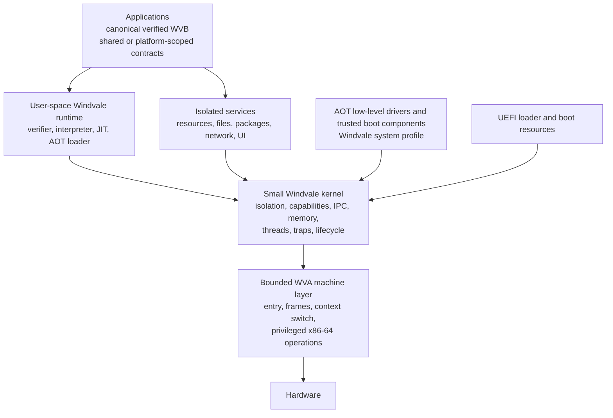

# Windvale OS architecture

## Status

Accepted long-lived architecture direction. [Decision 0084](../Decisions/0084-Minimal-Capability-Oriented-Windvale-Os-Architecture.md) records the kernel and service boundary; [Decision 0140](../Decisions/0140-Per-Module-Platform-Scope-And-Filesystem-Capabilities.md) records per-part platform scope and the application-library/provider boundary. Implementation remains incremental, and current behavior is defined only by qualified specifications or explicitly labeled candidate evidence.

This document fixes ownership, trust, and portability rules. It intentionally does not freeze syscall numbers, binary layouts, scheduling policy, package or filesystem formats, or other details that still need measured experiments.

## Short answer: what the OS is written in

The durable Windvale OS is written primarily in Windvale source (`.wv`), not C#.

- Windvale system-profile source owns kernel policy, state, validation, runtime services, system services, and drivers wherever the language can express them safely.
- WVA assembly (`.wva`) owns the small irreducible machine layer: privileged entry and exit, register frames, control-register operations, interrupt publication, context switching, and architecture instructions not yet expressible in Windvale.
- C# and .NET remain Stage 0 build, reference, and recovery tools while the native path is incomplete. They are not part of the permanent OS architecture. Every temporary C# OS emitter or adapter requires a named Windvale or WVA replacement seam.

The first versions may still be assembled, linked, packaged, launched, and independently checked by Stage 0 C# tools. That describes the bootstrap path, not the implementation language of the resulting OS.

## Goals

Windvale OS should:

- run the same canonical verified WVB program identity used on Windows and Linux;
- make authority explicit through capabilities rather than ambient privilege;
- keep the privileged kernel small enough to understand, test, and replace in bounded slices;
- use the shared Windvale native backend and ABI rather than create a kernel-specific compiler or language dialect;
- isolate failures and resource use at process and service boundaries;
- keep architecture-specific mechanics behind explicit WVA and target-adapter contracts;
- validate modules, packages, memory requests, and executable publication before use;
- remain reproducible and diagnosable from boot through application exit.

The first OS is not required to provide a desktop, broad hardware support, POSIX compatibility, a production network stack, or a permanently stable public ABI.

## Durable shape

Windvale adopts a small capability-oriented kernel with isolated services around it. This is a mechanism boundary, not a commitment to either a pure academic microkernel or an expanding monolithic kernel.

Some boot-critical adapters still reside with the kernel because the current isolated environment is one deliberately fixed process, not yet a service system. They remain named seams and move outside the kernel when init/resource, IPC, and capability evidence makes that safer and simpler. The design judges each move by trusted-code size, failure containment, performance, and implementation clarity rather than by a kernel-style label.

## Stable invariants

The following rules are intended to survive individual ABI and implementation revisions:

1. Canonical WVB is the program identity and cross-host distribution format. A particular module may use only shared contracts or may declare explicit platform-scoped requirements. Interpreted, JIT-compiled, cached, install-time, and AOT code are execution products of that identity, not different language semantics.
2. Kernel and low-level driver code is AOT. General JIT compilation never runs in the kernel; it runs in an ordinary process or an isolated authorized service.
3. The kernel grants no ambient filesystem, device, process, native-memory, or executable-publication authority.
4. Capabilities are unforgeable, rights-limited references to kernel-mediated objects. Raw host handles and persistent kernel pointers do not cross application or service boundaries.
5. Writable-or-executable discipline is mandatory. No accepted design requires a page to remain writable and executable.
6. Every loaded module, package, object, relocation, capability request, offset, length, and resource count is untrusted until validated within explicit limits.
7. CPU faults and Windvale runtime traps remain different contracts. A processor exception does not silently redefine a `WVR` language/runtime result.
8. Windows, Linux, and Windvale OS implement shared Windvale platform contracts and may expose explicit extensions. None of them defines language semantics, and an application is not required to support every environment when its platform scope is declared honestly.
9. C# is a bootstrap and recovery implementation only. New C# at a native or OS boundary must identify the Windvale or WVA component that will replace it.

## Kernel responsibilities

The kernel owns the mechanisms that require global authority or hardware privilege:

- early machine state after the boot handoff;
- CPU exception and interrupt entry, normalization, routing, and terminal kernel panic;
- physical-page ownership, virtual address spaces, mapping permissions, and isolation;
- process and thread lifecycle plus the minimum scheduling and waiting mechanisms;
- capability tables, rights reduction, revocation-safe identity, and kernel-object lifetime;
- bounded IPC endpoints and transfer of explicitly transferable capabilities;
- enforcement of executable-publication and verified-module admission policy;
- timers and interrupt bindings required for scheduling and device progress;
- clean platform shutdown and deterministic diagnostic transport;
- minimal boot-device mechanisms until an isolated driver or service can own them.

The kernel should not normally own language compilation, package policy, filesystems, networking policy, shells, graphical environments, general application runtimes, or the optimizing compiler. These belong in isolated Windvale services or processes when practical.

The semantic WVB verifier is a trusted Windvale component, but it need not become permanent core-kernel policy. Initially, an AOT verifier can be included in the boot image so it can validate the first WVB before an ordinary process exists. Later it can run as an isolated trusted service while the kernel continues to enforce that executable admission is backed by an accepted verifier identity and result.

## Process, thread, and capability model

A process is conceptually a protection domain containing:

- an isolated virtual address space;
- one or more schedulable threads;
- a capability table;
- the identity of its verified module and selected runtime contract;
- explicit memory, instruction, handle, and other resource budgets;
- lifecycle, result, fault, and diagnostic state.

This conceptual model is accepted. Qualified protected-process [version 11](../../Specifications/Windvale-Protected-Process.md) pressures that representation with separate init and interpreter roots, role-specific W^X extents, two init-owned typed RO/NX resources, one ordered atomic grant, two client aliases, execution-budget enforcement, automatic terminal cleanup, generation-safe same-root reuse, reduced rights, one kernel-owned capacity-one result channel, and closed lifecycle/fault/result evidence. This representation is implementation evidence, not yet a stable public process ABI.

A capability identifies a kernel-mediated object plus permitted operations. The current experiment uses slot 0, generation 1, machine reference 65536, a send-only client right, and init's combined receive-plus-fixed-grant rights. The one reference still names a deliberately closed boot contract rather than a general object table. The kernel checks every component before either channel or resource state changes. General capability allocation, transfer, revocation, and generation rollover remain unimplemented. References must not be recovered from raw addresses, and the current integer encoding remains internal and replaceable.

Application-library capability requirements are distinct from these internal object references. A library declares a versioned semantic requirement, the application explicitly approves its transitive requirements, init or a service manager grants a rights-limited instance, and the runtime binds the semantic operation to that instance. A required binding is established before process entry; an optional extension is reported absent before use. The binding may name an in-process provider on Windows or Linux and an IPC endpoint plus service-owned object on Windvale OS without changing the application-facing library contract. Binding does not promise permanent availability: revocation, stale generation, peer exit, service restart, and device removal remain explicit runtime outcomes.

Expected kernel-object families include processes, threads, address spaces, memory regions, channels or endpoints, interrupt bindings, device-memory ranges, and resource providers. This is a design inventory, not a commitment that every family is a public object or syscall.

## System calls and IPC

The system-call surface should be small, versioned, architecture-neutral at the semantic level, and concerned with mechanisms rather than high-level service policy. Likely operation families include:

- capability inspection, reduction, transfer, and close;
- memory creation, mapping, protection, sharing, and release;
- process and thread creation, start, wait, fault, and exit;
- channel creation, bounded send, bounded receive, and cancellation;
- timer or event waiting;
- interrupt and device-resource binding for authorized drivers;
- verified executable admission and publication.

x86-64 entry, exit, register preservation, and context-switch mechanics belong in WVA. Windvale source owns validation, policy, state transitions, accounting, and diagnostics.

Requests must use checked buffer descriptors and capability references rather than expose native structure layouts. The kernel validates address ranges, arithmetic, access direction, length, alignment, rights, and resource budgets before use. IPC requires bounded message and queue sizes, defined backpressure, and explicit behavior when a peer exits.

Protected-process version 11 retains the first measured register mechanics: `EBX` numbers 1/2/3 select send/receive/exit and number 4 selects the fixed atomic resource-set grant; `ESI` carries capability reference 65536; `EAX` carries the message/result or ordered set token `131073`. It preserves the ABI-17 context pointer in `RDX`, records role-specific extents and generation-stamped process identities, validates two `WVRES004` transitions per generation, and removes both aliases plus `WVBR002` when each fixed borrower becomes terminal. This assignment is experimental and internal. It is not general capability transfer or a public revocation API. Public user-ABI stability, larger-message encoding, copy-versus-map thresholds, ownership migration, independent resource lifetimes, non-tail reclamation, peer lifecycle, scheduling, and backpressure remain deferred.

## Memory and executable publication

The kernel owns physical pages, virtual mappings, protection changes, address-space isolation, and the final enforcement point for executable memory. A process runtime owns its language heap, roots, reclamation policy, and value representation within those mappings.

Executable publication follows a one-way discipline:

1. Accept canonical verified WVB or an authorized AOT artifact with complete identity and version inputs.
2. Validate native layout, relocations, bounds, architecture, ABI, and capabilities before publication.
3. Populate writable, non-executable memory.
4. Complete relocations and instruction-cache publication through the platform contract.
5. Remove write permission before granting execute permission.
6. Record ownership and lifetime so teardown, cache reuse, and fault attribution are deterministic.

JIT compilation occurs outside the kernel and receives only the minimum capability needed to request checked publication. Kernel code and low-level drivers use deterministic AOT images. No JIT service receives arbitrary kernel-memory access.

The current Windows/Linux bootstrap has already moved the allowed allocate/copy/seal/invoke/release state graph into Windvale under cross-host-qualified [Decision 0083](../Decisions/0083-Windvale-Owned-Native-Publication-Lifetime.md), while one bounded C# owner still performs the platform memory calls. This is a measured step toward the contract above, not the final OS publication boundary.

## Boot and trust chain

The first x86-64 path remains UEFI-based and evidence-driven. Qualified probes 24 through 32 establish interpretation, section-derived validation, runtime-supplied WVB, init ownership/grant, terminal cleanup, typed two-resource publication, generation-safe root reuse, two exact compiler-produced WVB modules, broader scalar/control-flow interpretation, and build-time native-stack proof:

1. A narrow loader validates its bounded inputs, captures the versioned handoff, loads the selected AOT kernel and boot resources, and exits boot services.
2. The kernel takes ownership of memory, its stack, exception state, page tables, and deterministic diagnostics. Firmware services are not used after the accepted exit boundary.
3. An AOT Windvale verifier/runtime component validates an embedded or image-contained canonical WVB module within explicit limits.
4. The kernel creates the first protected process, capability table, and resource budgets.
5. An init or service manager starts only the services authorized by the boot resource.
6. Ordinary modules execute through the same Windvale semantic and capability contracts used by the Windows and Linux hosts.

The boot container is a target artifact, not a replacement for WVB identity. Its package/resource format, integrity policy, measured-boot policy, and update scheme remain separate decisions.

## Services and drivers

Resource, package, filesystem, network, compiler, JIT, shell, and GUI policy belongs outside the kernel. Services communicate through bounded IPC and receive only declared capabilities. A service failure should not automatically become a kernel failure.

Platform libraries sit above these services. Ordinary applications call typed Windvale library contracts rather than syscalls or raw IPC. A Windvale OS runtime adapter validates values and messages, invokes the granted endpoint, validates the reply, and translates service lifecycle into the specified result. Mutating service protocols must preserve request correlation, exact progress, and indeterminate-completion evidence; neither the runtime nor service manager may blindly replay an uncertain mutation after restart. The kernel remains format-blind: it enforces endpoint identity, rights, buffer access, bounds, ownership, waiting, peer exit, and cleanup without interpreting file paths, resource names, window operations, or network protocols.

[Decision 0145](../Decisions/0145-First-Capability-Bearing-Static-Library.md) implements the first Stage 0 application-to-library authority chain without changing the kernel or WVB: a hosted application explicitly re-approves its platform library's transitive `file.read_bytes` requirement, the runtime still grants it separately, and capability-free Foundation validates the resulting immutable store. This is an opaque hosted-resource proof, not yet the typed Windvale OS service adapter or filesystem instance described below.

The filesystem is a family of capabilities rather than one kernel interface. A small shared core may cover only exact common semantics; atomic replacement, watching, links, permissions, memory mapping, sparse storage, transactions, and native OS facilities remain separate interfaces. Feature availability belongs to the granted filesystem or directory instance because volumes and remote stores on one OS can provide different guarantees. Application-visible file, directory, and watch references are typed capabilities; native handles, file descriptors, and kernel addresses remain provider details.

Drivers are AOT system-profile Windvale modules with explicit authority for the exact MMIO ranges, port-I/O ranges, interrupts, DMA resources, and kernel operations they need. WVA supplies instructions that cannot safely be expressed in `.wv`; it does not own device policy. Early serial, timer, interrupt-controller, or boot-storage code may begin in the kernel to establish the first working machine, but each such adapter needs an isolation or retention rationale.

Moving a driver out of the kernel is valuable only when the process and IPC boundary actually contains its failures without creating unbounded copying, hidden shared memory, or a second authority model. DMA isolation and IOMMU policy require their own later threat and hardware evidence.

## Failure and diagnostic model

- A user-process CPU fault terminates or reports against that process once process isolation exists; it should not normally panic the kernel.
- A Windvale runtime trap remains a defined semantic result and is reported through the owning runtime/process contract.
- A trusted service failure is contained where possible and handled according to explicit restart or dependency policy.
- A kernel invariant failure or uncontainable privileged CPU fault reaches a deterministic terminal panic path.
- Boot and automated tests retain machine-readable phase, status, and failure evidence with bounded timeouts.

Recovery, retry, restart, and resumable-exception policies must be added deliberately. Qualified normalized vector-6/vector-13 evidence proves only bounded terminal entry, not a general recovery design.

## Language and bootstrap ownership

| Concern | Durable owner | Current bootstrap allowance |
| --- | --- | --- |
| Kernel policy, state, validation, and diagnostics | System-profile Windvale (`.wv`) | C# may temporarily emit or independently verify a bounded object behind a named seam |
| Privileged entry, register frames, context switch, and architecture instructions | WVA (`.wva`) | A bounded C# machine-code emitter may remain only until WVA can express and verify the exact shape |
| WVB decoder and semantic verifier | Windvale, AOT for the first trusted boot component | C# remains the reference oracle and current host implementation |
| Interpreter, baseline JIT, AOT orchestration, and runtime | Windvale outside the kernel, except minimal trusted admission enforcement | C#/.NET remains Stage 0 until the native-retirement gate passes |
| Kernel and low-level driver machine code | Shared Windvale native backend, deterministic AOT | Stage 0 may build, link, package, and independently inspect it |
| Files, packages, network, shell, GUI, and most device policy | Isolated Windvale services | Minimal boot adapters may temporarily remain with the kernel |
| PE/COFF, ELF, UEFI, and future boot containers | Explicit target adapters | Current C# target writers are replaceable bootstrap components |

This split avoids two traps: keeping the OS dependent on .NET, and inventing a second kernel-only language implementation that forks Windvale semantics.

## Incremental implementation path

Each step must be useful, bounded, and independently qualified:

1. Complete the single-address-space machine foundation: normalized exception frames, essential faults, deterministic panic, page-table ownership, and clean shutdown.
2. Replace remaining raw machine emitters with WVA as the assembler contract gains the required instructions, while moving policy and validation into `.wv`.
3. Place an AOT Windvale WVB decoder and semantic verifier in the boot image and use it to validate one embedded canonical module inside the guest.
4. Add one protected user address space, one thread, a capability table, bounded resource accounting, and one IPC channel.
5. Start a minimal Windvale init/resource service and run the verified module outside the kernel.
6. Move the interpreter and later JIT into ordinary or isolated processes; enforce verified W^X publication at the kernel boundary.
7. Add drivers and resource services one measured device and contract at a time.
8. Prove the exact same WVB bytes, verifier result, outputs, diagnostics, and defined resource counters on Windows, Linux, and Windvale OS.

The first concrete step-2 migration is implemented locally: typed byte/word WVA now owns the common kernel exception terminal, its bounded COM1 polling loop, panic-marker data, Q35 exit, and fallback halt path. Descriptor construction remains a named Stage 0 seam, and the migrated path is not cross-host or pinned-QEMU qualified until those gates report against the same commit.

[Decisions 0085](../Decisions/0085-First-Wva-Owned-Q35-Clean-Shutdown.md) and [0086](../Decisions/0086-First-Wva-Owned-Normalized-X64-Trap-Entries.md) qualify clean Q35 shutdown and the first two normalized trap examples through the pre-paging probe-20 baseline at `12e9e2e`. Exact commit `860c69c` then qualifies [Decision 0088](../Decisions/0088-First-Kernel-Owned-X64-Page-Tables.md)'s bounded kernel root and [Decision 0090](../Decisions/0090-First-In-Guest-Wvb-Admission.md)'s fixed in-guest WVB admission.

[Decision 0091](../Decisions/0091-First-Protected-Windvale-Process.md) implements step 4: the admitted Windvale AOT program executes at CPL3 under a separate root, uses a generation/rights-checked capability to send and receive one register message, exits through `SYSCALL`, and can take a contained user general-protection fault while equivalent CPL0 faults remain terminal. Windvale owns the fixed process policy, WVA owns user syscall and exception-entry bytes, and the page/descriptor/MSR/dispatcher object remains a named Stage 0 replacement seam.

[Decision 0092](../Decisions/0092-First-Windvale-Init-Resource-Service.md) implements step 5: a Windvale init/resource service blocks with receive-only authority, a client runs under a second root with send-only authority, and one kernel-owned message wakes the service. Both normal client exit and contained client fault permit the independent service to complete. Its composition is cross-host qualified by the later probe-24 checkpoint at `190174a`.

[Decision 0093](../Decisions/0093-First-User-Space-Windvale-Bytecode-Interpreter.md) implements the first bounded step-6 slice as cross-host-qualified probe 24. The second process contains an AOT-built Windvale interpreter, records the interpreter and admitted-program identities separately, and derives result `29` from the admitted WVB instructions at CPL3. The admitted program's host-built AOT derivative is absent from that path.

[Decision 0094](../Decisions/0094-First-Section-Derived-User-Space-Wvb-Profile.md) advances cross-host-qualified probe 25. The interpreter validates the module envelope, derives all seven section payloads, checks the bounded function/export shape, and executes a second compiler-produced module after a longer name moves its code payload.

[Decision 0095](../Decisions/0095-First-Runtime-Supplied-Wvb-Boot-Resource.md) advances cross-host-qualified probe 26. The hosted Windvale interpreter declares only `file.read_bytes`, fetches `boot:main.wvb` through an exact WVA-owned ABI-16 leaf, and receives a borrowed descriptor into a separate RO/NX page. Stage 0 still creates that fixed resource and republishes the verified WVA stencil as code; the init service does not yet own or transfer it. This is a real runtime input, but not a filesystem, general resource namespace, loader, runtime selector, JIT publication service, or scheduler.

[Decision 0096](../Decisions/0096-First-Windvale-Init-Owned-Boot-Resource-Grant.md) advances cross-host-qualified probe 27. Init owns the admitted WVB page, Windvale `Main` selects fixed resource `1`, the client begins without a resource PTE or service pointers, and one validated syscall installs a RO/NX alias plus its ABI-16 tables. Init remains lifetime owner; the client is one fixed borrower. This moves real policy into Windvale without claiming a namespace, general handle transfer, ownership migration, package service, or scheduler.

Qualified [Decision 0097](../Decisions/0097-First-Terminal-Resource-Borrow-Revocation.md) advances probe 28. The Windvale policy requires zero live mappings after the borrower becomes terminal. Stage 0 revalidates the exact live borrow, accepts only the x86 processor-maintained leaf accessed bit, clears the client PTE and complete private resource publication, preserves init ownership and one historical grant, then reloads init's CR3. This is bounded lifecycle evidence, not page reclamation, reusable address-space teardown, SMP shootdown, or a general revocation interface.

Qualified [Decision 0098](../Decisions/0098-First-Typed-Two-Resource-Lookup.md) advances probe 29. Init selects the ordered set `(1,2)` containing the WVB and a separate four-byte execution budget. The kernel publishes two distinct RO/NX aliases and `WVBR002` atomically; the WVA leaf performs typed lookup; the Windvale interpreter charges budget per opcode; terminal cleanup revalidates and clears the complete pair. Pinned QEMU also measures a four-page kernel stack as necessary for the enlarged Windvale policy. This is still a fixed two-entry set with one lifetime, not dynamic enumeration, package lookup, independent revocation, or reclamation.

Qualified [Decision 0100](../Decisions/0100-First-Reclaimed-And-Reused-Process-Root.md) advances probe 30 at exact implementation commit `4a077ab`. After generation-1 cleanup, kernel memory 7 accepts only that exact 42-page allocator tail, zeroes it, restores the cursor, and immediately returns the same root to generation 2. `WVPROC09` and `WVRES004` distinguish logical identity from physical address through generation-stamped references and preserved grant history. Init grants/receives twice; the same interpreter runs twice; stale generation-1 evidence is rejected. This is real reclamation and reuse, but only for one LIFO extent on one CPU—not a general allocator, process manager, scheduler, PCID protocol, or SMP shootdown design.

Qualified [Decision 0101](../Decisions/0101-First-Exact-Wvb-Across-Three-Environments.md) advances Probe 31. The exact canonical `Sum-Data.wv` WVB runs through the Windows and Linux reference/native paths and in both protected OS generations, executing data, loop, local, call, and branch behavior to the same result `29`. This completes the first Phase-12 portability proof without claiming arbitrary loading or a general interpreter.

Qualified [Decision 0103](../Decisions/0103-Second-Exact-Wvb-And-Broader-Scalar-Control-Flow.md) advances Probe 32 to the existing `Function-Only.wv` cross-compiler fixture. Its exact 815-byte WVB exercises four functions and `bool`/`u8`/`u32`/`i32` control flow for 199 guest instructions and result `6`. The interpreter derives valid instruction boundaries, the process builder derives the exact 58,800-byte maximum native stack from verified call edges and frames, and `WVPROC11` binds the resulting 141-code-page/15-stack-page composition. The compiler remains at ABI 17. Exact implementation commit `da93897` passes complete Windows/Debian qualification in GitHub run 30758910402.

Qualified [Decision 0105](../Decisions/0105-Typed-Block-Scoped-Native-Value-Slots.md) advances the shared backend to ABI 18, selected from that measured stack and image pressure. It preserves Probe 32's WVB, interpreter behavior, process format, paging, resources, and serial contracts while reusing exact-type physical value cells across verified empty-stack blocks. `Executeˉmain` now needs 745 actual frame cells, the complete call graph needs 23,824 bytes in a minimal six-page stack, and the client needs 102 code pages. `WVKMEM10` therefore shrinks the reclaimable client extent from 161 to 113 pages and the bounded kernel arena from 182 to 134 pages. Exact implementation commit `484c228` passes Windows/Debian qualification in GitHub run 30762156220; all four Windows pinned-QEMU scenarios pass.

Qualified [Decision 0108](../Decisions/0108-Native-One-Byte-Construction.md) advances the shared backend to ABI 19 without changing Probe 32's reachable operation set, WVB, process/memory formats, stack proof, or firmware bytes. Windows and digest-pinned Debian each pass all 25 OS tests, while all four exact Windows pinned-QEMU scenarios retain their qualified identities. ABI 19 / `WVKMEM10` is therefore the latest qualified shared native/OS baseline.

Qualified [Decision 0109](../Decisions/0109-Native-Two-Byte-Little-Endian-Construction.md) advances the shared implementation to ABI 20 by adding an operation not reachable from Probe 32. It retains the guest WVB, generated probe fragments, process/memory formats, stack proof, and `WVKMEM10` policy. Windows and digest-pinned Debian each pass all 25 OS tests, while all four pinned Windows QEMU scenarios retain their exact firmware identities. ABI 20 / `WVKMEM10` is therefore the latest qualified shared native/OS baseline.

Implemented-candidate [Decisions 0126](../Decisions/0126-First-Read-Only-Resource-Store.md), [0129](../Decisions/0129-Bounded-Resource-Service-Request-Reply.md), [0135](../Decisions/0135-Bounded-Guest-Resource-Request-Reply.md), and [0142](../Decisions/0142-Immutable-Guest-Resource-Store.md) add the first post-Probe-32 resource pressure without making the kernel a filesystem. `WVRS 1` owns deterministic typed lookup; one-page `WVRQ 1` / `WVRY 1` owns correlation, limits, canonical failures, and copied inline results. Probe 34 advances to `WVPROC13`, `WVCHAN03`, `WVRES005`, and a 143-page `WVKMEM12` arena while retaining ABI 21's 109-page client image and 120-page same-root rebuild. Init alone receives an independently mapped 1,195-byte RO/NX three-entry store. Its WVA seam validates the exact bounded profile, selects the requested name dynamically, and constructs the reply in RW/NX data; the kernel remains format-blind. Terminal client exit or fault clears retained message/destination state and records peer status before a checked generation-2 reopen. All four Windows pinned-QEMU scenarios pass. This does not yet define paths, directories, enumeration, handles, providers, block storage, mutation, or persistence.

Cross-host-qualified [Decision 0133](../Decisions/0133-Frame-Owned-Direct-Native-Records.md) rebuilds Probe 32 through the single ABI-21 backend. The exact WVB, 199-instruction result, `WVPROC11`, resource lifecycle, fault behavior, and six-page stack envelope remain unchanged. The process builder consumes the compiler's projected frame plan: `Executeˉmain` needs 755 cells and the deepest call path needs 24,240 bytes. Explicit direct-record copies grow the linked client to 445,085 bytes and 109 RX pages, while record-arena use falls from 528 to zero. `WVKMEM11` supplies a 120-page client root inside a 141-page arena. Windows and Debian pass all 31 OS tests; all four Windows pinned-QEMU scenarios pass.

Cross-host-qualified [Decision 0150](../Decisions/0150-Bounded-Native-Dynamic-Value-Lifetimes.md) rebuilds Probe 34 through ABI 22. The normal client grows to 447,757 bytes and 110 RX pages; `WVKMEM13` supplies a 121-page client root alongside the retained 11-page init/resource extent in a 144-page arena. The exact WVB, `WVPROC13`, 755-cell interpreter frame, 24,240-byte stack path, zero record-arena use, resource lifecycle, and fault behavior remain unchanged. Exact descendant `2591cd5` passes all 31 OS tests on Windows and digest-pinned Debian in GitHub Verify run 30797770080; all four pinned-QEMU scenarios pass on Windows.

This sequence may interleave with native Windows/Linux work. It does not require .NET retirement before useful OS progress, and it does not treat host-built AOT evidence as in-guest verification.

## Deliberately deferred choices

The following should remain open until a focused implementation supplies evidence:

- stable public syscall numbers, register assignments, and user ABI (the version-6 internal experiment is not frozen);
- scheduler algorithm, priority model, real-time policy, and SMP strategy;
- IPC wire encoding, zero-copy thresholds, and service discovery;
- virtual-address layout, page size policy beyond architecture requirements, and shared-memory model;
- language heap, garbage collection, ownership, and reclamation strategy;
- package/archive format, filesystem on-disk format, namespace encoding, exact common filesystem-core operations, and update mechanism;
- driver isolation granularity, DMA/IOMMU policy, and supported device families;
- executable cache format and native-code persistence policy;
- network stack, GUI/compositor, compatibility layers, and application model;
- secure boot, signatures, measured boot, and recovery/update policy.

Deferring these is not indecision. It protects Windvale from supporting an accidental early ABI for years.

## Design review and risks

| Risk | Architectural response |
| --- | --- |
| C# quietly becomes permanent | Every C# OS/native boundary has a named `.wv` or `.wva` destination, and Decision 0057 controls removal from normal use |
| The kernel grows into every subsystem | Kernel ownership is limited to privilege, isolation, capabilities, IPC, memory, lifecycle, and unavoidable boot mechanisms |
| A strict microkernel creates complexity before it creates isolation | Early boot-critical code may remain local; movement to services requires measured containment and cost evidence |
| The first WVB cannot be verified without already running WVB | Boot an AOT Windvale verifier as a trusted component, then use it to admit canonical WVB |
| Unsafe system facilities leak into ordinary application code | Authority metadata, syntax, verifier rules, and explicit system capabilities keep privilege separate from platform scope |
| JIT code weakens the kernel trust boundary | JIT stays outside the kernel; publication is bounded, validated, capability-authorized, and W^X |
| Host or x86 details become language semantics | WVB and semantic operations remain architecture-neutral; WVA and target adapters own mechanics |
| Early encodings become permanent ABI debt | Stabilize invariants now, version experimental contracts, and defer public binary compatibility |
| Driver isolation prevents practical progress | Add one measured AOT driver at a time and choose kernel or service placement from containment and cost evidence |
| The design becomes documentation without a working path | Advance only through bounded boot, verifier, protection, IPC, service, and cross-host evidence slices |

## Reconsideration triggers

Revisit this direction if evidence shows that:

- the capability model cannot express required sharing or revocation without hidden global authority;
- the kernel/service split materially prevents deterministic progress or failure containment;
- a shared AOT/JIT backend cannot safely support both host and OS execution;
- Windvale system-profile semantics cannot express kernel policy without an unreviewable unsafe surface;
- a required architecture cannot implement the semantic syscall and capability contracts;
- measured IPC, process, or driver costs require moving a specific mechanism across the boundary;
- the trusted verifier cannot be isolated or updated without weakening executable admission;
- recovery evidence requires a maintained non-Windvale implementation rather than an archived Stage 0 path.

Any reconsideration changes a named boundary through a new decision. It must not silently make C#, a host ABI, or a machine architecture the definition of Windvale.
