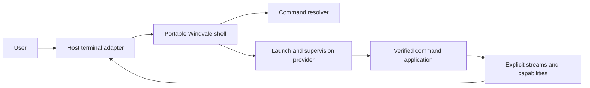

# Windvale shell product and architecture

## Status

Proposed product and architecture elaboration for the shell boundary accepted by
[Decision 0191](../Decisions/0191-Windvale-Console-Shell-And-Cli-Architecture.md)
and the broader [console, shell, and CLI architecture](Console-Shell-And-Cli.md).
This document records the intended experience, portable ownership boundary,
command model, and staged delivery plan so they can be evaluated before a shell
grammar or public application contract is frozen.

No Windvale OS terminal-input service, permanent shell application, general
process launcher, standard-input stream, pipeline, redirection, or job-control
contract is implemented by this document. The current browser Workbench command
line is a JavaScript host prototype; its file and editor commands are not the
Windvale shell or Windvale OS applications.

The compatibility analysis follows the accepted
[platform and portability model](Platform-And-Portability.md), the current
[Windvale OS architecture](Windvale-Os-Architecture.md), and the bounded
[browser playground contract](../../Specifications/Browser-Playground.md).
WebAssembly's possible status as a permanent host remains a separate product
decision; this document defines what compatibility would require from that host.

The exact proposed first grammar and command boundary are extracted into
[Windvale Shell 1](../../Specifications/Windvale-Shell-1.md). The ordered
[implementation-readiness plan](../Project/Windvale-Shell-Implementation-Readiness.md)
separates work that can begin with current portable facilities from terminal,
launch, stream, browser, and Windvale OS prerequisites that remain absent.

## Product intent

Windvale should have one small capability-native shell implemented in Windvale
and usable on Windvale OS, Windows, Linux, and the browser-hosted Workbench. The
same Windvale source and canonical WVB should own portable parsing, resolution,
help, completion, session policy, launch-plan construction, and result handling.
Each environment supplies only the rights-limited terminal, launch, filesystem,
package, time, and persistence providers available there.

The experience should borrow PowerShell's strongest qualities:

- consistent command conventions;
- discoverable commands, options, and help;
- completion backed by declared metadata rather than filesystem guessing;
- normal output kept separate from diagnostics;
- structured failure and, later, structured data composition; and
- the ability to inspect what a command resolves to before it runs.

Windvale should not copy PowerShell's long names as the only usable spelling,
its large dynamic object and conversion surface, ambient profiles, or its role
as a second general-purpose programming language. Serious automation remains an
ordinary verified Windvale application. The shell is an intentionally smaller
interactive composition environment.

## Experience principles

The shell should feel:

- **short:** common commands are quick to type and canonical names remain
  readable;
- **discoverable:** a user can find commands and understand their arguments,
  output, authority, and origin without executing them;
- **predictable:** quoting, expansion, command selection, completion, and status
  do not depend on locale, an ambient `PATH`, or mutable directory scanning;
- **capability-visible:** command spelling grants no authority, and exceptional
  access can be inspected before launch;
- **portable:** the same command means the same thing on every host that supplies
  its declared semantic capabilities;
- **bounded:** every command line, argument, completion result, output queue,
  history entry, pipeline, job set, and diagnostic has an explicit limit; and
- **honest:** provider loss, cancellation, verifier rejection, capability denial,
  application failure, and forced termination remain distinct.

Familiar aliases such as `cat`, `ls`, `rm`, `ps`, and `pwd` may make interactive
use comfortable. An alias changes only spelling; it cannot add arguments, hide
syntax, select a different authority profile, or bypass exact command identity.

## One shell across hosts

The portable shell is an ordinary capability-restricted Windvale application.
It is not embedded in the kernel, terminal service, browser page, or native host
launcher.



The shared shell owns:

- the bounded Shell 1 parser and later explicitly versioned grammar additions;
- prompt policy and private shell-session state;
- help, command discovery, completion, and alias interpretation;
- resolver requests and presentation of exact resolved identities;
- immutable application arguments and semantic launch-plan requests;
- foreground command and later pipeline orchestration;
- structured completion handling and the most recent command result; and
- portable formatting policy when a command explicitly supplies structured
  output.

Host or OS providers own:

- keyboard, serial, graphical, or remote terminal mechanics;
- terminal events, dimensions, editing surface, and presentation;
- exact package-generation lookup and immutable object acquisition;
- process admission, verifier/runtime selection, resource domains, execution,
  cancellation, observation, and teardown;
- concrete directory, file, clock, history-store, and administrative capability
  instances; and
- platform-specific diagnostics that do not redefine shell semantics.

Windows and Linux may initially execute the canonical shell WVB through the
Windvale runtime. Windvale OS may interpret, JIT, cache, or AOT-compile the same
WVB without changing its behavior. The browser may run it through the bounded
WebAssembly-hosted interpreter and adapt browser storage to the same semantic
filesystem capabilities. One source and one conformance suite are required;
byte-identical host-native executables are not.

## Compatibility model

Shell compatibility is a semantic claim with four distinct levels:

1. **core compatibility:** the same command bytes produce the same parse,
   resolution request, immutable arguments, and portable diagnostics;
2. **command compatibility:** an application with the same exact identity and
   bound semantic capabilities produces the same defined output and completion;
3. **session compatibility:** current location, aliases, history policy,
   cancellation, and foreground completion follow the same contracts; and
4. **integration compatibility:** a host may add explicitly scoped commands or
   terminal features without claiming they exist everywhere.

A host is not shell-compatible merely because it can display a prompt. A
compatibility claim names the supported level, shell and WVB identities,
provider contract versions, command-generation identity, and qualification
evidence. Optional host integration must remain observable and must not weaken
core or command compatibility.

The intended first host profiles are:

| Concern | Windows host | Linux host | Windvale OS | Browser/WebAssembly host |
| --- | --- | --- | --- | --- |
| Shell implementation | canonical WVB through the Windvale runtime, with optional shared-backend native execution | same canonical WVB and runtime/native semantics | same canonical WVB interpreted, JITed, cached, or AOT-compiled | same canonical shell WVB through a bounded WebAssembly-hosted runtime in a worker |
| Terminal adapter | Windows console or graphical terminal integration | TTY, PTY, or graphical terminal integration | isolated terminal service over serial first, graphical later | DOM presentation and input adapter outside the worker |
| Command resolver | immutable active-generation service; current host dispatcher is bootstrap evidence | same active-generation semantics | user-space package/resolver service | digest-verified static or origin-stored generation through a browser adapter |
| Process execution | clean Windvale launch provider over Windows process/runtime mechanisms | clean Windvale launch provider over Linux process/runtime mechanisms | service-manager launch into a bounded resource domain | disposable or supervised workers representing isolated command executions |
| Filesystem | rights-limited providers over explicitly selected Windows objects | rights-limited providers over explicitly selected Linux objects | filesystem service endpoints and directory capabilities | rights-limited providers over OPFS or session memory |
| Cancellation | typed shell cancellation translated by the Windows adapter | typed shell cancellation translated by the Linux adapter | terminal event and authorized process cancellation | cooperative worker message, then explicit forced worker termination |
| Persistence | explicit history/configuration store, never `%USERPROFILE%` discovery | explicit history/configuration store, never `$HOME` discovery | explicit user-space storage capability | explicit origin-scoped store; absence or eviction remains observable |
| Host extensions | explicitly Windows-scoped applications | explicitly Linux-scoped applications | explicitly Windvale-OS-scoped applications | explicitly browser/Workbench-scoped applications |

The browser is the host environment in the last column. WebAssembly supplies a
bounded execution representation but does not itself supply terminals, files,
processes, packages, time, identity, or persistence. JavaScript may implement a
host adapter, but portable Windvale code never receives the DOM, an OPFS handle,
a worker object, or an unrestricted JavaScript import surface.

### Shared semantic baseline

The following behavior must not vary by host:

- command input is strict UTF-8 with explicit byte and word bounds;
- parsing and quoting use the selected Shell grammar, never the invoking host's
  command-line parser;
- canonical command and alias comparison is ordinal and case-sensitive unless a
  later shell version explicitly selects another rule;
- arguments are one ordered immutable text vector and do not contain the shell
  executable, host launcher options, an ambient command-line string, or an
  inherited environment;
- `--` has the same application-option meaning on every host;
- resolution uses one immutable active-generation identity and never scans a
  Windows `PATH`, Linux `PATH`, browser storage names, or the current directory;
- text output is strict UTF-8 and captured lines use LF bytes even when a host
  terminal renders them differently;
- standard output, diagnostics, terminal control, and structured completion are
  separate channels;
- current location is authority represented by a directory capability, not a
  process-global native path string;
- application capability requirements, approval, concrete grants, and provider
  binding remain separate;
- provider loss, cancellation, forced termination, verifier rejection, language
  trap, and normal nonzero application result remain distinct;
- directory and command enumeration use canonical deterministic ordering rather
  than provider-native ordering; and
- deadlines and resource meters use Windvale contracts rather than host clock,
  scheduler, or process-accounting accidents.

An interactive command entered inside Windvale Shell is therefore parsed only
once by Windvale Shell. When a native Windows or Linux launcher starts the shell,
that outer launcher may necessarily receive host-parsed arguments; it must place
only the explicitly separated application arguments into Windvale's immutable
argument snapshot. Host quoting rules end at that outer boundary and do not
become Shell 1 syntax.

### Compatibility versus command availability

The shell core can be portable even when a particular command is not. Every
command record declares its supported platform scope and required semantic
capabilities. The active resolver exposes only identities that can be considered
for the current target, while command inspection can explain that an installed
identity is unavailable because of target, profile, provider, approval, or
policy.

The baseline catalog should prefer commands whose semantic interfaces can be
implemented on all four hosts. Platform-scoped commands remain explicit:

```text
command-info vm-list
Platform       windvale-os, windows, linux
Browser        unsupported: no VM observation provider
```

Absence is not emulation. A browser adapter must not return invented process or
filesystem information merely to make a command appear portable. Conversely, a
Windows- or Linux-specific application does not make the portable shell itself
platform-specific.

## Host compatibility details

### Windows

The Windows adapter may use Windows console, process, filesystem, and secure
storage mechanisms, but their native values do not enter portable shell
semantics.

- Drive letters, UNC spellings, `\\?\` paths, Win32 handles, alternate data
  streams, reparse points, file attributes, access-control lists, and
  case-insensitive lookup are available only through explicit provider or
  Windows-extension contracts.
- A current directory grant has a provider-supplied display identity. It is not
  `%CD%`, a drive-relative path, or an inherited process working directory.
- The provider must preserve ordinal capability names even when the underlying
  filesystem normally folds case. Two portable names cannot silently alias one
  native object.
- Windows CRLF presentation does not change captured Windvale LF output. A
  console adapter may render LF appropriately without rewriting redirected or
  hashed output bytes.
- Windows command-line quoting, `%VAR%` expansion, PowerShell expressions,
  `.exe` suffix inference, file associations, and `PATHEXT` are not Shell syntax
  or command discovery.
- Console control events and process termination are translated into typed
  cooperative cancellation or distinct forced termination. They are not exposed
  as portable signals.
- A Windows-native application is launched only by an explicitly scoped adapter
  and manifest. Typing a path to an `.exe` does not make it a Windvale command.

Windows Terminal, ConPTY, or another presentation mechanism can improve native
integration, but no one of them is required by the semantic shell contract.
Interactive terminal capabilities are reported explicitly so redirected,
headless, and test sessions do not pretend to have cursor or resize authority.

### Linux

The Linux adapter may use TTY/PTTY, process, filesystem, and secure storage
mechanisms without importing POSIX shell behavior.

- `/` paths, file descriptors, inode numbers, mount namespaces, ownership and
  mode bits, symlinks, device nodes, and case-sensitive native lookup are exposed
  only through explicit provider or Linux-extension contracts.
- `fork`, inherited descriptors, ambient current directories, environment
  inheritance, sessions, process groups, and POSIX signals are not foundational
  Windvale launch or job semantics.
- Bash quoting, globbing, `$VAR`, command substitution, shebang lookup, executable
  mode bits, and `PATH` scanning are not Shell syntax or command discovery.
- A TTY adapter translates bytes and control keys into versioned terminal events.
  CLI applications do not parse `termios` state or ANSI input unless they request
  a separately scoped compatibility interface.
- LF is already a natural terminal convention on Linux, but output remains
  defined by Windvale rather than by libc, locale, or terminal settings.
- Cooperative cancellation and provider loss remain typed outcomes; they are not
  reduced to numeric POSIX signal exits.

A separately packaged POSIX-compatibility shell or application adapter may be a
future Linux product feature. It does not alter the Windvale Shell grammar or
grant native process authority to ordinary portable commands.

### Windvale OS

Windvale OS is the native integration target but does not receive exceptions to
the shell boundary.

- The shell remains an ordinary verified user-space application. It is not init,
  a kernel monitor, terminal driver, package service, or service manager.
- The first normal terminal is expected to use isolated serial mechanics and one
  terminal session while the independent kernel emergency sink remains usable
  after shell or service failure.
- The terminal service publishes bounded text, key, resize, interrupt,
  end-of-input, and disconnect events. The shell never receives scan codes,
  interrupt-controller state, or device registers.
- The user-space resolver selects an exact installed command generation. The
  service manager admits an immutable launch plan and creates a clean process in
  a bounded resource domain.
- Filesystem operations go through isolated services and generation-safe
  directory/file capabilities. The kernel does not parse paths or implement
  shell redirection.
- Runtime choice—interpreter, JIT, install-time cache, or AOT—does not change
  command identity, arguments, capability behavior, output, or completion.
- Shell failure may allow a supervised replacement shell to attach to a surviving
  terminal session. It must not remove the emergency sink or silently inherit
  the previous shell's grants.

The current OS proves protected processes, endpoints, a directory-service slice,
bounded scheduling evidence, and exact WVB execution; it does not yet implement
the dynamic launch, resource-domain, isolated normal input/output, package
resolver, or terminal-session prerequisites needed by Shell 1. A host shell may
advance the portable implementation first, but host completion is not evidence
that the in-OS service path exists.

### Browser and WebAssembly

The browser profile should exercise the same shell and applications while
respecting the browser's containment and lifecycle model.

- The shell and every launched command run off the UI thread. The page owns
  presentation only; expensive or hostile Windvale work remains in bounded
  workers.
- A command worker receives copied immutable request bytes, exact artifact
  identities, declared grants, and resource limits. It receives no DOM, browser
  console, cookies, network authority, extension API, or ambient origin storage.
- OPFS and session memory are provider implementations. Applications see only
  versioned directory/file capabilities with explicit snapshot, mutation,
  durability, quota, and provider-loss behavior.
- Origin identity, browser profile, private-browsing mode, storage eviction, tab
  closure, refresh, and service-worker replacement are not portable filesystem
  semantics. Their effects surface as absence, revocation, provider loss, or a
  new session generation.
- Browser workers are not portable process identities. Cooperative cancellation
  is requested through the semantic provider; worker termination is reported as
  forced termination or provider loss and triggers complete host-side cleanup.
- Browser timers, event-loop scheduling, background throttling, and page
  visibility cannot define deadlines or resource accounting. The host adapter
  reports its supported deadline/meter profile explicitly.
- WebAssembly linear memory, imports, traps, and JavaScript exceptions never
  become Windvale application errors directly. The runtime validates envelopes
  and maps only specified outcomes into structured completion.
- The first shell profile must not require WebAssembly threads, shared memory,
  cross-origin isolation, synchronous filesystem access, or a service worker.
  Later accelerated profiles may declare those requirements explicitly.
- A digest-verified static package may supply the initial shell and command
  generation. OPFS filenames, URLs, cache entries, and fetched response order are
  acquisition details rather than executable identity.

The browser terminal may offer graphical editing, tabs, clipboard actions, and
resize events, but those features are optional terminal capabilities. Clipboard,
file-picker, download, upload, drag-and-drop, and network access require separate
user-mediated grants and are never implied by the shell's presence on a web page.

## Cross-host provider rules

### Terminal and presentation

The semantic terminal contract publishes typed events and receives presentation
operations. Host adapters may render colors, fonts, cursor shapes, and window
chrome differently. They must preserve ordered text/key events, bounded resize
coalescing, interrupt, end-of-input, disconnect, and strict UTF-8 behavior.

The terminal service owns input decoding, the generic editable buffer, cursor
movement, selection, and rendering. The shell owns prompt content, command-aware
completion candidates, and history policy. They compose without callbacks: the
terminal publishes bounded `Submit`, `Complete`, `History`, `Interrupt`, and
`Disconnect` requests; the shell returns bounded prompt, replacement, candidate,
or refusal operations. Exact record encodings remain a prerequisite contract,
but Windows key events, Linux terminal bytes, browser DOM events, and Windvale OS
scan codes stop at the terminal adapter.

Prompt wording and portable diagnostics should be deterministic when captured.
Purely visual styling is not part of captured output. Terminal dimensions are
positive bounded character cells when available; lack of dimensions is explicit
rather than replaced by a guessed host default.

### Files and current location

Portable commands operate on capability-relative names and objects rather than
native absolute paths. The current location combines one directory capability
with an informational display identity. Passing that identity back to a provider
does not recreate authority.

Shared filesystem contracts specify name encoding, case comparison, segment
rules, ordering, object kinds, snapshot or live behavior, partial progress,
durability, revocation, and provider loss. Stronger Windows, Linux, Windvale OS,
or browser guarantees use separate interfaces. The current read-only directory
capability's ordinal single-segment snapshot is a suitable early `file-read`
input but is not yet a general current-directory or enumeration contract.

### Launch, cancellation, and teardown

Windows processes, Linux processes, Windvale OS processes, and browser workers
have different mechanics. The shell sees one semantic launch/observation model:
exact admitted image, immutable inputs, granted providers, resource ceilings,
foreground attachment, typed cancellation, structured completion, and proof of
cleanup.

An adapter must not implement clean spawn by leaking its own environment,
handles, file descriptors, credentials, working directory, browser globals, or
service endpoints. If a host cannot prove complete cleanup, completion reports
that fact rather than pretending the command exited normally.

### Streams and pipelines

Native pipes, OS endpoints, and browser message channels can implement the same
bounded directional byte-stream contract, but none defines it. Every adapter
must preserve accepted-prefix progress, backpressure, end-of-stream, peer loss,
cancellation, and teardown behavior. Browser message copying, Windows pipe
buffering, Linux pipe sizes, and Windvale OS endpoint queues are not observable
portable constants.

Shell 2 cannot be declared cross-host compatible until the same pipeline
fixtures pass through all claimed adapters, including a slow reader, early
reader exit, writer failure, cancellation under backpressure, provider loss,
and aggregate resource cleanup.

### History, configuration, and host integration

History and configuration are optional bounded stores, not discovered dotfiles,
registry keys, environment variables, or browser local-storage conventions. One
portable record format may be used when its security, versioning, atomicity, and
recovery behavior are specified. A host may present native settings UI around
that provider without changing shell-visible values.

Default startup performs no hidden execution. Host integration packages may add
commands or aliases through the active generation, but cannot inject shell code,
change grammar, or gain authority merely because they were installed by the
operating system or browser site.

## Compatibility qualification matrix

The same fixtures should be executed through each claimed profile:

| Evidence | Windows | Linux | Windvale OS | Browser/WebAssembly |
| --- | :---: | :---: | :---: | :---: |
| Exact Shell 1 parse and diagnostics | required | required | required | required |
| Exact active-generation command resolution | required | required | required | required |
| Exact argument vector and `--` preservation | required | required | required | required |
| Exact portable text-output bytes and structured completion | required | required | required | required |
| Capability refusal before entry | required | required | required | required |
| Read-only directory snapshot command | required | required | required | required |
| Cooperative cancellation | required | required | required | required |
| Forced termination distinguished from cancellation | required | required | required | required |
| Provider loss and stale-generation rejection | required | required | required | required |
| Resource exhaustion with bounded diagnostics and cleanup | required | required | required | required |
| Host-specific command accurately reported unavailable elsewhere | required | required | required | required |
| Pipeline backpressure and aggregate teardown | Shell 2 | Shell 2 | Shell 2 | Shell 2 |

Qualification records identify the exact shell WVB, command WVBs, active
generation, runtime/provider versions, input fixtures, output hashes, structured
results, and resource ceilings. Windows/Linux agreement alone supports permanent
host evidence but not Windvale OS or browser qualification. Browser qualification
names each tested engine family; one Chromium result is not a claim about every
WebAssembly engine.

## Responsibility boundary

The four permanent responsibilities remain separate:

1. a device driver or remote adapter handles physical or transport mechanics;
2. a terminal service owns sessions, input decoding, editing, rendering, and
   terminal events;
3. the shell parses, resolves, composes, launches, and reports commands; and
4. command applications perform filesystem, package, process, system, compiler,
   VM, and other work with exact capabilities.

The terminal does not resolve commands. The shell does not parse scan codes,
ANSI escape input, package files, or native paths. The launcher does not infer a
command from a filename. The kernel does not implement an ordinary command
parser or privileged root shell.

## Command identity and spelling

Canonical public command identities use lowercase ASCII and `-` between words,
such as `file-read`, `directory-list`, `process-list`, and `package-install`.
They remain exact resolver keys and package-generation records rather than names
discovered by scanning a `PATH`.

The first shell should support short familiar aliases where they are clear:

| Canonical identity | Familiar alias | Purpose |
| --- | --- | --- |
| `file-read` | `cat` | copy one readable file to standard output in the first profile |
| `directory-list` | `ls` | list an explicitly bound directory |
| `file-remove` | `rm` | remove an explicitly selected entry |
| `process-list` | `ps` | inspect processes visible through one observation grant |

`pwd` is a Shell 1 built-in, not an alias for an external `location-show`
application. The `ls`, `rm`, and `ps` aliases enter later shell-version catalogs
only when their exact canonical applications and providers exist.

Shell 1 selects one-token command spelling. Its initial aliases are a fixed,
inspectable part of the shell version and resolve to canonical identities before
the active-generation resolver runs. An alias that names an unavailable
canonical command remains unavailable. A user alias, if later admitted, maps one
token to one exact command identity. It cannot contain arguments, operators,
expansion, redirection, another alias, or a host executable path.

A shorter command-family presentation is also desirable:

```text
file read Notes.txt
directory list
process list
package install Editor
system info
capability list
```

Shell 1 uses this form only for grouped help and completion. Executable spellings
remain `file-read`, `directory-list`, and familiar one-token aliases. This avoids
making parse boundaries depend on the installed package catalog: installing a
new multiword command cannot change the meaning of an existing line. A later
shell version may revisit registered multiword spellings only with a new grammar,
an exact conflict rule, and evidence that grouped help plus aliases are
insufficient.

### Native host applications

Shell 1 launches only applications whose exact Windvale module identity,
approval, launch profile, and runtime identity are present in the active
generation. Windows PE, Linux ELF, or Windvale OS native execution may be a
verified derivative of that admitted WVB; the semantic application identity
remains the Windvale application.

The shell does not scan a native `PATH`, infer `.exe`, inspect executable mode,
or pass an unparsed line to PowerShell, `cmd.exe`, Bash, or another host shell.
A later Windows/Linux-only bridge may expose an explicit command such as
`host-run` under a separately approved native-execution capability and exact
executable policy. That bridge is unavailable to portable automation and is not
part of Shell 1.

## Built-ins and command applications

Built-ins exist only when an operation must inspect or mutate the shell session
itself. The proposed first built-ins are:

- `help` for shell help and command discovery;
- `clear` for a semantic terminal clear request;
- `exit` for orderly shell-session completion;
- `status` for the most recent structured command or pipeline completion;
- `pwd` for the fixed initial directory display identity; and
- later, bounded alias, variable, foreground-cancellation, history, and job
  selection operations when their backing contracts exist.

Shell 1 has no `cd`. It starts with one fixed directory capability and display
identity chosen by the session launcher. Directory navigation follows only after
a live generation-safe navigation contract can replace that capability without
turning the display identity into authority.

Inspection and mutation outside the private shell session remain applications.
The initial application catalog should grow from real provider contracts rather
than from a desire to imitate another operating system. Candidate families are:

| Area | Candidate applications |
| --- | --- |
| Filesystem | `file-read`, `file-write`, `file-remove`, `file-copy`, `directory-list`, `directory-create` |
| Programs | `compile`, `run`, `module-verify`, `module-inspect` |
| Packages | `package-list`, `package-info`, `package-install`, `package-remove` |
| Processes | `process-list`, `process-info`, `process-cancel`, `process-stop` |
| System | `system-info`, `service-list`, `capability-list`, `log-read` |
| Virtualization | later `vm-list`, `vm-info`, `vm-start`, and `vm-stop` with separately bound attachments |

The first qualification catalog is intentionally smaller than those eventual
families. It contains the five built-ins above plus candidate applications
`echo`, `file-read` (alias `cat`), `module-verify`, and `command-info`.
`file-read` writes exact bytes and appends no newline; if only line-oriented text
output is available, an interim application must use a different name such as
`file-show`. `directory-list`, mutation, navigation, redirection, and native-host
execution are outside the first catalog.

Shipping an application grants nothing. For example, `process-list` receives
only a bounded observation capability, while `process-stop` requires an exact
mutation capability and should not share a broad process-management grant merely
because both appear under the same help heading.

Browser Workbench actions such as opening an editor tab or saving the active
editor buffer are product UI operations, not universal OS shell behavior. If
they remain available as commands, their names should be visibly scoped, such
as `workbench-open` and `workbench-save`, and their metadata should declare the
browser Workbench requirement.

## Command metadata and discovery

The shell should obtain bounded immutable metadata without executing the target
application. Metadata has two different trust roles and must not be represented
as one loosely versioned help object.

Launch-critical metadata is immutable and identity-bound. It contains:

- canonical identity and optional approved aliases;
- package, version, module digest, entry point, and platform/profile scope;
- accepted standard-input and produced standard-output kinds;
- diagnostic and structured-result schemas when present;
- required and optional semantic capabilities;
- default resource ceiling profile; and
- whether the command is interactive, mutating, administrative, or portable.

Presentation metadata is separately digest-bound and contains the short summary,
usage, option descriptions, examples, completion labels, and later localized
resources. Presentation metadata cannot select code, expand authority, change
argument boundaries, or override the launch-critical record.

Human help may evolve with a package version. Machine-readable command metadata
and output schemas remain versioned. Completion reads metadata and explicitly
authorized provider views; it never scans arbitrary native paths or executes a
program to ask what options it has.

The shell should expose discovery operations similar to:

```text
help
help file-read
command-list
command-info file-read
command-resolve cat
```

`command-resolve` should report the exact canonical identity, package, module,
entry point, active generation, approval, launch profile, and declared authority
without launching the application. A later `command-plan` may additionally ask
the service manager to validate a proposed launch and report its selected grants
and resource ceilings without making a process runnable. Planning is not a
promise that a provider will remain available.

## Shell 1 language

Shell 1 is deliberately an interactive command grammar, not a second Windvale
language. It should admit only:

- one command identity or approved alias;
- ordered immutable arguments;
- whitespace-separated unquoted words;
- literal single-quoted text;
- double-quoted text with one small fixed escape set; and
- `--` as ordinary argument data used by command option parsers to end option
  interpretation.

Shell 1 has no implicit globbing, word splitting after expansion, command
substitution, `eval`, functions, loops, conditional syntax, startup execution,
filesystem command discovery, or execution of the current directory. Operator
punctuation intended for later sequencing, pipelines, and redirection is
reserved outside quotes.

The proposed first contract accepts at most 4,096 strict-UTF-8 input bytes and
at most 68 words: one command plus the existing maximum 67 immutable application
arguments. It uses only ASCII space and tab as separators, prohibits word-segment
concatenation, fixes single- and double-quote behavior, and reserves future
operator characters outside quotes. Over-limit input is rejected before
resolution or launch and never silently truncated. Exact escapes, result shape,
and `WVSH1xxx` diagnostics are defined in the focused Shell 1 specification.

The shell parser should be capability-free and shared across all hosts. Its
conformance suite should cover empty input, whitespace, every quote and escape,
UTF-8 boundaries, reserved punctuation, incomplete quoting, maximum values,
one-over-limit values, hostile input, and deterministic error locations.

## Session state

The shell may retain only explicit private session state:

- one current-directory capability plus a provider-supplied display identity;
- the most recent structured command or pipeline completion;
- bounded optional aliases and one-argument variables;
- one foreground job and later a bounded background-job table; and
- bounded optional history and configuration backed by separate capabilities.

None of this state is ambient child inheritance. A child receives an immutable
argument vector, selected streams, and only the concrete provider instances in
its validated launch plan. The shell's own package, history, terminal, directory,
or administrative authority is never transferred wholesale.

Shell 1 retains the one directory capability supplied at session launch. Its
displayed location is informational; it is not a native path and cannot be
passed to an application as authority. A later `cd` replaces the capability only
after a provider resolves the requested child or parent under an accepted live
directory-navigation contract.

Secrets do not enter general shell variables, process arguments, aliases, or
history. A command requiring a secret uses a dedicated capability or a typed
sensitive-input interaction whose contents are suppressed before history is
recorded.

## Resolution and launch

One foreground command follows this conceptual sequence:

1. the terminal service publishes one bounded completed line;
2. the shell parses it without authority;
3. an alias or command spelling resolves against one immutable active-generation
   snapshot;
4. the resolver returns an exact package, module digest, entry point, approval,
   launch identity, platform/profile requirement, and declared capability set;
5. the shell constructs immutable arguments and requests only the streams,
   directory instance, and other grants needed for this invocation;
6. the service manager reverifies every identity and validates one immutable
   launch plan before making the process runnable;
7. the command runs inside a bounded resource domain;
8. the shell observes structured completion and renders status; and
9. every process, endpoint, stream, and temporary grant is released or reported
   as teardown failure.

Resolution selects identity but grants no authority. Command spelling, package
ownership, active-generation membership, user identity, and shell parentage are
not grants. Provider approval and concrete rights reduction occur independently
at launch.

The existing active-generation resolver and verified host dispatcher are useful
bootstrap evidence, but the permanent shell consumes a semantic resolver and
launch provider rather than calling a Windows/Linux host command or trusting a
caller-selected path.

## Output, diagnostics, and completion

Every command has separate standard output and diagnostic output. Requested data
belongs on standard output; errors and progress belong on diagnostics. Text uses
strict UTF-8 and Windvale LF conventions. Binary applications use byte streams
and do not pass their bytes through a line-oriented console operation.

Completion is a structured value that distinguishes at least:

- normal application completion with its numeric result;
- resolver or verifier rejection;
- launch or capability refusal;
- language trap or process fault;
- cooperative cancellation;
- forced termination;
- provider loss; and
- incomplete teardown.

Human-readable rendering may be concise, but the structured cause remains
available through shell status inspection and machine-readable output. A numeric
application result must not impersonate a verifier, capability, or provider
failure.

## Composition and structured data

Shell 2 may add `;`, `|`, `<`, `>`, `&&`, and `||` only after standard byte
streams, cancellation, backpressure, file replacement, and complete aggregate
teardown are implemented. A pipeline retains every stage's structured result;
a successful formatter cannot hide an earlier launch rejection, trap, or denial.

Byte streams remain the universal composition contract. They support text and
binary applications and do not require every program to participate in a large
shell-owned object runtime.

PowerShell-like structured composition remains a desirable later facility, but
it should use explicit versioned Windvale record streams. A producer declares
its schema, a consumer declares compatible schemas, and the launcher validates
the connection before either process runs. No content sniffing, implicit host
object wrapping, or unbounded reflection is permitted. Formatting a structured
stream for a person is an explicit application or library operation.

A possible future interaction is:

```text
process-list | record-filter State waiting | table
```

The spelling and filter model remain open until multiple real producers and
consumers justify them. Shell 1 does not need record pipelines to preserve
structured process completion and command metadata.

## Automation boundary

The shell may later support small explicit composition, but it should not grow
functions, loops, unrestricted startup scripts, reflection, arbitrary code
evaluation, or a second package/runtime model. Reusable automation is a Windvale
application with normal source semantics, imports, verification, tests,
capability declarations, and package identity.

If command files are later justified, their first role should be bounded command
composition under a separately versioned grammar. Merely placing a file in a
directory must never cause it to run at shell start or during command discovery.

## Example Shell 1 sessions

Discovery without execution:

```text
windvale> command-resolve cat
Alias          cat
Command        file-read
Package        windvale.foundation.files
Authority      one read-only directory
Status         installed and approved
```

Reading a file through an exact directory grant:

```text
windvale> cat Notes.txt
Windvale shell notes
windvale> status
Result         0
Completion     normal
```

An unavailable capability is not reported as an application exit:

```text
windvale> process-list
launch refused: process observation was not granted to this session
windvale> status
Completion     capability-refused
Command        process-list
```

The same portable application can be present but unsupported on one host:

```text
windvale> vm-list
launch refused: vm observation is unavailable on browser-workbench
```

Workbench-specific UI integration remains explicit:

```text
windvale> workbench-open Hello-Windvale.wv
opened Hello-Windvale.wv in the editor
```

These examples describe intended product behavior. Exact diagnostics and record
layouts remain subject to focused specifications and conformance fixtures.

## Workbench transition

The current browser Workbench can become an early proving host without being
misrepresented as Windvale OS:

1. retain its JavaScript command line as a labeled bootstrap controller;
2. implement one real Windvale command application, initially `file-read`/`cat`;
3. bind immutable arguments, exact byte output, and one read-only browser
   workspace directory capability in a disposable worker;
4. launch an exact verified WVB identity instead of executing a JavaScript
   `cat` branch;
5. add directory enumeration before implementing `directory-list`/`ls`;
6. move command parsing and resolution into the portable Windvale shell after
   terminal input and process launch contracts exist; and
7. keep editor-only operations in a visibly Workbench-scoped provider.

This sequence proves the application boundary first and avoids expanding the
bootstrap JavaScript shell into a competing permanent command environment.

## Delivery sequence

### Exploration and specification

- review representative interactive sessions for files, packages, processes,
  compilation, denial, cancellation, and provider loss;
- retain the selected one-token canonical names and fixed versioned aliases;
- preserve the accepted Shell 1 grammar, limits, diagnostics, and first catalog;
- specify the terminal exchange, split command metadata, resolver request,
  semantic launch request, byte streams, and structured completion;
- extend the implemented host-independent parser fixtures with separate resolver
  conformance fixtures when that contract is accepted.

### First real command path

- implement `file-read` as an ordinary Windvale application;
- give it immutable arguments, standard byte output, and one exact read-only
  directory instance;
- execute it through a disposable browser worker and Windows/Linux host runtime;
- prove identical semantics and bounded failures across those hosts; and
- replace only the Workbench's JavaScript `cat` branch after the real path is
  qualified.

### Shell 1

- retain the implemented portable parser while adding discovery, help, fixed
  current location, exact resolution, foreground launch, cancellation, and
  structured status;
- bind it first to the host terminal and browser terminal adapters;
- bind the same shell to Windvale OS after its terminal-input, resource-domain,
  and dynamic-launch prerequisites are qualified; and
- retain an independent kernel emergency sink and any explicitly labeled fixed
  recovery monitor.

### Later composition

- add byte streams, pipelines, redirection, aggregate cancellation, and teardown;
- add bounded history, configuration, environments, and jobs only with exact
  storage and lifecycle contracts; and
- evaluate typed record streams from measured application workflows rather than
  from shell-language ambition.

## Qualification expectations

The shell should not be called portable merely because its parser runs on more
than one host. Qualification should cover:

- identical parser results and diagnostics from the same UTF-8 input;
- identical command and alias resolution from the same active generation;
- exact argument preservation, including quoting boundaries and `--`;
- rejection of substitutions between resolution and launch;
- no authority gained from spelling, aliasing, parentage, or current location;
- correct separation and bounds for output and diagnostics;
- deterministic structured completion for success, denial, trap, cancellation,
  provider loss, and teardown;
- bounded resource exhaustion and hostile metadata/input rejection;
- no host path, handle, environment, or terminal encoding entering portable
  semantics; and
- complete process, stream, endpoint, and grant cleanup.

Windows and Linux are permanent qualification hosts. The browser is a useful
additional host profile. Windvale OS qualification adds terminal, kernel/service,
resource-domain, and native-provider evidence rather than changing the shell
contract.

## Open design questions

The following choices should be resolved through examples and focused decisions
before their contracts are implemented:

- Which signed format carries launch-critical versus presentation command
  metadata, and what exact subset is sufficient for safe completion?
- Which later directory-navigation operations can preserve capability-relative
  semantics across Windows, Linux, Windvale OS, and browser providers?
- What is the smallest versioned terminal, resolver, launch, observation,
  directory, and storage provider profile required to call Shell 1 usable?
- How does an offline browser acquire and activate its first digest-verified
  shell generation without making a URL, cache entry, or OPFS name executable
  identity?
- Which Windows terminal, Linux terminal, browser engine, and Windvale OS serial
  profiles form the first claimed compatibility matrix, and which remain
  development-only evidence?
- Which application is the first genuine structured-record producer/consumer
  pair, and does it justify typed pipelines?
- Should `command-plan` only validate identities and grants, or also support a
  standardized application-specific dry-run contract?
- What record encoding carries the selected terminal editing, completion, and
  history request/reply split without reentrant callbacks?
- How are portable command help and machine schemas localized without making
  locale part of deterministic resolution or machine output?
- What minimum recovery command catalog is required before the permanent shell
  is available, and how is it kept visibly separate from ordinary administration?

None of these questions reopens the accepted permanent boundaries: the shell is
an ordinary Windvale application, command identity is immutable through launch,
authority is explicit, the kernel has no general command parser, and automation
uses the Windvale language rather than an unrestricted shell language.
