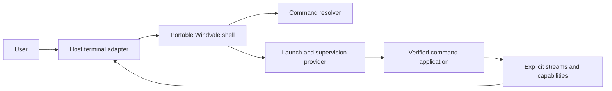

# Windvale shell product and architecture

## Status

Proposed product and architecture elaboration for the shell boundary accepted by
[Decision 0191](../Decisions/0191-Windvale-Console-Shell-And-Cli-Architecture.md)
and the broader [console, shell, and CLI architecture](Console-Shell-And-Cli.md).
This document records the intended experience, portable ownership boundary,
command model, and staged delivery plan so they can be evaluated before a shell
grammar or public application contract is frozen.

No Windvale OS terminal-input service, permanent shell application, general
process launcher, standard-input stream, pipeline, redirection, or job-control
contract is implemented by this document. The current browser Workbench command
line is a JavaScript host prototype; its file and editor commands are not the
Windvale shell or Windvale OS applications.

## Product intent

Windvale should have one small capability-native shell implemented in Windvale
and usable on Windvale OS, Windows, Linux, and the browser-hosted Workbench. The
same Windvale source and canonical WVB should own portable parsing, resolution,
help, completion, session policy, launch-plan construction, and result handling.
Each environment supplies only the rights-limited terminal, launch, filesystem,
package, time, and persistence providers available there.

The experience should borrow PowerShell's strongest qualities:

- consistent command conventions;
- discoverable commands, options, and help;
- completion backed by declared metadata rather than filesystem guessing;
- normal output kept separate from diagnostics;
- structured failure and, later, structured data composition; and
- the ability to inspect what a command resolves to before it runs.

Windvale should not copy PowerShell's long names as the only usable spelling,
its large dynamic object and conversion surface, ambient profiles, or its role
as a second general-purpose programming language. Serious automation remains an
ordinary verified Windvale application. The shell is an intentionally smaller
interactive composition environment.

## Experience principles

The shell should feel:

- **short:** common commands are quick to type and canonical names remain
  readable;
- **discoverable:** a user can find commands and understand their arguments,
  output, authority, and origin without executing them;
- **predictable:** quoting, expansion, command selection, completion, and status
  do not depend on locale, an ambient `PATH`, or mutable directory scanning;
- **capability-visible:** command spelling grants no authority, and exceptional
  access can be inspected before launch;
- **portable:** the same command means the same thing on every host that supplies
  its declared semantic capabilities;
- **bounded:** every command line, argument, completion result, output queue,
  history entry, pipeline, job set, and diagnostic has an explicit limit; and
- **honest:** provider loss, cancellation, verifier rejection, capability denial,
  application failure, and forced termination remain distinct.

Familiar aliases such as `cat`, `ls`, `rm`, `ps`, and `pwd` may make interactive
use comfortable. An alias changes only spelling; it cannot add arguments, hide
syntax, select a different authority profile, or bypass exact command identity.

## One shell across hosts

The portable shell is an ordinary capability-restricted Windvale application.
It is not embedded in the kernel, terminal service, browser page, or native host
launcher.



The shared shell owns:

- the bounded Shell 1 parser and later explicitly versioned grammar additions;
- prompt policy and private shell-session state;
- help, command discovery, completion, and alias interpretation;
- resolver requests and presentation of exact resolved identities;
- immutable application arguments and semantic launch-plan requests;
- foreground command and later pipeline orchestration;
- structured completion handling and the most recent command result; and
- portable formatting policy when a command explicitly supplies structured
  output.

Host or OS providers own:

- keyboard, serial, graphical, or remote terminal mechanics;
- terminal events, dimensions, editing surface, and presentation;
- exact package-generation lookup and immutable object acquisition;
- process admission, verifier/runtime selection, resource domains, execution,
  cancellation, observation, and teardown;
- concrete directory, file, clock, history-store, and administrative capability
  instances; and
- platform-specific diagnostics that do not redefine shell semantics.

Windows and Linux may initially execute the canonical shell WVB through the
Windvale runtime. Windvale OS may interpret, JIT, cache, or AOT-compile the same
WVB without changing its behavior. The browser may run it through the bounded
WebAssembly-hosted interpreter and adapt browser storage to the same semantic
filesystem capabilities. One source and one conformance suite are required;
byte-identical host-native executables are not.

## Responsibility boundary

The four permanent responsibilities remain separate:

1. a device driver or remote adapter handles physical or transport mechanics;
2. a terminal service owns sessions, input decoding, editing, rendering, and
   terminal events;
3. the shell parses, resolves, composes, launches, and reports commands; and
4. command applications perform filesystem, package, process, system, compiler,
   VM, and other work with exact capabilities.

The terminal does not resolve commands. The shell does not parse scan codes,
ANSI escape input, package files, or native paths. The launcher does not infer a
command from a filename. The kernel does not implement an ordinary command
parser or privileged root shell.

## Command identity and spelling

Canonical public command identities use lowercase ASCII and `-` between words,
such as `file-read`, `directory-list`, `process-list`, and `package-install`.
They remain exact resolver keys and package-generation records rather than names
discovered by scanning a `PATH`.

The first shell should support short familiar aliases where they are clear:

| Canonical identity | Familiar alias | Purpose |
| --- | --- | --- |
| `file-read` | `cat` | copy one or more readable files to standard output |
| `directory-list` | `ls` | list an explicitly bound directory |
| `file-remove` | `rm` | remove an explicitly selected entry |
| `process-list` | `ps` | inspect processes visible through one observation grant |
| `location-show` | `pwd` | display the shell's current directory identity |

The alias catalog must be inspectable, bounded, deterministic, and bound to the
same active installation generation as command resolution. A user alias, if
later admitted, maps one token to one exact command identity. It cannot contain
arguments, operators, expansion, redirection, or another alias.

A shorter command-family presentation is also desirable:

```text
file read Notes.txt
directory list
process list
package install Editor
system info
capability list
```

This presentation must not turn one broad `file` or `system` executable into an
ambiently privileged application. Two designs remain candidates:

1. retain hyphenated canonical execution names and use command families only in
   grouped help and completion; or
2. let an active generation register a bounded multiword display spelling that
   resolves directly to the same narrow exact identity.

The second design requires an explicit, deterministic prefix-resolution rule
and package-conflict policy. It must be specified and accepted before the Shell
1 parser treats a second word as part of a command name. Until then,
`file-read`, `directory-list`, and familiar one-token aliases are the conservative
executable spellings.

## Built-ins and command applications

Built-ins exist only when an operation must inspect or mutate the shell session
itself. The proposed first built-ins are:

- `help` for shell help and command discovery;
- `clear` for a semantic terminal clear request;
- `exit` for orderly shell-session completion;
- `status` for the most recent structured command or pipeline completion;
- `location-show` or `pwd` for the current directory display identity;
- `location-change` or `cd` for replacing the shell's current directory
  capability; and
- later, bounded alias, variable, foreground-cancellation, history, and job
  selection operations when their backing contracts exist.

Inspection and mutation outside the private shell session remain applications.
The initial application catalog should grow from real provider contracts rather
than from a desire to imitate another operating system. Candidate families are:

| Area | Candidate applications |
| --- | --- |
| Filesystem | `file-read`, `file-write`, `file-remove`, `file-copy`, `directory-list`, `directory-create` |
| Programs | `compile`, `run`, `module-verify`, `module-inspect` |
| Packages | `package-list`, `package-info`, `package-install`, `package-remove` |
| Processes | `process-list`, `process-info`, `process-cancel`, `process-stop` |
| System | `system-info`, `service-list`, `capability-list`, `log-read` |
| Virtualization | later `vm-list`, `vm-info`, `vm-start`, and `vm-stop` with separately bound attachments |

Shipping an application grants nothing. For example, `process-list` receives
only a bounded observation capability, while `process-stop` requires an exact
mutation capability and should not share a broad process-management grant merely
because both appear under the same help heading.

Browser Workbench actions such as opening an editor tab or saving the active
editor buffer are product UI operations, not universal OS shell behavior. If
they remain available as commands, their names should be visibly scoped, such
as `workbench-open` and `workbench-save`, and their metadata should declare the
browser Workbench requirement.

## Command metadata and discovery

The shell should obtain bounded immutable metadata without executing the target
application. One command record should eventually describe at least:

- canonical identity and optional approved aliases;
- package, version, module digest, entry point, and platform/profile scope;
- short summary and versioned help-resource identity;
- argument and option synopsis sufficient for help and completion;
- accepted standard-input and produced standard-output kinds;
- diagnostic and structured-result schemas when present;
- required and optional semantic capabilities;
- default resource ceiling profile; and
- whether the command is interactive, mutating, administrative, or portable.

Human help may evolve with a package version. Machine-readable command metadata
and output schemas remain versioned. Completion reads metadata and explicitly
authorized provider views; it never scans arbitrary native paths or executes a
program to ask what options it has.

The shell should expose discovery operations similar to:

```text
help
help file-read
command-list
command-info file-read
command-resolve cat
```

`command-resolve` should report the exact canonical identity, package, module,
entry point, active generation, approval, launch profile, and declared authority
without launching the application. A later `command-plan` may additionally ask
the service manager to validate a proposed launch and report its selected grants
and resource ceilings without making a process runnable. Planning is not a
promise that a provider will remain available.

## Shell 1 language

Shell 1 is deliberately an interactive command grammar, not a second Windvale
language. It should admit only:

- one command identity or approved alias;
- ordered immutable arguments;
- whitespace-separated unquoted words;
- literal single-quoted text;
- double-quoted text with one small fixed escape set; and
- `--` as ordinary argument data used by command option parsers to end option
  interpretation.

Shell 1 has no implicit globbing, word splitting after expansion, command
substitution, `eval`, functions, loops, conditional syntax, startup execution,
filesystem command discovery, or execution of the current directory. Operator
punctuation intended for later sequencing, pipelines, and redirection is
reserved outside quotes.

Exact maximum command bytes, word count, argument bytes, and diagnostic bytes
must align with process-argument and terminal-event contracts before the grammar
is frozen. Over-limit input is rejected before resolution or launch and never
silently truncated.

The shell parser should be capability-free and shared across all hosts. Its
conformance suite should cover empty input, whitespace, every quote and escape,
UTF-8 boundaries, reserved punctuation, incomplete quoting, maximum values,
one-over-limit values, hostile input, and deterministic error locations.

## Session state

The shell may retain only explicit private session state:

- one current-directory capability plus a provider-supplied display identity;
- the most recent structured command or pipeline completion;
- bounded optional aliases and one-argument variables;
- one foreground job and later a bounded background-job table; and
- bounded optional history and configuration backed by separate capabilities.

None of this state is ambient child inheritance. A child receives an immutable
argument vector, selected streams, and only the concrete provider instances in
its validated launch plan. The shell's own package, history, terminal, directory,
or administrative authority is never transferred wholesale.

`cd` replaces the shell's directory capability after a provider resolves the
requested child or parent under explicit directory-navigation semantics. The
displayed location is informational; it is not a native path and cannot be
passed to an application as authority.

Secrets do not enter general shell variables, process arguments, aliases, or
history. A command requiring a secret uses a dedicated capability or a typed
sensitive-input interaction whose contents are suppressed before history is
recorded.

## Resolution and launch

One foreground command follows this conceptual sequence:

1. the terminal service publishes one bounded completed line;
2. the shell parses it without authority;
3. an alias or command spelling resolves against one immutable active-generation
   snapshot;
4. the resolver returns an exact package, module digest, entry point, approval,
   launch identity, platform/profile requirement, and declared capability set;
5. the shell constructs immutable arguments and requests only the streams,
   directory instance, and other grants needed for this invocation;
6. the service manager reverifies every identity and validates one immutable
   launch plan before making the process runnable;
7. the command runs inside a bounded resource domain;
8. the shell observes structured completion and renders status; and
9. every process, endpoint, stream, and temporary grant is released or reported
   as teardown failure.

Resolution selects identity but grants no authority. Command spelling, package
ownership, active-generation membership, user identity, and shell parentage are
not grants. Provider approval and concrete rights reduction occur independently
at launch.

The existing active-generation resolver and verified host dispatcher are useful
bootstrap evidence, but the permanent shell consumes a semantic resolver and
launch provider rather than calling a Windows/Linux host command or trusting a
caller-selected path.

## Output, diagnostics, and completion

Every command has separate standard output and diagnostic output. Requested data
belongs on standard output; errors and progress belong on diagnostics. Text uses
strict UTF-8 and Windvale LF conventions. Binary applications use byte streams
and do not pass their bytes through a line-oriented console operation.

Completion is a structured value that distinguishes at least:

- normal application completion with its numeric result;
- resolver or verifier rejection;
- launch or capability refusal;
- language trap or process fault;
- cooperative cancellation;
- forced termination;
- provider loss; and
- incomplete teardown.

Human-readable rendering may be concise, but the structured cause remains
available through shell status inspection and machine-readable output. A numeric
application result must not impersonate a verifier, capability, or provider
failure.

## Composition and structured data

Shell 2 may add `;`, `|`, `<`, `>`, `&&`, and `||` only after standard byte
streams, cancellation, backpressure, file replacement, and complete aggregate
teardown are implemented. A pipeline retains every stage's structured result;
a successful formatter cannot hide an earlier launch rejection, trap, or denial.

Byte streams remain the universal composition contract. They support text and
binary applications and do not require every program to participate in a large
shell-owned object runtime.

PowerShell-like structured composition remains a desirable later facility, but
it should use explicit versioned Windvale record streams. A producer declares
its schema, a consumer declares compatible schemas, and the launcher validates
the connection before either process runs. No content sniffing, implicit host
object wrapping, or unbounded reflection is permitted. Formatting a structured
stream for a person is an explicit application or library operation.

A possible future interaction is:

```text
process-list | record-filter State waiting | table
```

The spelling and filter model remain open until multiple real producers and
consumers justify them. Shell 1 does not need record pipelines to preserve
structured process completion and command metadata.

## Automation boundary

The shell may later support small explicit composition, but it should not grow
functions, loops, unrestricted startup scripts, reflection, arbitrary code
evaluation, or a second package/runtime model. Reusable automation is a Windvale
application with normal source semantics, imports, verification, tests,
capability declarations, and package identity.

If command files are later justified, their first role should be bounded command
composition under a separately versioned grammar. Merely placing a file in a
directory must never cause it to run at shell start or during command discovery.

## Example Shell 1 sessions

Discovery without execution:

```text
windvale> command-resolve cat
Alias          cat
Command        file-read
Package        windvale.foundation.files
Authority      one read-only directory
Status         installed and approved
```

Reading a file through an exact directory grant:

```text
windvale> cat Notes.txt
Windvale shell notes
windvale> status
Result         0
Completion     normal
```

An unavailable capability is not reported as an application exit:

```text
windvale> process-list
launch refused: process observation was not granted to this session
windvale> status
Completion     capability-refused
Command        process-list
```

The same portable application can be present but unsupported on one host:

```text
windvale> vm-list
launch refused: vm observation is unavailable on browser-workbench
```

Workbench-specific UI integration remains explicit:

```text
windvale> workbench-open Hello-Windvale.wv
opened Hello-Windvale.wv in the editor
```

These examples describe intended product behavior. Exact diagnostics and record
layouts remain subject to focused specifications and conformance fixtures.

## Workbench transition

The current browser Workbench can become an early proving host without being
misrepresented as Windvale OS:

1. retain its JavaScript command line as a labeled bootstrap controller;
2. implement one real Windvale command application, initially `file-read`/`cat`;
3. bind immutable arguments, exact byte output, and one read-only browser
   workspace directory capability in a disposable worker;
4. launch an exact verified WVB identity instead of executing a JavaScript
   `cat` branch;
5. add directory enumeration before implementing `directory-list`/`ls`;
6. move command parsing and resolution into the portable Windvale shell after
   terminal input and process launch contracts exist; and
7. keep editor-only operations in a visibly Workbench-scoped provider.

This sequence proves the application boundary first and avoids expanding the
bootstrap JavaScript shell into a competing permanent command environment.

## Delivery sequence

### Exploration and specification

- review representative interactive sessions for files, packages, processes,
  compilation, denial, cancellation, and provider loss;
- select canonical naming and decide whether multiword command spellings enter
  Shell 1;
- specify the Shell 1 grammar, limits, command metadata, resolver request,
  semantic launch request, and structured completion;
- define the first command catalog only from available capabilities; and
- build host-independent parser and resolver conformance fixtures.

### First real command path

- implement `file-read` as an ordinary Windvale application;
- give it immutable arguments, standard byte output, and one exact read-only
  directory instance;
- execute it through a disposable browser worker and Windows/Linux host runtime;
- prove identical semantics and bounded failures across those hosts; and
- replace only the Workbench's JavaScript `cat` branch after the real path is
  qualified.

### Shell 1

- implement the portable parser, discovery, help, aliases, current location,
  exact resolution, foreground launch, cancellation, and structured status;
- bind it first to the host terminal and browser terminal adapters;
- bind the same shell to Windvale OS after its terminal-input, resource-domain,
  and dynamic-launch prerequisites are qualified; and
- retain an independent kernel emergency sink and any explicitly labeled fixed
  recovery monitor.

### Later composition

- add byte streams, pipelines, redirection, aggregate cancellation, and teardown;
- add bounded history, configuration, environments, and jobs only with exact
  storage and lifecycle contracts; and
- evaluate typed record streams from measured application workflows rather than
  from shell-language ambition.

## Qualification expectations

The shell should not be called portable merely because its parser runs on more
than one host. Qualification should cover:

- identical parser results and diagnostics from the same UTF-8 input;
- identical command and alias resolution from the same active generation;
- exact argument preservation, including quoting boundaries and `--`;
- rejection of substitutions between resolution and launch;
- no authority gained from spelling, aliasing, parentage, or current location;
- correct separation and bounds for output and diagnostics;
- deterministic structured completion for success, denial, trap, cancellation,
  provider loss, and teardown;
- bounded resource exhaustion and hostile metadata/input rejection;
- no host path, handle, environment, or terminal encoding entering portable
  semantics; and
- complete process, stream, endpoint, and grant cleanup.

Windows and Linux are permanent qualification hosts. The browser is a useful
additional host profile. Windvale OS qualification adds terminal, kernel/service,
resource-domain, and native-provider evidence rather than changing the shell
contract.

## Open design questions

The following choices should be resolved through examples and focused decisions
before their contracts are implemented:

- Are multiword spellings such as `file read` part of Shell 1, or only grouped
  help over canonical `file-read` identities?
- Which familiar aliases ship by default, and can installations add aliases
  without creating command-shadowing ambiguity?
- What exact metadata is safe and sufficient for option completion without
  running application code?
- What are the Shell 1 command, word, argument, completion, help, and history
  limits?
- Which current-location navigation operations can preserve directory-capability
  semantics across Windows, Linux, Windvale OS, and browser providers?
- Which application is the first genuine structured-record producer/consumer
  pair, and does it justify typed pipelines?
- Should `command-plan` only validate identities and grants, or also support a
  standardized application-specific dry-run contract?
- Which terminal editing behavior belongs in the terminal service and which
  completion/history behavior belongs in the shell?
- How are portable command help and machine schemas localized without making
  locale part of deterministic resolution or machine output?
- What minimum recovery command catalog is required before the permanent shell
  is available, and how is it kept visibly separate from ordinary administration?

None of these questions reopens the accepted permanent boundaries: the shell is
an ordinary Windvale application, command identity is immutable through launch,
authority is explicit, the kernel has no general command parser, and automation
uses the Windvale language rather than an unrestricted shell language.
