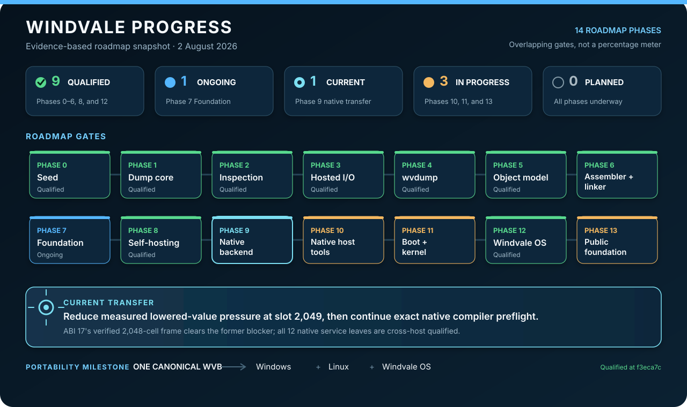

# Windvale progress

> Status snapshot: 10 August 2026

This is the authoritative current-state dashboard for implemented and qualified project progress, not a generated completion meter. Update it when the measured state, immediate transfer, or working paths change. Windvale phases overlap: later experiments can produce evidence while an earlier, deliberately open-ended foundation phase continues.

The [development roadmap](Roadmap.md) owns the forward sequence and phase gates; [qualification evidence](Seed-Verification-Evidence.md) owns exact completed runs and artifact identities; accepted decisions own rationale. The root README remains a stable public overview and should link here instead of repeating this changing narrative.

## Indicators

| Indicator | Meaning |
| :---: | --- |
| ✅ Qualified | The phase's defined gate has reproducible evidence. |
| 🔵 Ongoing | Useful qualified slices exist, and the phase continues as real tool pressure demands more. |
| 🎯 Current transfer | The immediate measured ownership boundary being moved into Windvale. |
| 🚧 In progress | Concrete implementation evidence exists, but the phase gate remains open. |
| ○ Planned | The phase has an accepted direction but not yet its completion evidence. |

These indicators describe evidence, not effort. Windvale does not publish percentage-complete estimates because the remaining work changes as compiler, runtime, native, and operating-system experiments reveal better boundaries.

## Roadmap gates

| Phase | Status | Evidence today | Next gate |
| --- | :---: | --- | --- |
| 0–6. Seed through assembler and linker | ✅ Qualified | The Stage 0 foundation, byte primitives, hosted resource boundary, `wvdump`, object model, assembler, and linker have Windows and Debian evidence. | Preserve these contracts as later native and OS work consumes them. |
| 7. Foundation modules | 🔵 Ongoing | Machine contracts, byte ordering, decimal parsing, and byte construction are shared by real Windvale tools. Decisions 0145 and 0153 qualify explicit transitive platform-library approval plus the first versioned, rights-limited immutable directory read. The unqualified `WVDB 1` experiment adds a portable typed page/B+tree reader, Decision 0210 composes it with the real hosted directory provider, and implemented-candidate Decision 0211 adds checked format-neutral `u64` page geometry. Probe 35 exercises resource semantics through an isolated guest service, and Probe 36 contains one deliberate failure of that service. | Specify the first pre-opened storage-object/resource contract with exact generation, lifetime, partial progress, mutation, flush, fencing, publication, and recovery semantics before implementing writes. |
| 8. Self-hosted compiler | ✅ Qualified | The committed 12-module inventory produces byte-identical 599,868-byte Stage 1 and Stage 2 compilers on Windows and Debian. Cross-host-qualified Decisions 0168 and 0169 package the exact native compiler as independently verified, atomically published PE/ELF executables and directly reproduce Stage 2 on both hosts without loading .NET; the Stage 0 recovery runbook records clean-checkout provenance. | Advance the remaining native tools without weakening the retained recovery oracle. |
| 9. Shared native backend | 🎯 Current transfer | Cross-host-qualified Decision 0148 supplies the live WVA reclaiming leaf. Decision 0150 verifies generation-owned byte buffers and return checkpoints and completes cross-host native reproduction without implicitly calling that leaf; qualified Decision 0151 maps all 180,190 full-allocator invocations to physical owner locations and five verified phases. | Add caller-liveness evidence or consume the full-allocator schedule in one small successor fixture before broadening allocation integration. |
| 10. Native host tools and .NET retirement | 🚧 In progress | Exact commit `524e84afb6e5bab6bbd95ebc0b9eeaf886af834b` cross-host qualifies the Decision 0213 WVB 1.11 semantic-freeze baseline; `9d36387867ebff80ee94c6f9f7996da4ef32a4a3` qualifies the first Decision 0214 Windows/Linux publisher profile; `d2e71c1d6491153afb715674fc13ba2c6276326a` qualifies their distributed composition as the ordinary project source-to-WVB route; and `e2d9c52548fd782a57765b1a9635d8cbe009df20` qualifies native WVB verification and deterministic inspection on both permanent hosts. Decision 0217 pins the runner inventory; Decisions 0218, 0226, 0227, 0229, and 0230 grow its fixed native plan from two scalar/control results to five portable results, three exact runtime failures, five malformed-WVB envelope rejections, eight typed-execution corruptions, and one control-reachability corruption; Decision 0310 grows that plan to twenty-six cases with one canonical WVO acceptance and three structural WVO rejections; Decision 0311 establishes a separate native linker-rejection command, and Decision 0325 expands it to every externally driven `WVL1001` through `WVL1010` family with exact reports and existing-output preservation while leaving internal `WVL1011` and large-map `WVL1012` separate; Decision 0313 adds an analogous three-case console-packager rejection command over a dedicated six-byte fixture, with host-target reports and destination preservation; Decision 0314 adds a shared two-case publisher-rejection command with exact phase reports, destination preservation, and zero scratch; Decision 0317 adds malformed and valid-but-unsupported lowerer rejections with exact native reports, destination preservation, and zero private work; Decision 0321 adds one exact output-preserving case for each stable WVA diagnostic family without rebuilding the qualified assembler; Decision 0322 requires both digest-bound WVO read-only launchers to agree exactly across all thirteen stable rejection families while preserving every input; Decision 0220 qualifies the native assembler; Decisions 0221–0224 add native linker, read-only WVO, version-1 PE/ELF materialization, and accepted-subset WVB-to-WVO candidates; Decision 0225 composes the build/lower/link/package process boundaries into one exact current-host return-42 application; Decision 0228 expands native lowering to eight decreasing-ordinal scalar/control functions through an extracted layout directory; Decision 0231 adds focused data/object modules plus exact canonical `Sum-Data.wv` `.rodata` and relocation lowering; Decision 0232 replaces the Main-last/decreasing-call restriction with complete signatures, arbitrary exported-Main order, and bounded general scalar recursion; Decision 0233 transfers the `u8`/`u32` and typed-return subset required by compiler-produced `Function-Only.wv`; Decision 0234 completes the bounded `u32`/`u8` comparisons shared by all remaining compiler-produced fixtures while preserving retained WVO bytes; Decision 0235 adds exact multiple immutable data plus static borrowed text/bytes descriptor locals, views, slicing, length, and reads through an extracted instruction-state module; Decision 0236 adds service-backed text concatenation, UTF-8 validation/conversion, and quoting; Decision 0237 adds generation-owned bytes concatenation with exact compiler-produced `Data-And-Text.wv` WVO equality; Decision 0238 adds bounded nominal-table admission plus enum locals, constants, comparisons, and name lookup with exact focused WVO equality; Decision 0239 adds deterministic one-block direct record construction, local copying, and field access with exact focused WVO equality; Decision 0240 adds nonzero-first enum admission plus one-block record parameters, caller-owned returns, and bounded record calls through an extracted call-instruction module; and Decision 0241 adds multi-block record-local liveness, block-scoped record temporaries, and scalar-returning record consumers with exact compiler-produced `Nominal-Types.wv` WVO equality through the direct current-host package. Decisions 0307 and 0308 now add Windvale admission plus the reused native atomic publication transaction to digest-bound console packaging and accepted-subset WVO lowering. No candidate artifact is promoted by those local proofs. The broad Windows/Linux gate is intentionally grouped at the end of the active retirement goal. Forward language semantics advance only through `Compiler/Windvale`; C# retains its recovery and independent-evidence role. | Continue the remaining focused backend and hosted-capability transfers with quick local checks, refresh upstream, regenerate current identities once, and run one grouped dual-host qualification before artifact promotion and the final recovery archive. |
| 11. Boot path and kernel | 🚧 In progress | Cross-host-qualified Probe 40 adds `WVKMEM17`, fixed generation-safe memory objects, and WVA-owned first-fit non-tail client release/zero/reuse while the later directory object remains live, without changing `WVPROC17`, paging 5, ABI 22, or Probe 39's timer proof. Historical qualification passes all 87 Seed and 39 OS tests on Windows/Debian and all five pinned Windows QEMU scenarios. Decision 0435 removes Stage 0 from supplied-image boot execution; the repaired normal image again passes its exact digest-bound boot contract. Decisions 0436 through 0438 add portable UEFI v3 construction, independent verification, the real native-link-output handoff, and retained paired native-built UEFI packager containers with a permanent three-case lane. Decision 0439 makes that native packager construct the final normal recovery EFI from the real Probe 40 link result. Decision 0440 exposes fourteen ordered WVO containers; Decision 0441 resolves their native linker's 128 MiB relocation-generation blocker; Decision 0442 removes the managed linker from the current-host normal recovery command; Decision 0443 moves three top-level WVA shim objects to the native assembler; Decision 0444 supplies all four selected inner WVA objects natively; Decision 0445 adds a digest-bound eleven-object seed and a `.NET`-free ordinary normal-image build candidate; Decisions 0446 and 0447 compile and lower the canonical native-probe and admission Windvale sources in that ordinary path; Decisions 0448 through 0451 add one verified consolidated producer for four compact architecture objects, Decision 0452 adds a separate normal-memory-object producer, Decision 0453 reconstructs the normal loader object from a pinned architecture fixture, Decision 0454 compiles the canonical system source to WVB and lowers it through Windvale, Decision 0455 composes the general native tools for portable process-policy source, and Decision 0456 rebuilds the final process object from canonical sources plus one reviewed architecture fixture. Decision 0489 extends the ordinary image builder to byte-identical invalid-opcode and general-protection variants without adding C# to that path; both pass their exact pinned-QEMU panic contracts. The normal object inventory remains eleven native producers and zero frozen WVOs. | Execute the native build independently on Linux, add the two contained process-fault images, close the remaining native verification gaps, and qualify the final Decision 0057 gate before promotion. |
| 12. Runtime on Windvale OS | ✅ Qualified | Exact `Sum-Data.wv` and `Function-Only.wv` compiler outputs run across both hosts and Windvale OS; the second covers four functions and four scalar families. | Use a third real program or measured native-size pressure to choose further generalization. |
| 13. Public foundation | 🚧 In progress | The public GitHub repository and its licensing, contribution, security, governance, support, and authorship policies are live. | Record the initial publication baseline and establish ongoing public project operations. |
| WebAssembly interoperability | 🚧 In progress | The complete portable compiler now lowers to an 18,349,927-byte import-free ABI-4 direct WebAssembly artifact through a fixed 34-segment Windvale generator. The direct compiler preserves the exact 183-byte WVB and result `42`, reports 1,186,358 compiler instructions, and executes the pinned source in 991.3 ms on the measured Windows Node.js host instead of the preceding 64-to-105-second interpreter path. The normal Monaco playground, artifact publication, website verification, and deployment remain .NET-free; the separate ABI-3 interpreter now only admits and executes compiler-produced WVB. Direct package verification passes under the optimizing WebAssembly tier, while real Chromium and cross-browser memory/latency measurements remain pending. Reconstructing the pinned segmented generator Wasm still uses the explicit Stage 0 recovery seam. | Measure the direct package in desktop and mobile Chromium, reduce its 18.35 MB transfer and fixed 2,497-page memory where useful, broaden source/diagnostic coverage, replace the segmented generator's recovery seam, and complete the project-wide retirement gate. |

The latest Phase 10 local increment is [Decision 0494](../Decisions/0494-Native-Compiler-Reconstruction.md). The shared compiler front end now reuses admitted graph, symbol, binding, and declaration evidence instead of rebuilding it; hosted build-driver profile 2 owns a bounded 224 MiB text arena and 8 KiB snapshot-name stride while other compiler-family profiles retain their previous arena and name-stride geometry. The candidate compiler family carries an explicit 64-billion-instruction ceiling pending paired qualification. The current Windows native build-driver application reproduces its exact 1,101,068-byte WVB in one 57.3-second run without loading .NET. Decisions 0492 and 0493 reconstruct the hosted-container toolset and dependent publisher-overlay family. Decision 0494 adds a distinct unqualified current-compiler inventory: the native source/bootstrap, staged lower/link, canonical transport, and paired package path reproduces the exact 921,640-byte compiler WVB plus 27,666,432-byte Windows and 27,668,480-byte Linux applications without a managed writer. Independent Linux reconstruction and execution, the current full Stage-2 measurement, the grouped dual-host gate, promotion, and the final Stage 0 recovery release remain.

[Decision 0473](../Decisions/0473-Native-WVHV-Startup-Admission.md) established the earlier hosted-verifier startup-admission boundary. Windvale admits the complete digest-bound verifier service bundle, checks every startup relocation plus the normalized template digest, joins the native-owned runtime, platform, startup, and bundle responses into exact format-4 PE/ELF applications, and directly executes the packaged constructor plus its generated verifier on Windows without loading .NET. Startup production and verification share one ordered target model instead of duplicating 45 Windows and 24 Linux relocation calculations. Decisions 0461 through 0472 own admitted `WVHV` metadata, the exact runtime header, immutable hashing, exact `WVVR` projection, retained request containers, native reconstruction, the complete six-service bundle, startup relocation, platform bytes, final composition, direct Windows execution, and shared startup targets. New C# remains test/differential evidence plus deletion-bound recovery identity wiring. Decision 0458's changed-file front door continues to stop on named gaps without invoking .NET.

[Decision 0439](../Decisions/0439-Native-Uefi-Recovery-Packaging-Cutover.md)
removes the managed UEFI writer from the real normal Probe 40 recovery workflow.
Stage 0 still produces and links the scenario objects; those upstream duties,
the remaining scenarios, Linux execution, promotion, and the grouped gate stay
explicit.

[Decision 0440](../Decisions/0440-Probe-40-Object-Inventory-Boundary.md)
makes that upstream boundary explicit as fourteen verified WVO containers. It
also exposed the retained native linker's peak resource use on the real
663-line Probe 40 canonical map.
[Decision 0441](../Decisions/0441-Scale-Safe-Native-Wv-Linker-Relocation-Emission.md)
identifies repeated complete-image relocation generations as the exact 128 MiB
arena blocker and makes the current Windows candidate reproduce the complete
image. Linux qualification remains.
[Decision 0442](../Decisions/0442-Native-Probe-40-Recovery-Linking-Cutover.md)
then makes the current-host normal recovery command consume Stage 0's ordered
objects through the digest-bound native linker and native UEFI packager. Only
object/scenario production still executes .NET in that command; Linux recovery
execution remains pending.
[Decision 0443](../Decisions/0443-Native-Probe-40-Top-Level-Wva-Assembly.md)
makes the same command assemble top-level memory-object, timer, and kernel shim
sources through the qualified native assembler. Stage 0 now returns eleven
top-level objects; inner process-image WVA and other object construction remain.
[Decision 0444](../Decisions/0444-Native-Probe-40-Inner-Process-Wva-Handoff.md)
makes the command assemble its init, directory, boot-resource, and selected
client WVA objects natively too. Stage 0 consumes those exact WVOs for checked
process-image composition; its compiler, lowerer, adapter, and inner links remain.
[Decision 0445](../Decisions/0445-Digest-Bound-Native-Probe-40-Object-Seed.md)
freezes the remaining eleven normal objects with exact Stage 0 provenance and
adds a native-only ordinary build. The current-host two-case retirement lane
constructs the exact EFI and proves repeated-output preservation in 9.5 seconds.
[Decision 0446](../Decisions/0446-Native-Probe-40-Windvale-Source-Producer.md)
compiles and lowers the canonical native-probe Windvale source in that ordinary
build, reproduces its exact WVO, and reduces the frozen seed to ten objects.
[Decision 0447](../Decisions/0447-Native-Probe-40-Admission-Source-Producer.md)
adds a verified native WVO export rename, compiles and lowers the canonical
admission source in the same build, and reduces the frozen seed to nine objects.
[Decision 0448](../Decisions/0448-Native-Probe-40-Exception-Object-Producer.md)
adds a focused native x64 exception-object producer over shared verified WVO
construction and reduces the frozen seed to eight objects.
[Decision 0449](../Decisions/0449-Native-Probe-40-Admission-Bridge-Producer.md)
consolidates that package with a second exact WVB admission-bridge recipe and
reduces the frozen seed to seven objects.
[Decision 0450](../Decisions/0450-Native-Probe-40-Native-Bridge-And-Support-Producer.md)
adds the two-section native bridge/support recipe to the same bounded producer
and reduces the frozen seed to six objects.
[Decision 0451](../Decisions/0451-Native-Probe-40-Paging-Object-Producer.md)
adds the exact paging installer to that producer and reduces the frozen seed to
five objects while leaving the larger memory object for separate review.
[Decision 0452](../Decisions/0452-Native-Probe-40-Memory-Object-Producer.md)
adds a separate focused normal-memory-object producer and leaves four frozen
objects without growing the compact producer into a catch-all.
[Decision 0453](../Decisions/0453-Native-Probe-40-Loader-Object-Producer.md)
reconstructs the normal loader object from a pinned architecture fixture and
leaves three frozen objects.
[Decision 0454](../Decisions/0454-Native-Probe-40-System-Kernel-Target.md)
compiles the canonical system source to exact WVB, lowers that verified module
through the Windvale-native kernel target, and leaves two frozen objects.
[Decision 0455](../Decisions/0455-Native-Probe-40-Process-Policy-Source-Path.md)
composes the general native builder, lowerer, and export renamer for the
portable process-policy source and leaves one frozen process object.
[Decision 0456](../Decisions/0456-Native-Probe-40-Process-Object.md)
regenerates that object's 463,531 payload bytes from canonical sources and
versioned records, retains only a 46,678-byte reviewed architecture fixture,
and removes the final WVO from the normal frozen inventory.

[Decision 0346](../Decisions/0346-Bounded-Native-Publisher-Self-Lowering.md)
closes the measured Decision 0345 publisher lifetime boundary on Windows. The
native producer and publisher established bounded self-lowering without loading
.NET or widening the arena. Decision 0394 later prunes the now-unused portable
publication bridge from that admission closure; the current exact identities
are 431,568-byte WVB and 6,355,569-byte WVO. Extended execution of the refreshed
self-lowering case, Linux execution, and the grouped retirement gate remain
pending.

[Decision 0347](../Decisions/0347-Fixed-Native-Nominal-Wvb-Rejections.md)
transfers five representative nominal-type rejection cases into the existing
native unsafe-WVB lane. [Decision 0429](../Decisions/0429-Fixed-Native-Assembler-Golden-Objects.md)
then adds three exact positive assembler products, and
[Decision 0430](../Decisions/0430-Fixed-Native-Typed-Wvb-Rejections.md) adds six
typed-control and nominal-shape rejections, and
[Decision 0431](../Decisions/0431-Compact-Native-Wvb-Rejection-Closure.md) adds
four compact stack, receiver, and nominal-kind cases, and
[Decision 0432](../Decisions/0432-Fixed-Native-Scalar-X64-Golden-Object.md) adds
the fourth exact positive assembler product, and
[Decision 0433](../Decisions/0433-Fixed-Native-Wva-Positive-Matrix.md) adds 17
typed byte/word positive vectors to the existing differential owner, and
[Decision 0434](../Decisions/0434-Expanded-Native-Wva-Positive-Matrix.md) adds
52 expanded register/control/relocation vectors. At that point the retirement
coordinator owned 31 suites and 3,147 fixed cases without .NET. The latest two cases verify
exact process-object reconstruction and destination preservation; the Probe 40
cases preserve the resulting EFI image while the normal frozen-object inventory
is empty. Hostile
value limits and other WVA inventory remain later work.

[Decision 0435](../Decisions/0435-Digest-Bound-Os-Boot-Execution.md) removes
Stage 0 construction from the ordinary QEMU execution command. The verifier now
admits one caller-supplied EFI by exact SHA-256 and preserves both copies; the
C# builder is reachable through an explicit recovery script. The first focused
normal boot exposes a current guest failure after `boot-services=exited`, so O1
remains a candidate and O2 image construction remains managed-normal.

[Decision 0392](../Decisions/0392-Shared-Immutable-Snapshot-Publisher-Shells.md)
completes the format-neutral publisher extraction on both permanent hosts. One
platform shell now owns immutable resource acquisition, comparison, identity,
alias rejection, and transaction dispatch; tiny WVO and hosted-container policy
entries select the admitted snapshot sequence. The focused Windows WVO route
passes through the new shell. Linux execution, paired hosted application
packaging, managed-publication deletion, and the grouped gate remain open.

[Decision 0393](../Decisions/0393-Paired-Native-Hosted-Container-Publishers.md)
adds exact paired hosted-container publisher applications and public CLI
targets. The focused Windows run publishes the admitted payload, rejects changed
content and a destination alias, preserves existing state, leaves no scratch,
and loads no CLR. Shared WVA now owns the publication-state token ABI. Native
reconstruction of Stage 0 package construction, Linux execution, promotion, and
the final grouped dual-host gate remain open.

[Decision 0394](../Decisions/0394-Pruned-Staged-Publisher-Bridge-Closure.md)
removes the two dormant private publication functions and their two-module
source dependency from the staged admission project. The focused publisher
still passes native atomic publication through shared WVA, while the smaller
admission WVB and paired packages retain exact identities. This makes the next
remaining boundary explicit: replace Stage 0 hosted-package construction and
orchestration rather than carrying duplicate publication logic.

[Decision 0395](../Decisions/0395-Standalone-Native-Hosted-Container-Planner.md)
starts that replacement pipeline with an exact standalone Windows/Linux planner.
The current-host process turns a real 4,096-byte runtime header into the same
Windvale-owned layout/target plan as the retained fragment without loading .NET.
Decision 0396 adds the paired standalone platform-byte producer: the current
host turns that plan into the exact Windvale-owned PE header/import/relocation
or ELF header response without loading .NET. Decision 0397 adds the paired
startup producer: it verifies the canonical target WVO, projects the plan's
target table into `WVSI 1`, and emits exact instantiated code without loading
.NET. Decision 0398 adds the paired runtime-header producer: canonical metadata
now becomes the exact raw 4,096-byte planner input without loading .NET.
Decision 0399 adds the preceding metadata constructor: `WVHM 1` now becomes the
exact raw 1,024-byte metadata record without loading .NET. Producing the
metadata request from immutable fragment/service evidence, producing service
bundle resources and segment requests, then composing planner, resource
producers, segmenter, and publisher, are the next construction boundaries.

Decision 0400 now exposes the established segmented service-bundle constructor
as a paired native process: one exact `WVSQ 2` request becomes one immutable
`WVSI 2` response without loading .NET. Acquiring fragment/service resources,
constructing their ordered requests and metadata evidence, and composing the
complete pipeline remain the next boundaries.

Decision 0403 adds the matching native request producer. `WVSG 1` maps bounded
raw fragment and service resources into their publication-plan positions, and
one paired native process emits the exact canonical `WVSQ 2` request for a
selected segment without loading .NET. Ordered invocation, response/evidence
composition, final hosted-container segment requests, Linux execution,
promotion, and the grouped gate remain.

Decision 0404 reuses the same immutable source geometry for the six final
hosted-container regions. One paired native process now emits an exact `WVHT 1`
request without managed segment arithmetic or byte construction, and the
shared capability-free append state keeps both request roots focused. Ordered
request/response and manifest lifecycle, Linux execution, promotion, and the
grouped gate remain.

Decisions 0405 through 0409 now close publication-request and source-geometry
production, variable enum-service construction and native fragment
reconstruction, and fixed-service acquisition. The fixed-resource process
reads each retained leaf once and places it around service 7; the existing
native metadata-request process remains the single digest gate over the actual
staged set. Ordered process/private-resource lifecycle, complete composition,
Linux execution, promotion, and the grouped gate remain.

Decision 0410 additionally moves `WVMI` and `WVHS` control-file construction
into one focused Windvale-native process. Decision 0411 then admits all final
container producer responses, verifies their bundle payloads against runtime-
bound SHA-256 evidence, emits bounded raw chunks, and constructs the exact six-
region `WVSG` without managed extraction or concatenation. Native final
segment-set manifest construction follows in Decision 0412: exact final
`WVHT`/`WVHU` resources now become a self-admitted `WVHM` through a paired
native process. All identified hosted-container binary formats therefore have
native owners. Decision 0413 also moves both admitted segment counts into the
existing Windvale request producers, so the following platform scripts do not
decode binary plans or guess loop completion from failure. Digest-bound tool
acquisition, ordered process/private-resource lifecycle, Linux execution,
promotion, and the grouped gate remain.

Decision 0414 now binds all 19 hosted-container native tools through one exact
candidate inventory and composes them behind focused Windows/Linux launchers.
The Windows path completes lowering through atomic publication in 10.3 seconds
and reproduces the independent 236,032-byte PE exactly. The first composed run
also exposed and corrected the logical-source/aligned-image distinction in the
metadata-request boundary. Linux execution, focused failure preservation,
promotion, managed-entry-point cutover, and the grouped gate remain.

The current unqualified language candidate advances Stage 0 and the Windvale-written compiler together through WVB 1.11: inference and trailing commas; constants; privacy, aliases, qualified identities, and metadata; named records and `else if`; exhaustive `match`; nominal payload variants and recoverable-result shapes; bounded sequences, affine builders, and `for`; loop control and short-circuit flow; compound assignment; checked division/remainder; bitwise operations and shifts; and exact text/bytes equality. The ordinary native compiler path, deterministic artifacts, editor grammar, and focused compiler/runtime/WebAssembly cases are synchronized. Resource-lifetime syntax remains at its explicit design gate until provider values, cleanup ordering/failures, and immutable manifest representation are decided.

Implemented-candidate [Decision 0207](../Decisions/0207-U64-Binary-Fields-For-Durable-Storage.md) adds exact little-endian `u64` byte codecs for future durable storage fields. [Decision 0209](../Decisions/0209-Single-Current-Wvb-1-11-Format.md) folds them into canonical WVB 1.11 and brings the Windvale-written compiler to the same source/WVB surface; native, WebAssembly, and Windvale OS profiles retain explicit narrower 1.11 subsets. Implemented-candidate [Decision 0208](../Decisions/0208-Native-Read-Only-Directory-Snapshot-Binding.md) also gives `windvale run` an explicit bounded Windows/Linux snapshot binding for the already qualified directory-read contract; independent Linux qualification remains pending.

The [Windvale Database reader experiment](../../Specifications/Windvale-Database-Reader.md) validates a maximum 16,416-byte immutable snapshot containing at most 64 checksummed pages, performs an exact bounded B+tree lookup, returns typed found/missing/failure outcomes, and has independent malformed-input fixtures. Implemented-candidate [Decision 0210](../Decisions/0210-First-Hosted-Wvdb-Snapshot-Consumer.md) adds the first real hosted path: at most six rights-limited directory reads assemble one immutable snapshot and preserve provider failures separately from invalid database bytes. Implemented-candidate [Decision 0211](../Decisions/0211-U64-Database-Storage-Geometry.md) adds a separate capability-free [`u64` page-range contract](../../Specifications/Database-Storage-Geometry.md) with typed invalid-size, arithmetic-overflow, and outside-storage outcomes. Neither slice implements durable storage, transactions, caching, concurrency, or a service.

Proposed [Decision 0198](../Decisions/0198-Next-Integrated-Architecture-Defaults.md) is a documentation-only successor review set. It builds from qualified Probe 40 and recommends concrete defaults for resource domains and later memory generalization, clean launch/supervision, streams/terminal/shell, `LinkPort 1`/`virtio-net`, identity/time/entropy/trust, packages/releases/recovery, and language variants/collections/metadata. None of those proposed contracts changes the implemented or qualified indicators above.

## Working end to end

- ✅ Windvale source → canonical WVB → verification → execution on Windows or Linux
- 🚧 Evolved source surface → canonical WVB 1.11 → verified reference, Windvale-compiler, native, and bounded WebAssembly subsets, including Stage 0 `u64` byte codecs; independent dual-host qualification remains
- ✅ Windvale assembly → verified WVO → deterministic linked x86-64 image
- ✅ Portable WVB → shared WVO/AOT backend → linked UEFI image → kernel-owned execution
- ✅ Hosted `Wv-Dump-Core.wv` → W^X/WVO execution → deterministic report for a real WVB
- 🔵 Capability-bearing hosted library → explicit transitive application approval → canonical WVB requirement → separate runtime grant → live immutable `WVRS 1` lookup → versioned `WVDR 1` directory read → cross-host-qualified Probe-35 guest service → Probe-36 contained service peer loss → Probe-37 kernel-owned endpoint identity → Probe-38 split providers and two endpoints → Probe-39 bounded preemption → qualified Probe-40 non-tail memory objects; names and discovery remain
- 🚧 Rights-limited immutable directory → at most six bounded chunks → complete `WVDB 1` validation → exact B+tree lookup with separate storage/database failures; parallel capability-free `u64` page geometry now preflights complete ranges, while durable format, storage authority, mutation, transactions, and service placement remain
- ✅ Windvale-produced native bytes → Windvale validation and patching → live host-service consumption
- ✅ Verified native fragment → Windvale image layout → narrow host W^X publication adapter
- ✅ Windvale lifetime graph → internal state owner → allocate/copy/seal/invoke/release
- ✅ Qualified compiler WVB → native compiler execution → byte-identical WVB file publication
- ✅ Independently verified native PE/ELF compiler → complete 12-source inventory → byte-identical Stage 2 compiler on Windows and pinned Debian without loading .NET
- ✅ Portable scalar `.wv` → verified WVB/native fragment → cross-host-qualified deterministic import-free Windows `.exe` or Linux `.elf` → normalized process result
- ✅ Hosted `.wv` with `console.write_line` → verified service requirement → `WVHC 1` metadata and exact output leaf → cross-host-qualified standalone Windows/Linux console application
- ✅ Exact ABI-22 compiler → measured large-native WVO → bounded link/runtime/service profiles → cross-host-qualified direct PE/ELF Stage 2 reproduction → public atomic `compile`/`aot` recovery route
- 🔵 Explicit `.wv` inputs or bounded Project 1 → single source snapshots → Windvale-native compiler → shared portable compiler-aligned verifier → accepted WVB publication through format-5 Windows/Linux driver packages; current-host direct evidence passes, cross-host qualification and atomic source-visible replacement remain
- 🔵 Constant-return metadata-free WVB 1.11 subset → Windvale-owned ABI-22 x86-64 selection → exact canonical WVO 1.0; two-immediate oracle agreement, native hosted-shell execution, and malformed-input output preservation pass on the current host, while broader operations and dual-host qualification remain
- 🔵 Windvale native staging producer → bounded compiler WVO chunks/manifest → exact snapshot and native-identity checks → exclusive-sibling write/flush/reread/atomic replacement; current-host producer/publisher composition passes without loading .NET, while full compiler self-lowering, Linux composition, and grouped qualification remain
- 🔵 Native version-1 PE/ELF materializer → portable completed-application admission → exclusive-sibling durable write/reread/atomic replacement → direct result 42 without loading .NET; host-container construction, Linux execution, grouped qualification, and promotion remain
- ✅ ABI-21 direct records → deterministic frame backing → caller-owned returns → zero record-arena use in both the exact compiler and rebuilt Probe 32
- 🚧 Verified descriptor ownership → exact WVA allocator leaf → physical emission schedule → live W^X differential execution; full-allocator selection remains open
- ✅ ABI-22 dynamic values → generation-owned byte buffers → verified return checkpoints → complete native Stage 2 reproduction on Windows and Debian
- ✅ Canonical constant WVB → Windvale-authored selector → deterministic Wasm → result `42`
- ✅ Checked-add WVB → Windvale-authored selector → execution ABI 1 → result or `WVR3007` plus exact instruction count
- ✅ Bounded straight-line `i32` WVB → Windvale-authored lowering → checked arithmetic → deterministic Wasm under Node.js
- ✅ Sequential loops and `if`/`if/else` → ABI-2 instruction metering → exact success and `WVR3011` exhaustion
- ✅ Bounded acyclic calls → real Wasm functions → one shared ABI-2 instruction budget across callees
- ✅ Canonical WVB → complete Windvale verifier Wasm → bounded scalar/text/bytes interpreter Wasm → exact result, failure, and dual-budget evidence under Node.js
- ✅ Pinned generated Wasm → static JavaScript host → disposable browser worker without loading .NET
- ✅ WVA trap entries + Q35 adapter → normalized terminal faults + clean VM poweroff
- 🚧 Typed byte/word WVA + exact C# differential oracle → WVA-owned exception terminal and one bounded COM1 byte loop; the integrated Windows/Debian suites and four Windows pinned-QEMU scenarios pass, while Decision 0125's dedicated exact cross-host/pinned qualification claim remains open
- ✅ WVA paging mechanics → kernel-owned low-1-GiB W^X identity root
- ✅ One embedded WVB → in-guest Windvale admission → its AOT form
- ✅ Fixed admission → separate CPL3 root → capability-checked send/receive/exit
- ✅ Deliberate CPL3 privileged fault → recorded process fault → kernel continuation
- ✅ Windvale init service → blocked receive → send-only client → cross-process wake
- ✅ Exact admitted WVB → Windvale interpreter at CPL3 → result 29 → init service
- ✅ Probe 24 → Windows and pinned-Debian Seed plus OS-test qualification
- ✅ Probe 25 → section-derived interpreter → Windows and pinned-Debian Seed plus OS-test qualification
- ✅ Probe 26 → separate RO/NX WVB boot resource → Windows/pinned-Debian Seed and OS qualification plus four Windows pinned-QEMU scenarios
- ✅ Probe 27 → Windvale init selection → one-shot immutable grant → Windows/pinned-Debian Seed and OS qualification plus four Windows pinned-QEMU scenarios
- ✅ Probe 28 → terminal borrower → cleared alias and private publication → 67/67 Seed and 25/25 OS tests on Windows and Debian plus four Windows pinned-QEMU scenarios
- ✅ Probe 29 → atomic typed WVB/budget set → exact WVA lookup and Windvale opcode charging → 67/67 Seed and 25/25 OS tests on Windows and Debian plus four Windows pinned-QEMU scenarios
- ✅ Probe 30 → exact tail release/zero → generation-safe same-root rebuild → 67/67 Seed and 25/25 OS tests on Windows and Debian plus four Windows pinned-QEMU scenarios
- ✅ Probe 31 → exact canonical `Sum-Data.wv` WVB → 203 charged guest opcodes → result `29` in both rebuilt clients → 67/67 Seed and 25/25 OS tests on Windows and Debian plus four Windows pinned-QEMU scenarios
- ✅ Probe 32 → exact cross-compiler `Function-Only.wv` WVB → four functions and `bool`/`u8`/`u32`/`i32` control flow → 199 guest opcodes → result `6` in both rebuilt clients → 67/67 Seed and 25/25 OS tests on Windows and Debian plus four Windows pinned-QEMU scenarios
- 🔵 Three typed resources → canonical `WVRS 1` lookup → separately attached `WVDS 1` snapshot → exact `WVDQ 1` / maximal `WVDR 1` exchange in both rebuilt clients → cross-host-qualified Probe 35 → Probe-36 malformed request → contained init fault → exact waiting-client wake and resource revocation; all five Windows QEMU scenarios pass

## Reading the evidence

- [README overview](../../README.md#what-works-today) summarizes user-visible working paths and routes current detail here.
- [Development roadmap](Roadmap.md) defines the phase gates and detailed execution plan.
- [Qualification evidence](Seed-Verification-Evidence.md) records the exact cross-host reports, artifacts, and digests.
- [Changelog](../../CHANGELOG.md) summarizes the newest accepted slices.

The SVG is a dated visual aid. It should be refreshed only when the phase picture becomes materially misleading; ordinary wording or milestone changes belong in the Markdown sources first.
