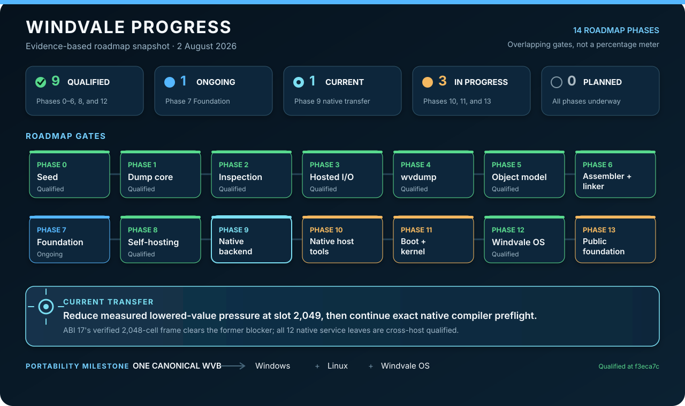

# Windvale progress

> Status: Current project snapshot as of 6 October 2026
> Authority: Informative; linked specifications and evidence own exact contracts
> Last reviewed: 2026-10-06

<a href="Images/Windvale-Roadmap-August-2026.svg"></a>

Windvale is building directly toward the integrated 1.0 host product. The signed
`v0.1.0` preview remains the completed public foundation; no `v0.2.0` product
release is planned. Windvale OS continues on its own qualification path and is
not an undeclared requirement for the Windows and Linux 1.0 product.

The [language and essential-library scope decision](../Decisions/0976-Focus-Windvale-1.0-On-The-Language-And-Essential-Libraries.md)
now selects a usable language/compiler/runtime first, using the compiler and its
tools as primary library consumers. WVDB, secondary applications and broader
OS/2.0 work are outside this critical path. Preserve earlier exact evidence;
the current product scope does not rewrite its original claims.

This page answers three questions: what works now, what is still missing, and
what result comes next. The [roadmap](Roadmap.md) owns forward gates. The
[verification evidence](https://github.com/eworker-inc/Windvale/blob/928f772e9e65c1840f263cf6ac099ab1bae0df27/Documents/Project/Seed-Verification-Evidence.md) and
[Language 1.0 migration evidence](https://github.com/eworker-inc/Windvale/blob/928f772e9e65c1840f263cf6ac099ab1bae0df27/Documents/Project/Windvale-Language-1.0-Migration-Evidence.md)
retain exact runs, hosts, artifact sizes, and hashes. The
[Language 1.0 Slice 8 qualification record](../Evidence/2026-09-04-Language-1.0-Slice-8-Qualification.json)
owns the final paired-host compiler result. The
[historical progress snapshot](https://github.com/eworker-inc/Windvale/blob/928f772e9e65c1840f263cf6ac099ab1bae0df27/Documents/Project/Progress-History-2026-08-31.md) retains the
earlier detailed implementation diary.

The image is an editorial snapshot, not a generated status report. Update this
page whenever standing changes; refresh the image only when it becomes
materially misleading.

## What works today

- The Windvale-written Language 1.0 source compiler has Slice 8 qualification
  within its exact declared targets and subsets. The forward memory integration
  is a separate candidate, using the compiler and its tools as maintained consumers.
- Windvale Seed source compiles to canonical WVB, which is verified and runs on
  Windows and Linux. The native toolchain also assembles WVA, verifies WVO,
  links images, and packages supported native applications.
- The Windvale-written Seed compiler reaches byte-identical Stage 1 and Stage 2
  results on Windows and Debian from its committed source inventory.
- Interpreter, deterministic AOT, baseline-JIT, WebAssembly, object, linker,
  hosted-container, and OS execution paths support their documented subsets.
- The repository's normal build and verification workflow is native-only. The
  qualified managed Stage 0 survives only in its immutable recovery release.
- The signed `v0.1.0` preview provides installers, an offline verifier, release
  evidence, explicit capability approval, and a package-backed WVDB Query
  application.
- The offline package lifecycle admits two packages, activates an immutable
  generation, recovers an interrupted update, rolls back, and removes
  package-owned state while preserving application data.
- Two canonical portable WVB applications have qualified execution evidence on
  Windows, Linux, and Windvale OS.
- The static browser playground compiles, verifies, and runs supported source
  entirely in the browser through the pinned WebAssembly path.

## Current work

Language, memory, essential libraries and toolchain delivery are active. Rows
for other lanes retain component standing and later needs; they do not direct
new database, service, shell, OS or compute-program work before this delivery.

| Boundary | Standing | What works | What is missing or next |
| --- | :---: | --- | --- |
| Language 1.0 | Qualified | The frozen design covers values, control flow, typed failure, generics, collections, ownership, borrowing, elastic memory budgets, hosted source access, callables, closures, bounded structured tasks, contained unsafe memory, and authenticated Foreign calls. [Decision 0943](../Decisions/0943-Complete-Windvale-Language-1.0-Slice-8-Qualification.md) accepts the exact compiler state after all 126 native owners and 5,981 cases passed on each host, deterministic reconstruction passed on Windows and Debian, and both declared WebAssembly subsets passed. | Preserve the exact qualified compiler scope. General native memory, essential library integration, current toolchain promotion and clean-install delivery remain open. |
| Slice 8 source admission | Qualified | The target-aware front door authenticates, analyzes, pairs, emits, verifies, lowers, assembles, links, packages, and executes registered Foreign calls without pointer escape or ambient authority. The real Linux system-profile record consumer uses the canonical Foundation Memory, Result, and Unsafe modules and passes within the [final paired-host gate](../Evidence/2026-09-04-Language-1.0-Slice-8-Qualification.json); separate native ABI cases qualify the Windows path. | Complete. Preserve this evidence unless a declared source, WVB, containment, ABI, or qualification input changes. Decisions [0893](../Decisions/0893-Authenticate-Production-Source-Analysis-Ingress.md) and [0895](../Decisions/0895-Bind-Authenticated-Foreign-Declarations-In-A-Private-Compiler-Phase.md) remain historical proposals rather than alternate compilers. |
| Unsafe Foundation slice | Qualified | Canonical unsafe value types, scratch construction, immutable observation, affine mutable-region containment, exact write-region validation, and contained `Writeˉpointer::<Abi>` derivation execute through WVB 1.37 and are consumed immediately by registered WVB 1.38 bindings. The real record consumer preserves the exact binding, target, lifetime, and authority boundary through native execution. | The bounded compiler/runtime contract is complete. Future library APIs must reuse it without widening authority. |
| Compiler scale | Development refresh | The prior Language 1.0 compiler-scale checkpoint remains historically qualified. Normal staging now uses compact frame initialization; the refreshed staging executable reconstructs byte for byte on Windows and Debian. Authenticated analysis can be reused after an emission change or failure, with fresh admission and authentication. | The [throughput plan](Verification-Throughput-Plan.md) owns current measurements. The refreshed products need broader qualification; the earlier exact-artifact gate is not evidence for these new bytes. Cold preparation and packaging remain performance work. |
| Memory management | Candidate integration | The [native owned-collections path](../../Specifications/Windvale-Native-Owned-Collections.md) connects scalar Vector reservation, append, length, indexed reads, explicit replacement growth and owned helper calls/returns to physical storage and canonical budget accounting. Ordinary helper returns now release unused budgets, scalar Vectors and canonical allocation Results automatically in reverse acquisition order. Returned allocations remain live through parent-budget cleanup. Candidate WVB 1.43 adds replacement and reserved append through exclusive scalar Vector helpers, plus native parameter length. A candidate [fresh-domain constructor](../../Specifications/Windvale-Native-Owned-Domain.md) initializes context 10 and its physical/accounting states after checking the supplied regions. The candidate [owned console launcher](../../Specifications/Windvale-Native-Owned-Console-Application.md) provides ordinary Windows/Linux packaging and startup for that capability-free Core path, with domain closure checked before exit. Repeated helper cleanup fits a 64-byte arena and a 48-byte peak charge. | Complete broader scope exits, mutable element views, broader borrowed helpers, hosted launchers and shared immutable backing, then migrate interpreter working state. Broader owner aggregates still need cleanup support. Direct indexed reads retain conservative source borrow restrictions. Ordinary interpreter working-set reduction and whole-path qualification remain open. |
| Libraries 1.0 | Active | The package parser and immutable-borrow consumer are delivered. Candidate WVB 1.42 adds focused Windows/Debian evidence for Copy-record collections and owned-budget helpers. | Complete essential library rows using compiler/runtime/toolchain consumers, then native and installed qualification. The typed Package-Lock refactor is deferred. The [completion matrix](Compiler-Tools-And-Libraries-1.0-Matrix.md#current-checkpoint-and-next-action) tracks scope; the [completion plan](Compiler-Tools-And-Libraries-Completion-Plan.md) owns current blockers. The [six-item simplification goal](Verification-Throughput-Plan.md#six-item-simplification-goal) addresses diagnostics, feedback time and maintenance overhead. |
| Project 4 build integration | Development | The selected package parser/lock source closure now builds through explicit-target Project 4 manifests and current-source native publication. Focused Windows/Debian launcher, replacement, malformed-output, and consumer cases are recorded in the [integration evidence](../Evidence/2026-09-15-Source-Edition-Package-Integration.json). | Installed compiler and publisher promotion, full transaction fault-injection qualification, and complete suite migration remain open; the selected package-parser delivery gate is closed. |
| WVDB 1.0 | Deferred | Upper-layer identity, tables, typed relationships, indexes, queries, transactions, storage profiles, types, documents/graphs, and backup direction are accepted. Existing storage and service slices remain useful implementation evidence. | Finish normative storage, durability, backup/restore, service, operations, and conformance contracts, then reconcile the implementation against them. |
| Packages and services | Active | Immutable packages, release admission, installers, offline activation, rollback, command resolution, and rights-limited execution are established foundations. | Define and qualify the complete 1.0 service lifecycle, support, migration, update, compatibility, and recovery promises. |
| Windvale OS | Deferred | Probe 40 qualifies protected processes, capability IPC, bounded preemption, generation-safe memory reuse, exact WVB portability, and growing source ownership of the fixed process machine. Filesystem work has bounded host and FAT32 foundations. | Bind a surviving consumer and FAT32 media, enter the ready filesystem provider, complete one bounded guest read with rollback and teardown, then advance networking without claiming arbitrary application launch. |
| Windvale Shell | Deferred | The Shell 1 parser and portable `echo` path have paired evidence. A hosted exact-byte output and file-read target exists. | Package and resolve file-read, route the Workbench `cat` command through verified WVB, and later add an interactive or in-OS host deliberately. |
| Compute and efficiency | Program | Performance and memory are repository-wide requirements with a separate 2027 program. | Add improvements only through named workloads, measurements, resource bounds, regression thresholds, and reproducible public evidence. |

## WVB version scopes

Name the track when a bytecode version matters:

- Seed and its frozen bootstrap/recovery path retain qualified WVB 1.11.
- The qualified Language 1.0 source compiler includes authenticated Foreign
  calls through WVB 1.38. Other execution targets retain their declared subsets.
- Libraries 1.0 development extends immutable borrowing and owned collections
  through candidate WVB 1.43. Scalar Vector helpers have focused native storage
  integration; Copy-record collection lowering and installed-toolchain promotion
  remain open. Focused checks do not establish independent compiler reconstruction
  or complete qualification.
- Candidate WVB 1.44/1.45 connects reserved byte construction, shared-value
  cleanup and budget helpers to native ABI 25/context 11. Current compiler hosts
  have been reconstructed on Windows and Debian through the explicit temporary
  bootstrap projection. Final verification, self-lowering and installed promotion
  remain open. The [completion plan](Compiler-Tools-And-Libraries-Completion-Plan.md)
  owns the exact current boundary and next consumer.

The [dated library history](https://github.com/eworker-inc/Windvale/blob/928f772e9e65c1840f263cf6ac099ab1bae0df27/Documents/Project/Library-Development-History-2026-09-26.md) preserves
the earlier 1.39 checkpoint details and delivery measurements. Later development
does not silently redefine frozen Seed or Language 1.0 qualification identities.

## What is not complete

Windvale 1.0 is not released. General memory management, essential libraries,
current-generation toolchain promotion, clean installation/self-hosting and final
Windows/Debian qualification remain open. WVDB and broader services are deferred. The completed Language 1.0 compiler qualification
does not substitute for those product gates.

[Support policy accepted](Windvale-1.0-Stability-And-Support-Policy.md): each
official minor line receives 12 months of fixes through its latest patch.

Windvale OS does not yet provide arbitrary application launch, a live general
filesystem provider, a complete network stack, a general scheduler, broad
hardware support, or a desktop. The browser playground is not a Windvale OS
boot. Proposed agent-runtime and Observatory work is not an active release
claim.

## Immediate next results

1. Finish the scope and supported-toolchain audit in the
   [completion plan](Compiler-Tools-And-Libraries-Completion-Plan.md#supported-toolchain-and-retirement-map).
   Identify current, required-bootstrap, superseded, recovery-only and parked
   components before removing code.
2. Measure and simplify ordinary preparation/build/verify/run using one selected
   current compiler generation. Keep cold reconstruction separate and bounded.
3. Complete ownership-to-storage memory and essential library APIs with compiler
   parsing, symbol/analysis state, interpreter working state and output writing
   as maintained consumers. Fixed-live-state workloads must stabilize on both
   hosts; guest release and larger arenas are not proof of native reuse.
4. Reconstruct and qualify a selected generation, prove clean-install use, then
   retire replaced active paths. WVDB, the typed Package-Lock refactor and
   secondary applications are deferred; necessary toolchain package functions
   remain maintained.

## How to verify ordinary work

After a coherent edit, run one change-aware verifier:

```powershell
pwsh -NoProfile -File Tools/Verify/Verify-Changed.ps1
```

Use the focused owner selected for the changed boundary. Do not run development
and complete qualification as a ladder against the same unchanged source.

## Evidence and history

- [Exact Seed and release evidence](https://github.com/eworker-inc/Windvale/blob/928f772e9e65c1840f263cf6ac099ab1bae0df27/Documents/Project/Seed-Verification-Evidence.md)
- [Language 1.0 migration evidence](https://github.com/eworker-inc/Windvale/blob/928f772e9e65c1840f263cf6ac099ab1bae0df27/Documents/Project/Windvale-Language-1.0-Migration-Evidence.md)
- [Detailed progress history through this reorganization](https://github.com/eworker-inc/Windvale/blob/928f772e9e65c1840f263cf6ac099ab1bae0df27/Documents/Project/Progress-History-2026-08-31.md)
- [Release naming and recovery policy](Release-Names-And-Tags.md)
- [Windvale 1.0 product gate](Windvale-1.0-Product-Plan.md)
