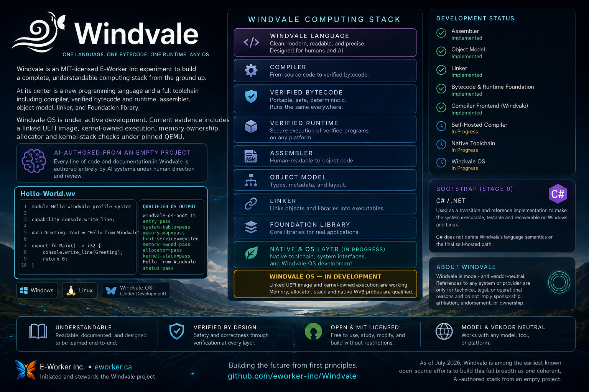

# Windvale

Windvale is an MIT-licensed [E-Worker Inc](https://eworker.ca) experiment to build an entire, understandable computing stack from the ground up. Its code and documentation are authored entirely by AI systems under human direction and review.

AI systems produce the source and prose. Humans define the objectives, direct the work, review and test the results, decide what the project accepts and publishes, and remain responsible for publication. [E-Worker Inc](https://eworker.ca) provides project stewardship.

At its center is a **new programming language**, together with its compiler, portable bytecode, verified runtime, assembler, object model, linker, and Foundation library. The long-term integration goal is a **new small operating system** capable of loading and running the same verified Windvale programs that run on Windows and Linux. The language and tools remain independently useful before the operating system is complete.

## Progress at a glance

**Status key:** ✅ Working now · 🚧 Working but incomplete · ○ Planned

*“Working now” means implemented and tested for the current experimental Windvale Seed scope. It does not mean permanently finished or production-stable.*

| Project area | Status | What works today | Next major milestone |
| --- | :---: | --- | --- |
| Windvale language | ✅ Working now | Typed portable and hosted programs with modules, functions, control flow, records, enums, text, bytes, and explicit capabilities | Expand the language only as compiler, library, and operating-system work requires |
| C# Stage 0 toolchain | ✅ Working now | Compiles Windvale source and provides the current recovery and reference implementation on Windows and Linux | Retire from the normal workflow after the native Windows/Linux bootstrap gate; preserve final recovery evidence |
| Compiler written in Windvale | 🚧 In progress | Compiles its complete accepted source graph and reproduces the exact 599,868-byte bytecode compiler | Move the qualified compiler through the shared native execution path |
| Portable bytecode and verifier | ✅ Working now | Deterministic `.wvb` modules can be decoded, inspected, disassembled, and safety-checked before execution | Evolve the format from implementation evidence without weakening its safety boundary |
| Runtime on Windows and Linux | ✅ Working now | The same verified module runs through the .NET-hosted portable reference interpreter with bounded resources and explicit host services | Build Windvale-native interpreter, baseline JIT, AOT, memory, and host adapters |
| Foundation library | 🚧 In progress | Shared machine, byte-ordering, decimal-parsing, and byte-construction modules are used by real Windvale tools | Add collections, text, diagnostics, and other facilities demanded by self-hosting |
| Assembler | ✅ Working now | C# and Windvale assemblers turn textual WVA assembly into matching verified WVO objects | Add instructions and addressing required by native compilation and the kernel |
| Object-file model | ✅ Working now | WVO defines verified sections, symbols, and relocations shared by the assembler and linker | Support richer object requirements discovered by the native backend |
| Linker | ✅ Working now | C# and Windvale linkers resolve symbols and relocations into the same deterministic flat x86-64 image and map | Produce executable and bootable target formats |
| CLI and inspection tools | ✅ Working now | One CLI can compile, verify, inspect, run, assemble, link, and inspect or verify objects | Move more command implementations into Windvale and add broader developer tooling |
| Editor support | ✅ Working now | Windvale syntax highlighting and language configuration work locally in Visual Studio Code | Package it publicly and pursue GitHub language recognition when eligible |
| Tests, specifications, and reproducibility | ✅ Working now | Valid, malformed, boundary, random-input, deterministic-output, and cross-host checks protect the current contracts | Extend the same evidence discipline to self-hosting, native code, and the operating system |
| Native compiler and host programs | 🚧 In progress | ABI 12/context 4 is a Windows-tested candidate; eight service slots, including immutable argument access, use exact native leaves | Qualify the candidate, then narrow the three remaining hosted adapters and move construction/publication ownership into Windvale |
| Windvale operating system | 🚧 In progress | Probe 14 is a Windows-tested service-free ABI-12/context-4 AOT candidate; probe 13 remains cross-host/pinned-QEMU qualified | Qualify probe 14, then add traps, in-guest verification/runtime, clean shutdown, and Hyper-V evidence |
| Open-source project foundation | 🚧 In progress | MIT licensing, contribution, security, governance, support, and authorship policies exist | Complete the publication baseline and establish public project operations |

**Working end to end today:**

```text
Windvale source -> compiled WVB -> verification -> execution on Windows or Linux
Windvale assembly -> verified WVO object -> deterministic linked x86-64 image
System-profile Hello-World.wv -> verified WVO -> linked UEFI image -> post-firmware serial output
Portable Native-Wvb-Probe.wv -> verified WVB -> ABI-12 WVO -> linked UEFI image -> kernel-owned execution
Hosted Wv-Dump-Core.wv -> ABI-12 W^X/WVO execution -> complete deterministic real-WVB report
```

**Shared native WVB in the OS:** [`Hello-World.wv`](Operating-System/Kernel/Hello-World.wv) still supplies the special system-profile diagnostics, while ordinary portable [`Native-Wvb-Probe.wv`](Operating-System/Kernel/Native-Wvb-Probe.wv) compiles to canonical verified WVB and then to the current ABI-12 candidate. After the loader exits UEFI boot services, claims and clears a 64 KiB arena, exercises its allocator, copies the handoff, and switches to an 8 KiB kernel stack, the bridge constructs context version 4 with zero argument fields. The portable module loops over immutable i32 data, passes borrowed bytes into an internal function, slices and reads them, checks `u8`/`u32` results, and must return exact result 29 before boot continues. This is host-built AOT evidence; the guest does not yet load or verify WVB. The current Windows-tested version-14 candidate transcript is:

```text
windvale-os-boot 14
entry=pass
system-table=pass
memory-map=pass
boot-services=exited
memory-owned=pass
allocator=pass
kernel-stack=pass
Hello from Windvale
native-context=pass
native-wvb=pass
windvale-source=pass
status=pass
```

The exact ownership, allocator, implementation seam, target, and evidence limits are recorded in [Decision 0052](Documents/Decisions/0052-First-Kernel-Owned-Memory-Foundation.md), [Decision 0056](Documents/Decisions/0056-Windvale-Owned-Post-Memory-Evidence.md), [Decision 0064](Documents/Decisions/0064-First-Shared-Native-Wvb-In-Windvale-Os.md), [Decision 0065](Documents/Decisions/0065-Versioned-Native-Execution-Context-And-Console-Service.md), [Decision 0066](Documents/Decisions/0066-Borrowed-Bytes-And-Unsigned-Native-Values.md), [Decision 0067](Documents/Decisions/0067-Borrowed-Hosted-Input-And-First-Native-Wvb-Inspector.md), [Decision 0068](Documents/Decisions/0068-Bounded-Native-Nominal-Values-And-Wvdump-Structural-Core.md), [Decision 0069](Documents/Decisions/0069-Dynamic-Native-Text-And-Complete-Wvdump.md), [Decision 0070](Documents/Decisions/0070-First-Runtime-Native-Utf8-Service.md), [Decision 0071](Documents/Decisions/0071-Native-Text-Arena-And-Core-Text-Services.md), [Decision 0072](Documents/Decisions/0072-Final-Pure-Runtime-Native-Services.md), [Decision 0073](Documents/Decisions/0073-Native-Argument-Table-And-Process-Input-Services.md), the [native execution-context specification](Specifications/Windvale-Native-Execution-Context.md), the [kernel-memory specification](Specifications/Windvale-Kernel-Memory.md), and the [kernel native-seam specification](Specifications/Windvale-Kernel-Native-Seam.md).

**Current focus:** qualify ABI 12's native immutable argument boundary, then replace the three remaining hosted callbacks only behind explicit Windows/Linux contracts while moving service construction, verification, W^X publication, arenas, and execution into Windvale.

**Latest qualified evidence:** exact commit `f97d221` passes zero-warning Windows and Debian Qualification with all 56 tests. ABI 11/context 3 gives native services one checked 16 MiB text arena; strict UTF-8 validation, enum naming, concatenation, deterministic quoting, signed formatting, and unsigned formatting all use exact platform-neutral x86-64 leaves. Interpreter, Windows/Linux W^X JIT, and linked WVO/AOT agree over bounded dynamic text and the complete 1,441-line Windvale `wvdump`; normalized contracts match and all 61 portable artifacts (7,752,647 bytes) are byte-identical. Both hosts pass all 15 OS tests. The exact 15,872-byte Windvale OS image has SHA-256 `ceffc3e33bf007e47b109f3b6a71db2fdceac3c0e908d1471f056909ee42532d` and emits the complete version-13 success transcript under pinned QEMU 11.0 on Windows. The Windvale bytecode compiler still reproduces its exact 599,868-byte artifact in 6,700,562,174 verified VM instructions. C# still constructs, verifies, and publishes all native service bundles, owns arenas/execution, and supplies hosted runtime services, so this is not yet a Windvale-written native runtime or .NET retirement. See the [qualification evidence](Documents/Project/Seed-Verification-Evidence.md) and [development roadmap](Documents/Project/Roadmap.md) for the complete scope and remaining gates.

Today, Windvale uses dependency-free C# and .NET as its Stage 0 bootstrap. C# is a transition and reference implementation: it makes the compiler, bytecode verifier, runtime, assembler, object model, linker, and CLI executable, testable, and recoverable on Windows and Linux while those components are progressively implemented in Windvale itself. C# does not define Windvale's language semantics or the final self-hosted path. After the native-retirement gate, .NET leaves the normal build, test, packaging, and execution workflow; the final Stage 0 release may remain only as archived recovery and provenance evidence.

The accepted native destination keeps canonical WVB as the portable program identity while a Windvale-written execution stack supplies a verified interpreter, low-latency baseline JIT, optional measured optimizing tier, deterministic AOT, native memory management, and narrow Windows, Linux, and Windvale OS adapters. JIT and AOT share one native ABI, backend, and relocation model. [Decision 0059](Documents/Decisions/0059-First-Shared-Native-Wvb-Slice.md) through [Decision 0072](Documents/Decisions/0072-Final-Pure-Runtime-Native-Services.md) cross-host qualify the Stage 0 seam through ABI 11, all six pure native leaves, the complete Windvale `wvdump`, and firmware probe 13. [Decision 0073](Documents/Decisions/0073-Native-Argument-Table-And-Process-Input-Services.md) advances the current candidate to ABI 12 with exact argument-count and argument-copy leaves. The larger direction, safety boundary, proposed WVA copy-and-patch tier, and exact .NET retirement conditions remain defined by [Decision 0057](Documents/Decisions/0057-Windvale-Native-Execution-And-Dotnet-Retirement.md) and the [native-execution architecture](Documents/Architecture/Native-Execution-And-Dotnet-Retirement.md).

The Windvale-written compiler lives under `Compiler/Windvale`; the independent C# reference/recovery compiler lives under `Compiler/Reference`. “Bootstrap” describes the staged and reproducible process between them, not the product name of either implementation.

[E-Worker Inc](https://eworker.ca) initiated and stewards the project. Windvale is model- and vendor-neutral. A particular system or provider is recorded only when technically, legally, or operationally material; such a record does not imply sponsorship, affiliation, endorsement, or ownership by its provider.

As of July 2026, Windvale is among the earliest known open-source efforts to build this full breadth as one coherent, AI-authored stack from an empty project: its own source-language semantics, compiler, verified bytecode, runtime, assembler, object model, linker, Foundation library, native path, and operating system. Earlier AI-authored operating systems and language/toolchain projects exist; this claim concerns the combined scope, not priority for any one component. The scope, search method, and close comparisons are recorded in the [earliest-known claim evidence](Documents/Project/Earliest-Known-Claim-Evidence.md).

Windvale is experimental and not yet stable. The assembler, object model, linker, bytecode/runtime foundation, and complete Windvale-written bytecode compiler have reproducible cross-host evidence. Exact Stage 1 to Stage 2 self-reproduction is qualified on Windows and Debian; native compiler execution, the general native toolchain, and Windvale OS remain active milestones. Development contracts may change without backward compatibility until they are explicitly stabilized.

## Project overview



*This July 2026 overview is a periodic visual snapshot. Current repository contracts and qualification evidence govern if the project later advances beyond what the image shows.*

## Current milestone: Windvale Seed

Windvale Seed is implemented as a dependency-free C# Stage 0 toolchain. It provides:

- A small typed source language with modules, functions, locals, control flow, immutable nominal records and enums, immutable text, integer and byte data, and explicit capabilities
- Bounded deterministic compile-time source-module composition with explicit transitive dependencies, nominal source contracts, and no runtime linkage
- Portable Foundation modules for bounded machine contracts, ordinal byte-span ordering, structured unsigned decimal parsing, and immutable byte construction, driven by the object core, assembler, linker, and future compiler needs
- A first Windvale-written compiler lexer that streams the complete implemented Seed token surface over strict UTF-8 bytes without a token collection
- A Windvale-written declaration parser that discovers module/declaration shapes and balanced function-body spans as immutable source views without a declaration collection
- A Windvale-written body parser that reproduces the complete implemented statement/expression grammar as flat child-span views without a syntax tree collection
- A canonical Windvale Source Set (`WVSS 1`) reader that gives the portable semantic pipeline bounded random access to a root plus ordered dependency sources without host objects or native paths
- A Windvale-written import graph and declaration/signature binder with independently validated packed symbol evidence, transitive visibility, and deterministic nominal identities
- A cross-host-qualified Windvale-written body binder with canonical parameter/local evidence and a typed WVIR producer with explicit blocks, temporaries, operations, source spans, independent binary validation, and fused successful-path local discovery
- A Windvale-written WVIR-to-WVB backend with static multi-module flattening, canonical function/data/type/capability ordering, all three root profiles, primitive static data, immutable records, nominal enums, explicit capabilities, text/bytes and Foundation intrinsics, exact Stage 0 byte equality, mandatory verification, runtime execution, and qualified exact Stage 1 to Stage 2 self-reproduction
- A Windvale-written import-graph phase that resolves the complete WVSS root closure and rejects duplicate, missing, cyclic, and unreachable imports without host collections
- Foundation `u8`, `u32`, immutable byte slices and concatenation, bounded signed/unsigned little-endian reads and writes, exact SHA-256 identity, and explicit byte widening
- Strict UTF-8 validation/encoding/decoding, safe ASCII quoting, deterministic enum names, invariant integer formatting, and bounded text construction
- A Windvale-written `.wvb` decoder that validates every section payload, reports declarations, and walks complete instruction streams through a hosted file shell
- A canonical x86-64-first WVO 1.0 object model with sections, symbols, relocations, a bounded C# oracle, and a Windvale-written producer/structural inspector
- A versioned WVA 1 textual assembly contract and Stage 0 assembler that infers definition offsets/sizes and emits verified WVO objects
- A Windvale-written WVA assembler that performs bounded scanning and semantic validation, derives definition ranges, encodes the complete initial x86-64 instruction/data set, constructs canonical WVO objects, and writes only a fully accepted result
- A separate Stage 0 linker that resolves verified WVO inputs, lays out a bounded x86-64 flat memory image, applies checked relocations, independently reconstructs the result, and emits a canonical path-free map
- A qualified Windvale-written linker that validates WVO, resolves and lays out inputs, constructs and independently reconstructs relocated images, emits the canonical map, and publishes only after complete success
- A stack-independent typed Windvale IR
- Deterministic `.wvb` bytecode generation
- A bounded binary reader and mandatory control-flow/type verifier
- A human-readable module inspector and disassembler
- A portable .NET reference runtime
- Explicit hosted arguments, bounded first-read file snapshots and file output, standard output, separate diagnostics, support preflight, and exact capability authorization
- Conformance, malformed-input, determinism, diagnostics, and runtime-limit coverage
- One CLI with module `compile`, `inspect`, `verify`, and `run`, textual `assemble`, deterministic `link`, plus object `object-inspect` and `object-verify` commands

## License and stewardship

Windvale is open source under the [MIT License](LICENSE). Copyright © 2026 [E-Worker Inc](https://eworker.ca) and Windvale contributors. The company is the project business and steward.

“Author” and “authored” describe how the project was produced; they do not assert that an AI system is a legal person or copyright holder. The MIT License grants permissions from each applicable rightsholder for rights that subsist. See [Decision 0031](Documents/Decisions/0031-AI-Authorship-And-Vendor-Neutrality.md) for the project-wide attribution policy.

## Contributing and project policies

- [Contributing](CONTRIBUTING.md) — development model, evidence, review, DCO sign-off, and licensing
- [Security](SECURITY.md) — supported versions and private vulnerability reporting
- [Governance](GOVERNANCE.md) — stewardship, roles, decisions, releases, and identity
- [Code of conduct](CODE_OF_CONDUCT.md) — participation and private conduct reporting
- [Support](SUPPORT.md) — public help channels and current support limits
- [Project identity](TRADEMARKS.md) — permitted reference to Windvale and E-Worker names and visual identity
- [Changelog](CHANGELOG.md) — unreleased status and initial `0.y.z` versioning policy
- [GitHub publication runbook](Documents/Project/GitHub-Publication-Runbook.md) — private-first import, initial baseline, and public-visibility checklist

## Requirements

- .NET SDK 10.0.302 or a compatible later patch in the same feature band
- Windows or Linux

The repository pins the SDK in `global.json` and uses no external NuGet packages.

## Editor support

The repository includes [Windvale language support](Tools/Editors/Windvale/README.md) for `.wv` source files. Its TextMate-compatible `source.windvale` grammar provides Windvale syntax highlighting and a Visual Studio Code language configuration while the language builds enough public adoption for a future GitHub Linguist submission.

Preview it from the repository root in a Visual Studio Code Extension Development Host:

```powershell
code --extensionDevelopmentPath=Tools/Editors/Windvale .
```

GitHub does not load repository-local grammars, so GitHub file highlighting and the repository language bar will continue to omit Windvale until Linguist accepts the language. The project does not misclassify `.wv` as C# or another existing language in the meantime.

## Quick start

Build and run the complete Seed verifier on Windows:

```powershell
pwsh -NoProfile -File Tools/Verify/Verify-Seed.ps1
```

For the normal inner loop, let the changed paths select the relevant test areas:

```powershell
pwsh -NoProfile -File Tools/Verify/Verify-Changed.ps1
```

Use the fast tier directly when you need to override that plan. Areas are repeatable and combine as a union; a displayed-name filter narrows that union further:

```powershell
pwsh -NoProfile -File Tools/Verify/Verify-Seed.ps1 `
  -Level Fast `
  -TestArea compiler,runtime `
  -TestFilter 'declaration namespaces' `
  -FailFast `
  -TimingReportPath artifacts/seed-timing-fast.json
```

The available areas are `assembler`, `bytecode`, `compiler`, `foundation`, `golden`, `linker`, `object-model`, and `runtime`. `Verify-Changed.ps1` fails closed to all areas for broad or unrecognized implementation changes. Changed-file and Fast runs are development feedback only.

When a timing report includes the golden test, its `goldenPhases` array separates artifact compilation, baseline runtime work, compiler closures, inspection tools, assembler, linker, and contract assembly. Each phase reports elapsed time, executed VM instructions, current-thread allocated bytes, and garbage-collection deltas. These metrics are diagnostic and do not enter the conformance report.

Runtime performance work should iterate with a narrow compiler or runtime filter, use `-TestArea golden` alone for periodic measured checkpoints, and run Standard only for the final candidate. The complete suite is not required after every optimization edit.

`-Level Development` builds and runs every regular in-process test while deferring the multi-billion-instruction golden cross-host contract. It is the broad pre-commit development check. `-Level Standard` builds and runs the complete in-process conformance suite but skips native CLI qualification. The default `Qualification` level retains the complete verifier and remains mandatory for qualifying portable semantics or artifact identities.

On Linux:

```sh
./Tools/Verify/Verify-Seed.sh
```

Linux exposes the same tiers through `VERIFY_LEVEL`, comma-separated `TEST_AREAS`, `TEST_FILTER`, `FAIL_FAST`, and `TIMING_REPORT_PATH`; use `VERIFY_LEVEL=development` for the broad regular suite. GitHub runs the default qualification level on Windows and Linux concurrently.

Compiler bootstrap convergence is intentionally separate from the normal development suite because it executes billions of verified VM instructions. Run it once for a final compiler candidate:

```powershell
pwsh -NoProfile -File Tools/Verify/Verify-Bootstrap.ps1
```

```sh
./Tools/Verify/Verify-Bootstrap.sh
```

The verifier builds Stage 1 with the C# recovery compiler, asks that Windvale bytecode compiler to build Stage 2 from the exact canonical source inventory, independently verifies both modules, and requires complete byte equality.

Compile, verify, inspect, and run the portable example:

```powershell
dotnet run --project Tools/Windvale.Tool -- compile Examples/Seed/Sum-Data.wv -o artifacts/Sum-Data.wvb
dotnet run --project Tools/Windvale.Tool -- verify artifacts/Sum-Data.wvb
dotnet run --project Tools/Windvale.Tool -- inspect artifacts/Sum-Data.wvb
dotnet run --project Tools/Windvale.Tool -- run artifacts/Sum-Data.wvb
```

The result is:

```text
Result: 29
```

Compile and run the hosted example with its capability granted explicitly:

```powershell
dotnet run --project Tools/Windvale.Tool -- compile Examples/Seed/Hello-Windvale.wv -o artifacts/Hello-Windvale.wvb
dotnet run --project Tools/Windvale.Tool -- run artifacts/Hello-Windvale.wvb --allow console.write_line
```

The runtime refuses that module without `--allow console.write_line`.

Compile and run the portable Foundation example that validates a static `.wvb` header:

```powershell
dotnet run --project Tools/Windvale.Tool -- compile Examples/Foundation/Read-Wvb-Header.wv -o artifacts/Read-Wvb-Header.wvb
dotnet run --project Tools/Windvale.Tool -- inspect artifacts/Read-Wvb-Header.wvb
dotnet run --project Tools/Windvale.Tool -- run artifacts/Read-Wvb-Header.wvb
```

It exercises `u8`, `u32`, immutable byte slices, and bounded little-endian reads and returns `Result: 1`.

Compile and run the first shared Foundation contract:

```powershell
dotnet run --project Tools/Windvale.Tool -- compile Foundation/Machine-Contracts.wv -o artifacts/Machine-Contracts.wvb
dotnet run --project Tools/Windvale.Tool -- compile `
  Examples/Foundation/Machine-Contracts-Demo.wv `
  --module Foundation/Machine-Contracts.wv `
  -o artifacts/Machine-Contracts-Demo.wvb
dotnet run --project Tools/Windvale.Tool -- run artifacts/Machine-Contracts-Demo.wvb
```

The module exposes the exact alignment and ASCII machine-name predicates shared by the Windvale assembler and linker. The boundary demo returns `Result: 0`.

Compile and run the shared ordinal byte-span contract:

```powershell
dotnet run --project Tools/Windvale.Tool -- compile Foundation/Byte-Ordering.wv -o artifacts/Byte-Ordering.wvb
dotnet run --project Tools/Windvale.Tool -- compile `
  Examples/Foundation/Byte-Ordering-Demo.wv `
  --module Foundation/Byte-Ordering.wv `
  -o artifacts/Byte-Ordering-Demo.wvb
dotnet run --project Tools/Windvale.Tool -- run artifacts/Byte-Ordering-Demo.wvb
```

The module compares validated spans of one immutable byte value without allocation or text decoding. The WVO object core, assembler, and linker share it for canonical name ordering; the demo returns `Result: 0`.

Compile and run the shared bounded decimal parser:

```powershell
dotnet run --project Tools/Windvale.Tool -- compile Foundation/Decimal-Parsing.wv -o artifacts/Decimal-Parsing.wvb
dotnet run --project Tools/Windvale.Tool -- compile `
  Examples/Foundation/Decimal-Parsing-Demo.wv `
  --module Foundation/Decimal-Parsing.wv `
  -o artifacts/Decimal-Parsing-Demo.wvb
dotnet run --project Tools/Windvale.Tool -- run artifacts/Decimal-Parsing-Demo.wvb
```

The module returns an imported immutable `Foundationˉu32ˉparse` record, validates arbitrary byte spans without trapping, and accepts only bounded ASCII decimal values through `u32` maximum. The assembler and linker share it; the demo returns `Result: 0`.

Compile and run the shared immutable byte-construction contract:

```powershell
dotnet run --project Tools/Windvale.Tool -- compile Foundation/Byte-Construction.wv -o artifacts/Byte-Construction.wvb
dotnet run --project Tools/Windvale.Tool -- compile `
  Examples/Foundation/Byte-Construction-Demo.wv `
  --module Foundation/Byte-Construction.wv `
  -o artifacts/Byte-Construction-Demo.wvb
dotnet run --project Tools/Windvale.Tool -- run artifacts/Byte-Construction-Demo.wvb
```

The module creates repeated byte values with logarithmic concatenation and replaces validated ranges without mutation or traps. Its demo covers the exact 4 MiB limit; the assembler and linker share it, and the future bytecode encoder can use the same replacement contract for measured backpatching.

Compile and run the transitive source-module composition example:

```powershell
dotnet run --project Tools/Windvale.Tool -- compile `
  Examples/Foundation/Module-Composition-Demo.wv `
  --module Examples/Foundation/Module-Composition-Middle.wv `
  --module Examples/Foundation/Module-Composition-Leaf.wv `
  -o artifacts/Module-Composition-Demo.wvb
dotnet run --project Tools/Windvale.Tool -- run artifacts/Module-Composition-Demo.wvb
```

The compiler resolves only the explicitly supplied portable source modules, internalizes dependency records, enums, and functions into one ordinary WVB, and returns `Result: 42`. The leaf's nominal result crosses the transitive module boundary. Reordering the two `--module` inputs produces identical bytes.

Compile and run the first Windvale-written compiler slice:

```powershell
dotnet run --project Tools/Windvale.Tool -- compile `
  Compiler/Windvale/Source-Lexer-Core.wv `
  --module Foundation/Decimal-Parsing.wv `
  -o artifacts/Source-Lexer-Core.wvb
dotnet run --project Tools/Windvale.Tool -- compile `
  Examples/Compiler/Source-Lexer-Demo.wv `
  --module Compiler/Windvale/Source-Lexer-Core.wv `
  --module Foundation/Decimal-Parsing.wv `
  -o artifacts/Source-Lexer-Demo.wvb
dotnet run --project Tools/Windvale.Tool -- run artifacts/Source-Lexer-Demo.wvb --max-steps 10000000
```

The lexer returns one token plus the next byte cursor and source position. It covers the complete current Seed keyword/operator surface, U+02C9 names, typed decimal literals, strict UTF-8 and string escapes, and bounded failures. The demo returns `0`. The parser advances this streaming contract; indexed token rescanning is retained only for verification.

Compile the streaming declaration pass and make it parse its own source:

```powershell
dotnet run --project Tools/Windvale.Tool -- compile `
  Compiler/Windvale/Source-Declaration-Parser.wv `
  --module Compiler/Windvale/Source-Lexer-Core.wv `
  --module Foundation/Decimal-Parsing.wv `
  -o artifacts/Source-Declaration-Parser.wvb
dotnet run --project Tools/Windvale.Tool -- compile `
  Examples/Compiler/Source-Declaration-Parser-Tool.wv `
  --module Compiler/Windvale/Source-Declaration-Parser.wv `
  --module Compiler/Windvale/Source-Lexer-Core.wv `
  --module Foundation/Decimal-Parsing.wv `
  -o artifacts/Source-Declaration-Parser-Tool.wvb
dotnet run --project Tools/Windvale.Tool -- run artifacts/Source-Declaration-Parser-Tool.wvb `
  --allow console.write_line `
  --allow diagnostic.write_line `
  --allow file.read_bytes `
  --allow process.argument `
  --allow process.argument_count `
  --max-steps 45000000 `
  -- Compiler/Windvale/Source-Declaration-Parser.wv
```

The declaration pass parses signatures and balanced body spans so later passes can bind declarations first and parse bodies from exact immutable views. The hosted shell only supplies an explicit file snapshot and report sink.

Compile the statement/expression pass and make it parse its own source:

```powershell
dotnet run --project Tools/Windvale.Tool -- compile `
  Compiler/Windvale/Source-Body-Parser.wv `
  --module Compiler/Windvale/Source-Declaration-Parser.wv `
  --module Compiler/Windvale/Source-Lexer-Core.wv `
  --module Foundation/Decimal-Parsing.wv `
  -o artifacts/Source-Body-Parser.wvb
dotnet run --project Tools/Windvale.Tool -- compile `
  Examples/Compiler/Source-Body-Parser-Tool.wv `
  --module Compiler/Windvale/Source-Body-Parser.wv `
  --module Compiler/Windvale/Source-Declaration-Parser.wv `
  --module Compiler/Windvale/Source-Lexer-Core.wv `
  --module Foundation/Decimal-Parsing.wv `
  -o artifacts/Source-Body-Parser-Tool.wvb
dotnet run --project Tools/Windvale.Tool -- run artifacts/Source-Body-Parser-Tool.wvb `
  --allow console.write_line `
  --allow diagnostic.write_line `
  --allow file.read_bytes `
  --allow process.argument `
  --allow process.argument_count `
  --max-steps 160000000 `
  -- Compiler/Windvale/Source-Body-Parser.wv
```

The body pass returns flat statement and expression views with bounded child spans, counts, and depths. It validates the lexer, declaration parser, and itself without retaining tokens or a syntax tree; semantic binding is the next compiler slice.

Compile the packed source-set reader and validate the real compiler frontend set:

```powershell
dotnet run --project Tools/Windvale.Tool -- compile `
  Compiler/Windvale/Source-Set-Core.wv `
  --module Compiler/Windvale/Source-Body-Parser.wv `
  --module Compiler/Windvale/Source-Declaration-Parser.wv `
  --module Compiler/Windvale/Source-Lexer-Core.wv `
  --module Foundation/Decimal-Parsing.wv `
  -o artifacts/Source-Set-Core.wvb
dotnet run --project Tools/Windvale.Tool -- compile `
  Examples/Compiler/Source-Set-Tool.wv `
  --module Compiler/Windvale/Source-Set-Core.wv `
  --module Compiler/Windvale/Source-Body-Parser.wv `
  --module Compiler/Windvale/Source-Declaration-Parser.wv `
  --module Compiler/Windvale/Source-Lexer-Core.wv `
  --module Foundation/Decimal-Parsing.wv `
  -o artifacts/Source-Set-Tool.wvb
dotnet run --project Tools/Windvale.Tool -- run artifacts/Source-Set-Tool.wvb `
  --allow console.write_line `
  --allow diagnostic.write_line `
  --allow file.read_bytes `
  --allow process.argument `
  --allow process.argument_count `
  --max-steps 800000000 `
  -- Compiler/Windvale/Source-Set-Core.wv `
     Compiler/Windvale/Source-Body-Parser.wv `
     Compiler/Windvale/Source-Declaration-Parser.wv `
     Compiler/Windvale/Source-Lexer-Core.wv `
     Foundation/Decimal-Parsing.wv
```

WVSS 1 keeps the root first and dependencies in declared-module-name order, validates every source through the qualified syntax frontend, and exposes immutable source slices by index. `Compilerˉsourceˉgraph` resolves import topology over that boundary. `Compilerˉsourceˉsymbols` validates global declaration namespaces and signatures, creates an independently checked `WVSD 1` declaration directory, computes transitive module visibility once, and assigns canonical nominal indices. Its private `WVSI 1.1` evidence maps source-order directory identities to canonical record/enum ordinals in both directions without changing public WVSD bytes. `Compilerˉsourceˉbindings` assigns parameter/local slots and scopes, resolves body reads, assignments, constructors, functions, capabilities, and Foundation intrinsics, and publishes an independently checked `WVLB 1` binding directory. `Compilerˉsourceˉwir` performs complete implemented expression typing, field/operator checks, control-flow construction, and independent `WVIR 1` validation. Its successful path constructs parameter/local evidence and typed WVIR in one statement traversal, reuses validated lexical/declaration evidence across compiler phases, and retains checked standalone boundaries and diagnostic oracles. The exact ten-module typed-WVIR input completes in 3,912,239,584 instructions under the unchanged four-billion ceiling. `Compilerˉsourceˉwvb` lowers a complete graph to one canonical WVB 1.6 module: it preserves the portable, hosted, or system root, statically internalizes portable dependency functions and nominal types, precomputes immutable canonical order tables, and avoids reparsing accepted source merely to recover emission coordinates. It translates owner-aware WVSD identities to ordinal WVB function/data/capability indices, emits only root exports, serializes canonical Types and Capabilities metadata, interns escaped Unicode literals across modules deterministically, and remains byte-identical to Stage 0 for all five differential fixtures. Over the real 12-module, 677,073-source-byte compiler closure, Stage 0 produces a 599,868-byte Stage 1 compiler and Stage 1 produces a byte-identical Stage 2 compiler in 6,700,562,174 verified VM instructions. Both artifacts have SHA-256 `9673bf3331763181f443ec67b7a513bc66daa718969f7f6b0d197a4186071066`. The current 4 MiB WVSS envelope is therefore sufficient for this real bootstrap; parity with Stage 0's 16 MiB input limit remains a separate future contract decision.

Compile and run the first Windvale-written `wvdump` core:

```powershell
dotnet run --project Tools/Windvale.Tool -- compile Examples/Foundation/Wv-Dump-Core.wv -o artifacts/Wv-Dump-Core.wvb
dotnet run --project Tools/Windvale.Tool -- inspect artifacts/Wv-Dump-Core.wvb
dotnet run --project Tools/Windvale.Tool -- run artifacts/Wv-Dump-Core.wvb `
  --allow console.write_line `
  --allow diagnostic.write_line `
  --allow file.read_bytes `
  --allow process.argument `
  --allow process.argument_count `
  --max-steps 10000000 `
  -- artifacts/Sum-Data.wvb
```

This hosted module reads an explicit file argument through a bounded capability while pure Windvale functions validate WVB 1.6, decode declarations and nominal shapes, walk every instruction, and emit a versioned ASCII-safe line report. It validates the complete module before normal output. With no program arguments it runs embedded valid and adversarial self-checks.

Compile the first Windvale-written WVO object producer, write its representative object through an explicit capability, and inspect it with the independent Stage 0 object reader:

```powershell
dotnet run --project Tools/Windvale.Tool -- compile `
  Examples/Foundation/Wvo-Object-Core.wv `
  --module Foundation/Byte-Ordering.wv `
  -o artifacts/Wvo-Object-Core.wvb
dotnet run --project Tools/Windvale.Tool -- run artifacts/Wvo-Object-Core.wvb `
  --allow console.write_line `
  --allow diagnostic.write_line `
  --allow file.write_bytes `
  --allow process.argument `
  --allow process.argument_count `
  --max-steps 10000000 `
  -- artifacts/Sample.wvo
dotnet run --project Tools/Windvale.Tool -- object-verify artifacts/Sample.wvo
dotnet run --project Tools/Windvale.Tool -- object-inspect artifacts/Sample.wvo
```

The object is exactly 189 bytes. It contains `.text` and `.rodata`, local/export/import symbols, and one x86-64 relative `i32` relocation. The verifier rejects noncanonical or malformed objects before inspection.

Assemble the first WVA 1 source and inspect its canonical object:

```powershell
dotnet run --project Tools/Windvale.Tool -- assemble Examples/Assembler/Hello-Object.wva -o artifacts/Hello-Object.wvo
dotnet run --project Tools/Windvale.Tool -- object-verify artifacts/Hello-Object.wvo
dotnet run --project Tools/Windvale.Tool -- object-inspect artifacts/Hello-Object.wvo
```

The Stage 0 assembler emits exact x86-64 instruction bytes, derives symbol offsets and sizes from named definitions, and records unresolved relative and absolute fixups. It never performs link layout or import resolution. The same WVA contract remains the recovery oracle for the Windvale-written implementation.

Compile and run the Windvale-written WVA assembler against that source:

```powershell
dotnet run --project Tools/Windvale.Tool -- compile `
  Assembler/Windvale/Wva-Assembler-Core.wv `
  --module Foundation/Machine-Contracts.wv `
  --module Foundation/Byte-Ordering.wv `
  --module Foundation/Decimal-Parsing.wv `
  --module Foundation/Byte-Construction.wv `
  -o artifacts/Wva-Assembler-Core.wvb
dotnet run --project Tools/Windvale.Tool -- run artifacts/Wva-Assembler-Core.wvb `
  --allow console.write_line `
  --allow diagnostic.write_line `
  --allow file.read_bytes `
  --allow file.write_bytes `
  --allow process.argument `
  --allow process.argument_count `
  --max-steps 10000000 `
  -- Examples/Assembler/Hello-Object.wva artifacts/Hello-Object-Windvale.wvo
dotnet run --project Tools/Windvale.Tool -- object-verify artifacts/Hello-Object-Windvale.wvo
```

The assembler validates the complete WVA 1 declaration, section, definition, statement, numeric, ordering, limit, and reference model without host text parsing. It measures the complete object, derives ranges and relocation indices through bounded passes, encodes exact instruction/data and canonical WVO records, and calls the hosted writer only after success. With no program arguments it runs embedded valid, adversarial, and encoding checks. Link layout and relocation application remain separately owned.

Assemble a provider object and link the two verified inputs into the first flat image:

```powershell
dotnet run --project Tools/Windvale.Tool -- assemble Examples/Linker/Console-Provider.wva -o artifacts/Console-Provider.wvo
dotnet run --project Tools/Windvale.Tool -- link `
  --base-address 1048576 `
  --entry Main `
  -o artifacts/Hello-Linked.bin `
  artifacts/Hello-Object.wvo `
  artifacts/Console-Provider.wvo
```

The Stage 0 linker verifies both WVO inputs, resolves `Console_write`, places actual section addresses with alignment, materializes zero padding, applies the relative call and absolute data relocation, independently reconstructs every output byte, and writes a 24-byte image. The Windvale-written `Wvˉlinkerˉcore` under `Linker/Windvale/` implements the same contract as verified bytecode: it validates each immutable input snapshot, independently reconstructs the image, constructs the complete bounded canonical map, and invokes the host writer once only after every deterministic step succeeds. The two implementations produce byte-identical images and maps. The raw image SHA-256 is `0e02d447ec379e8bc8be373694d6ca14fdde0125550cbd34ee05b3ecc63ffe9a`; it is a memory-layout experiment, not itself a Windows, Linux, UEFI, or Windvale OS executable. The separate UEFI adapter under `Linker/Reference/` consumes verified flat link evidence for the accepted boot path.

## Seed language example

```text
module Sumˉdata profile portable;

data Values: [i32] = [3, 5, 8, 13];

fn Add(Left: i32, Right: i32) -> i32 {
    return Left + Right;
}

export fn Main() -> i32 {
    var Index: i32 = 0;
    var Total: i32 = 0;

    while Index < length(Values) {
        Total = Add(Total, Values[Index]);
        Index = Index + 1;
    }

    return Total;
}
```

## Repository layout

- `Compiler/` — source lexer, parser, semantic analysis, typed WIR, and bytecode lowering
- `Foundation/` — portable Windvale source modules with explicit multi-consumer contracts
- `Assembler/Windvale/` — Windvale-written WVA parser, semantic validation, x86-64 encoding, and WVO production
- `Assembler/Reference/` — independent C# Stage 0 assembler and recovery oracle
- `Linker/Windvale/` — Windvale-written global symbol resolution, flat-image layout, relocation, independent verification, and canonical maps
- `Linker/Reference/` — independent C# Stage 0 linker, recovery oracle, and currently C#-only UEFI target adapter
- `Runtime/Windvale.Bytecode/` — module contracts, codec, verifier, digest, and inspector
- `Runtime/Windvale.Runtime/` — verified-bytecode reference interpreter and capability host
- `Object-Model/Windvale.ObjectModel/` — WVO contracts, codec, verifier, digest, and inspector
- `Tools/Windvale.Tool/` — command-line composition
- `Tools/Verify/` — Windows and Linux verification entry points
- `Tests/` — dependency-free Seed conformance runner
- `.github/` — public issue, pull-request, dependency-update, and verification automation
- `Examples/Seed/` — portable and hosted example programs
- `Examples/Foundation/` — incremental programs that exercise self-hosting prerequisites
- `Examples/Assembler/` — canonical WVA input examples and object-production coverage
- `Examples/Linker/` — canonical WVA provider inputs for multi-object linking
- `Specifications/` — implemented source, bytecode, CLI, and conformance contracts
- `Documents/` — architecture, decisions, project direction, and open questions

## Architecture direction

- Windows and Linux are permanent Windvale runtime and development hosts.
- Portable Windvale modules run through Windvale-defined contracts instead of inheriting host semantics.
- Source syntax, typed WIR, distributable bytecode, and future native IR remain distinct contracts.
- Portable, hosted, and system programming have explicit capability profiles.
- The OS begins with the [accepted x86-64 UEFI 2.11 environment](Documents/Decisions/0044-First-X64-Uefi-Boot-Environment.md): pinned QEMU Q35/TCG automation first, then Hyper-V Generation 2 compatibility, without making either host define Windvale semantics.
- Bootstrap dependencies and AI contributions must be documented honestly and reproducibly.

## Documents

- [Project vision](Documents/Project/Project-Vision.md)
- [GitHub publication runbook](Documents/Project/GitHub-Publication-Runbook.md)
- [Seed implementation](Documents/Architecture/Seed-Implementation.md)
- [Platform and portability model](Documents/Architecture/Platform-And-Portability.md)
- [Compiler bootstrap options](Documents/Architecture/Compiler-Bootstrap-Options.md)
- [Native execution and .NET retirement](Documents/Architecture/Native-Execution-And-Dotnet-Retirement.md)
- [Seed language specification](Specifications/Seed-Language.md)
- [Seed immutable records](Specifications/Seed-Records.md)
- [Seed enums and bounded formatting](Specifications/Seed-Enums-And-Formatting.md)
- [Hosted resource boundary](Specifications/Hosted-Resources.md)
- [Foundation byte primitives](Specifications/Foundation-Bytes.md)
- [Windvale wvdump core](Specifications/Wv-Dump-Core.md)
- [Windvale wvdump report](Specifications/Wv-Dump-Report.md)
- [Windvale WVO object core](Specifications/Wvo-Object-Core.md)
- [Source naming conventions](Specifications/Source-Naming.md)
- [Seed bytecode specification](Specifications/Seed-Bytecode.md)
- [Windvale object format](Specifications/Windvale-Object-Format.md)
- [Windvale textual assembly](Specifications/Windvale-Assembly.md)
- [Windvale WVA assembler core](Specifications/Wva-Assembler-Core.md)
- [Windvale linking contract](Specifications/Windvale-Linking.md)
- [Windvale linker core](Specifications/Wv-Linker-Core.md)
- [Foundation machine contracts](Specifications/Foundation-Machine-Contracts.md)
- [Foundation ordinal byte-span ordering](Specifications/Foundation-Byte-Ordering.md)
- [Foundation bounded decimal parsing](Specifications/Foundation-Decimal-Parsing.md)
- [Foundation bounded byte construction](Specifications/Foundation-Byte-Construction.md)
- [Compiler source lexer](Specifications/Compiler-Source-Lexer.md)
- [Compiler source declaration parser](Specifications/Compiler-Source-Declaration-Parser.md)
- [Compiler source body parser](Specifications/Compiler-Source-Body-Parser.md)
- [Compiler source-set contract](Specifications/Compiler-Source-Set.md)
- [Compiler source-graph contract](Specifications/Compiler-Source-Graph.md)
- [Compiler declaration and signature symbols](Specifications/Compiler-Source-Symbols.md)
- [Compiler body, local, and call binding](Specifications/Compiler-Source-Bindings.md)
- [Compiler typed source IR](Specifications/Compiler-Source-Wir.md)
- [Compiler source-to-WVB backend](Specifications/Compiler-Source-Wvb.md)
- [Seed CLI specification](Specifications/Seed-CLI.md)
- [Seed conformance specification](Specifications/Seed-Conformance.md)
- [Seed verification throughput](Documents/Architecture/Seed-Verification-Throughput.md)
- [Seed verification evidence](Documents/Project/Seed-Verification-Evidence.md)
- [Repository foundation decision](Documents/Decisions/0001-Repository-And-Foundation.md)
- [Seed bootstrap decision](Documents/Decisions/0002-Windvale-Seed-Bootstrap.md)
- [Source naming and mutation decision](Documents/Decisions/0003-Source-Naming-And-Mutation.md)
- [Foundation byte primitives decision](Documents/Decisions/0004-Foundation-Byte-Primitives.md)
- [Immutable nominal records decision](Documents/Decisions/0005-Immutable-Nominal-Records.md)
- [Nominal enums and bounded formatting decision](Documents/Decisions/0006-Nominal-Enums-And-Bounded-Formatting.md)
- [Explicit hosted resources decision](Documents/Decisions/0007-Explicit-Hosted-Resources.md)
- [WvDump payload and report decision](Documents/Decisions/0008-WvDump-Payload-Decoding-And-Safe-Reports.md)
- [Minimal object foundation decision](Documents/Decisions/0009-Minimal-Windvale-Object-Foundation.md)
- [Minimal assembly contract decision](Documents/Decisions/0010-Minimal-Windvale-Assembly-Contract.md)
- [Deterministic flat-image linker decision](Documents/Decisions/0011-Deterministic-Flat-Image-Linker.md)
- [Windvale linker bootstrap prerequisites decision](Documents/Decisions/0012-Windvale-Linker-Bootstrap-Prerequisites.md)
- [Balanced persistent byte sequences decision](Documents/Decisions/0013-Balanced-Persistent-Byte-Sequences.md)
- [Windvale linker object views decision](Documents/Decisions/0014-Windvale-Linker-Object-Views.md)
- [Windvale linker resolution and layout decision](Documents/Decisions/0015-Windvale-Linker-Resolution-And-Layout.md)
- [Windvale immutable image and relocations decision](Documents/Decisions/0016-Windvale-Immutable-Image-And-Relocations.md)
- [Independent Windvale image reconstruction decision](Documents/Decisions/0017-Independent-Windvale-Image-Reconstruction.md)
- [Canonical Windvale map and publication decision](Documents/Decisions/0018-Canonical-Windvale-Map-And-Publication.md)
- [Bounded static source-module composition decision](Documents/Decisions/0019-Bounded-Static-Source-Module-Composition.md)
- [First two-consumer Foundation module decision](Documents/Decisions/0020-First-Two-Consumer-Foundation-Module.md)
- [Shared ordinal byte-span ordering decision](Documents/Decisions/0021-Shared-Ordinal-Byte-Span-Ordering.md)
- [Static nominal source contracts decision](Documents/Decisions/0022-Static-Nominal-Source-Contracts.md)
- [Shared bounded u32 decimal parsing decision](Documents/Decisions/0023-Shared-U32-Decimal-Parsing.md)
- [Bounded immutable byte construction decision](Documents/Decisions/0024-Bounded-Byte-Construction.md)
- [Streaming bootstrap source lexer decision](Documents/Decisions/0025-Streaming-Bootstrap-Source-Lexer.md)
- [Streaming declaration views decision](Documents/Decisions/0026-Streaming-Declaration-Views.md)
- [Streaming statement and expression views decision](Documents/Decisions/0027-Streaming-Statement-And-Expression-Views.md)
- [MIT license and E-Worker stewardship decision](Documents/Decisions/0028-MIT-License-And-E-Worker-Stewardship.md)
- [Canonical packed compiler source sets decision](Documents/Decisions/0029-Canonical-Packed-Compiler-Source-Sets.md)
- [Portable compiler import graphs decision](Documents/Decisions/0030-Portable-Compiler-Import-Graphs.md)
- [AI authorship and vendor neutrality decision](Documents/Decisions/0031-AI-Authorship-And-Vendor-Neutrality.md)
- [Public contribution and governance foundation decision](Documents/Decisions/0032-Public-Contribution-And-Governance-Foundation.md)
- [Portable declaration and signature binding decision](Documents/Decisions/0033-Portable-Declaration-And-Signature-Binding.md)
- [Portable body, local, and call binding decision](Documents/Decisions/0034-Portable-Body-Local-And-Call-Binding.md)
- [Canonical typed source IR decision](Documents/Decisions/0035-Canonical-Typed-Source-IR.md)
- [Initial Windvale-written WVB backend decision](Documents/Decisions/0036-Initial-Windvale-Wvb-Backend.md)
- [Canonical backend remapping and static-data decision](Documents/Decisions/0037-Canonical-Backend-Remapping-And-Static-Data.md)
- [Nominal types in the Windvale backend decision](Documents/Decisions/0038-Nominal-Types-In-The-Windvale-Backend.md)
- [Capability profiles in the Windvale backend decision](Documents/Decisions/0039-Capability-Profiles-In-The-Windvale-Backend.md)
- [Static multi-module Windvale backend decision](Documents/Decisions/0040-Static-Multi-Module-Windvale-Backend.md)
- [Fused local discovery and typed WVIR decision](Documents/Decisions/0041-Fused-Local-Discovery-And-Typed-Wvir.md)
- [Bounded lexical dispatch and function profiling decision](Documents/Decisions/0042-Bounded-Lexical-Dispatch-And-Function-Profiling.md)
- [Compiler implementation role layout decision](Documents/Decisions/0043-Compiler-Implementation-Role-Layout.md)
- [First x86-64 UEFI boot environment decision](Documents/Decisions/0044-First-X64-Uefi-Boot-Environment.md)
- [First UEFI application and boot probe decision](Documents/Decisions/0045-First-Uefi-Application-And-Boot-Probe.md)
- [Bounded UEFI memory map probe decision](Documents/Decisions/0046-Bounded-Uefi-Memory-Map-Probe.md)
- [Bounded ExitBootServices transition decision](Documents/Decisions/0047-Bounded-Exit-Boot-Services-Transition.md)
- [First kernel handoff and relative UEFI link decision](Documents/Decisions/0048-First-Kernel-Handoff-And-Relative-Uefi-Link.md)
- [Bidirectional nominal symbol index decision](Documents/Decisions/0050-Bidirectional-Nominal-Symbol-Index.md)
- [Assembler implementation role layout decision](Documents/Decisions/0051-Assembler-Implementation-Role-Layout.md)
- [Linker implementation role layout decision](Documents/Decisions/0053-Linker-Implementation-Role-Layout.md)
- [Validated scan reuse and ten-module closure decision](Documents/Decisions/0055-Validated-Scan-Reuse-And-Ten-Module-Closure.md)
- [Windvale-native execution and .NET retirement decision](Documents/Decisions/0057-Windvale-Native-Execution-And-Dotnet-Retirement.md)
- [Reproducible compiler bootstrap convergence decision](Documents/Decisions/0058-Reproducible-Compiler-Bootstrap-Convergence.md)
- [First shared native WVB slice decision](Documents/Decisions/0059-First-Shared-Native-Wvb-Slice.md)
- [Checked native i32 arithmetic and traps decision](Documents/Decisions/0060-Checked-Native-I32-Arithmetic-And-Traps.md)
- [Typed native blocks and forward control flow decision](Documents/Decisions/0061-Typed-Native-Blocks-And-Forward-Control-Flow.md)
- [Dynamic native instruction budgets and backward control flow decision](Documents/Decisions/0062-Dynamic-Native-Instruction-Budgets-And-Backward-Control-Flow.md)
- [Shared-budget native calls and static data decision](Documents/Decisions/0063-Shared-Budget-Native-Calls-And-Static-Data.md)
- [First shared native WVB in Windvale OS decision](Documents/Decisions/0064-First-Shared-Native-Wvb-In-Windvale-Os.md)
- [Native argument table and process-input services decision](Documents/Decisions/0073-Native-Argument-Table-And-Process-Input-Services.md)
- [Open questions](Documents/Project/Open-Questions.md)
- [Development roadmap](Documents/Project/Roadmap.md)

## Development

Read [AGENTS.md](AGENTS.md) and [CONTRIBUTING.md](CONTRIBUTING.md) before making non-trivial changes. Use the repository remote and active branch configured for your checkout, preserve unrelated work, and run the platform verifier appropriate to the change.
