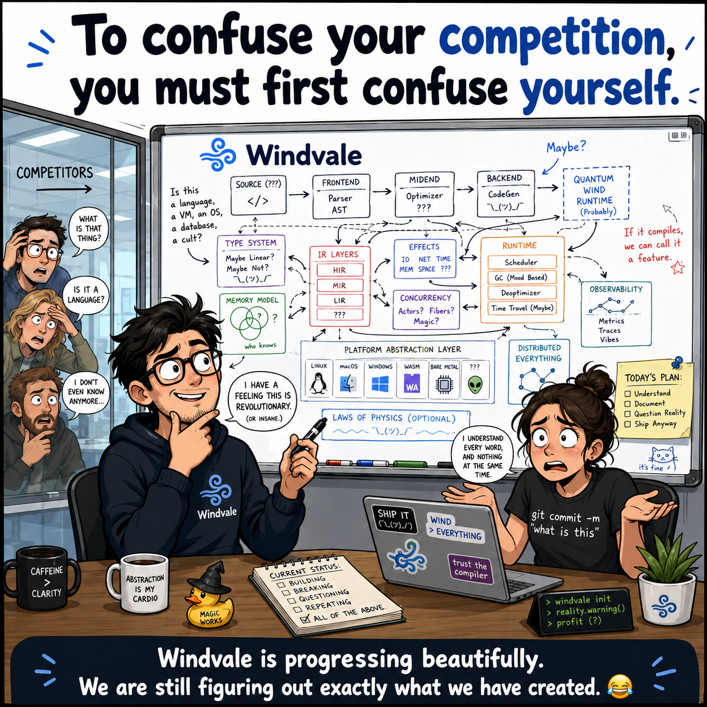

# Windvale



*A playful August 2026 portrait of Windvale's scope: one ambitious computing stack, plenty of open questions, and steady progress from language to operating system.*

Windvale is a source-available [E-Worker Inc](https://eworker.ca) experiment to build an entire, understandable computing stack from the ground up. Its code and documentation are authored entirely by AI systems under human direction and review.

AI systems produce the source and prose. Humans define the objectives, direct the work, review and test the results, decide what the project accepts and publishes, and remain responsible for publication. [E-Worker Inc](https://eworker.ca) provides project stewardship.

At its center is a **new programming language**, together with its compiler, portable bytecode, verified runtime, assembler, object model, linker, and Foundation library. The long-term integration goal is a **new small operating system** capable of loading and running the same verified Windvale programs that run on Windows and Linux. The language and tools remain independently useful before the operating system is complete.

**[Visit windvale.ca](https://windvale.ca/)** · **[Try the browser playground](https://windvale.ca/playground/)** · **[Support Windvale](https://windvale.ca/support/)**

## What works today

Windvale Seed is experimental, but several paths already work end to end:

```text
Windvale source -> deterministic WVB -> verification -> execution on Windows or Linux
Windvale assembly -> verified WVO object -> deterministic linked x86-64 image
Portable Sum-Data.wv -> the same canonical WVB -> Windows, Linux, and Windvale OS
Portable Function-Only.wv -> the same canonical WVB -> Windows, Linux, and Windvale OS
```

The current Stage 0 toolchain includes the typed language, compiler, bytecode verifier, portable reference runtime, assembler, object model, linker, CLI, editor support, and focused Foundation modules. A Windvale-written compiler reproduces its canonical bytecode compiler exactly; independently verified native PE/ELF compiler packages and public format-3 project/CLI routes now reproduce it directly on Windows and Debian without loading .NET. Paired fixed-authority applications package the Windvale-written compiler-aligned verifier, and a format-5 Windvale-native build driver now composes that verifier, compiler, and Project 1 parser to publish accepted WVB from explicit sources or a bounded `.wvproj` without loading .NET; dual-host qualification is pending. The Windvale-owned ABI-22 x86-64 selector now algorithmically lowers bounded acyclic `i32`/`bool` control flow—including locals, checked arithmetic, comparisons, jumps, branches, and early returns—into the exact canonical WVO; loops, calls, broader backend transfer, and dual-host qualification remain. Cross-host-qualified Probe 39 adds a private four-interrupt HPET-calibrated local-APIC preemption proof across three protected roots. Cross-host-qualified Probe 40 adds Windvale-owned policy plus WVA-owned generation-safe non-tail client memory-object release, zeroing, and same-root reuse while a later directory object remains live. C# remains the bootstrap, complete x64 backend, host adapter, package constructor, and recovery implementation while the remaining retirement gates are completed.

Windvale is not production-stable. Native compiler execution, the general native toolchain, broader runtime services, and the operating system remain active milestones. For current detail, use the authoritative documents instead of treating this overview as a cumulative status log:

- [Progress dashboard](Documents/Project/Progress.md) — concise indicators and working paths
- [Development roadmap](Documents/Project/Roadmap.md) — phase gates, sequencing, and current focus
- [Seed implementation](Documents/Architecture/Seed-Implementation.md) — component ownership and implemented boundaries
- [Specification index](Specifications/README.md) — current language, format, runtime, native, and OS contracts
- [Qualification evidence](Documents/Project/Seed-Verification-Evidence.md) — exact cross-host history and artifact identities

## Browser playground

The experimental Stage 0 playground compiles, verifies, and runs Windvale entirely in the browser through .NET WebAssembly. It reuses the C# reference compiler and interpreter as the current semantic oracle, produces canonical WVB, and exposes only explicitly checked console and diagnostic capabilities. Its bounded portable subset is also lowered by the Windvale-authored backend and executed in a disposable Web Worker for differential evidence.

Cross-host-qualified `windows-x64-console-v1` and `linux-x64-console-v1` targets package capability-free scalar programs as deterministic import-free PE32+ and sectionless static-PIE ELF applications. Cross-host-qualified version-2 targets add one explicit `console.write_line` capability, serialized and independently verified runtime metadata, exact native output leaves, and real standalone console output. The generated `.exe` and `.elf` run without loading .NET; their compiler and outer-container packagers remain Stage 0 hosted.

**[Open the Windvale Playground](https://windvale.ca/playground/)**

The separate **[direct WebAssembly demo](https://windvale.ca/playground/wasm-demo/)** starts no Blazor or .NET runtime. It checks and executes one pinned, independently verified Windvale-generated artifact in the same disposable worker and accepts editable text input. Artifact production and the general source compiler path still use Stage 0.

Run it locally:

```powershell
dotnet run --project Tools/Windvale.Playground
```

The [playground host specification](Specifications/Browser-Playground.md) defines its limits and non-claims. This is a browser host for the language, not a browser boot of Windvale OS and not yet an accepted permanent WebAssembly compiler target.

The separate [experimental WebAssembly target](Specifications/Windvale-WebAssembly.md) proves the first lower layer in Windvale source: portable `.wv` code revalidates canonical WVB and emits deterministic import-free Wasm with checked scalar/control, fixed-memory value, and bounded call support. A complete compiler-aligned Windvale verifier proves structure, identities, typed executable flow, reachability, and exact stack contracts. The same portable algorithm now serves both a [standalone hosted verifier profile](Specifications/Windvale-Hosted-Verifier-Application.md) with exact read-only authority and the [Windvale compiler build driver](Specifications/Windvale-Compiler-Build-Driver.md), which verifies its in-memory compiler result before the sole output call. A separate 468,320-byte Wasm-hosted interpreter executes verified scalar WVB plus bounded static data and descriptors, immutable text/bytes operations, strict UTF-8, invariant formatting, deterministic quoting, SHA-256, records, enums, typed defaults, and versioned byte-array entry/return. A three-artifact import-free verifier bundle admits both the exact hosted compiler and a 597,545-byte capability-free WVSS-to-WVB adapter under Node.js without .NET. Reclaiming fixed-arena value storage, compact local-shape metadata, and conservative bounded guest-record tracing now carry the portable compiler to an ordinary 100,000-instruction guest-budget result instead of the former 1,512-value and 37,085-record boundaries. Guest text/bytes heap ownership, complete compilation, browser-worker packaging, and cross-browser qualification remain before the editable playground can switch. The existing direct demo already runs without a .NET runtime.

## Quick start

Requirements:

- .NET SDK 10.0.302 or a compatible later patch in the same feature band
- Windows or Linux

The repository pins the SDK in `global.json` and uses no external NuGet packages.

Compile, verify, inspect, and run the portable example:

```powershell
dotnet run --project Tools/Windvale.Tool -- compile Examples/Seed/Sum-Data.wv -o artifacts/Sum-Data.wvb
dotnet run --project Tools/Windvale.Tool -- verify artifacts/Sum-Data.wvb
dotnet run --project Tools/Windvale.Tool -- inspect artifacts/Sum-Data.wvb
dotnet run --project Tools/Windvale.Tool -- run artifacts/Sum-Data.wvb
```

The result is `Result: 29`.

For verification tiers, hosted capabilities, project builds, bootstrap convergence, assembly, linking, and component examples, continue with the [Seed development runbook](Documents/Runbooks/Seed-Development.md).

## Seed language example

```text
module Sumˉdata profile portable;

data Values: [i32] = [3, 5, 8, 13];

fn Add(Left: i32, Right: i32) -> i32 {
    return Left + Right;
}

export fn Main() -> i32 {
    var Index: i32 = 0;
    var Total: i32 = 0;

    while Index < length(Values) {
        Total = Add(Total, Values[Index]);
        Index = Index + 1;
    }

    return Total;
}
```

## Repository layout

- `Compiler/` — parsing, semantic analysis, Windvale IR, and code generation
- `Assembler/` — Windvale and reference WVA parsing, instruction encoding, and WVO production
- `Object-Model/` — structured sections, symbols, relocations, and serialization
- `Linker/` — symbol resolution, layout, relocation, and image production
- `Runtime/` — bytecode loading, verification, execution, and host adaptation
- `Foundation/` — reusable Windvale APIs and implementations needed by current tools
- `Operating-System/` — boot, kernel, processes, services, and platform work
- `Tools/` — CLI, editors, website support, inspection, and verification tools
- `Tests/` — conformance, integration, malformed-input, and reproducibility coverage
- `Specifications/` — implemented language, bytecode, module, native, and platform contracts
- `Documents/` — architecture, decisions, project direction, evidence, and runbooks
- `Website/` — the public [windvale.ca](https://windvale.ca/) project site

## Architecture direction

- Windows and Linux are permanent Windvale runtime and development hosts, not the semantic definition of the language.
- Each Windvale part declares its honest platform scope; parts that use shared contracts can cross environments, while Windows-, Linux-, or Windvale OS-specific parts remain valid and explicit.
- Source syntax, typed WIR, distributable bytecode, native IR, object files, and executable images remain distinct contracts.
- Platform scope, authority level, required capabilities, and optional capabilities remain separate metadata dimensions; a requirement never grants authority by itself.
- The durable [Windvale OS architecture](Documents/Architecture/Windvale-Os-Architecture.md) uses a small capability-oriented kernel written primarily in `.wv`, a bounded `.wva` machine layer, and isolated Windvale services.
- [Proposed next integrated defaults](Documents/Decisions/0198-Next-Integrated-Architecture-Defaults.md) connect the next resource-domain, process, console, network, trust, package, and language contracts for product review without claiming implementation.
- C# and .NET remain Stage 0 until the documented native-retirement gate is qualified on Windows and Linux.
- Bootstrap dependencies and AI contributions must be documented honestly and reproducibly.

## Documentation

Start with the [documentation guide](Documents/README.md). It separates current status, enduring architecture, specifications, accepted decisions, historical evidence, and operational records.

## License, stewardship, and participation

Windvale-owned work is source-available under the [Windvale Community Source License 1.0](LICENSE). Personal, noncommercial, evaluation, and qualifying small-organization uses are free; large-organization production use and Windvale-as-a-product use require a separate commercial agreement with [E-Worker Inc](https://eworker.ca). Independent applications created with Windvale belong to their creators and may use terms of their choice. Third-party components remain under their [separate licenses](THIRD-PARTY-NOTICES.md).

Copyright © 2026 E-Worker Inc and Windvale contributors. “Author” and “authored” describe how the project was produced; they do not assert that an AI system is a legal person or copyright holder. See [Decision 0031](Documents/Decisions/0031-AI-Authorship-And-Vendor-Neutrality.md) for the project-wide attribution policy and [Decision 0114](Documents/Decisions/0114-Community-Source-Licensing-And-Commercial-Stewardship.md) for the licensing decision.

- [Contributing](CONTRIBUTING.md)
- [Contributor License Agreement](CONTRIBUTOR-LICENSE-AGREEMENT.md)
- [Third-party notices](THIRD-PARTY-NOTICES.md)
- [Security](SECURITY.md)
- [Governance](GOVERNANCE.md)
- [Code of conduct](CODE_OF_CONDUCT.md)
- [Support](SUPPORT.md)
- [Project identity](TRADEMARKS.md)
- [Changelog](CHANGELOG.md)

Read [AGENTS.md](AGENTS.md) and [CONTRIBUTING.md](CONTRIBUTING.md) before making non-trivial changes.
