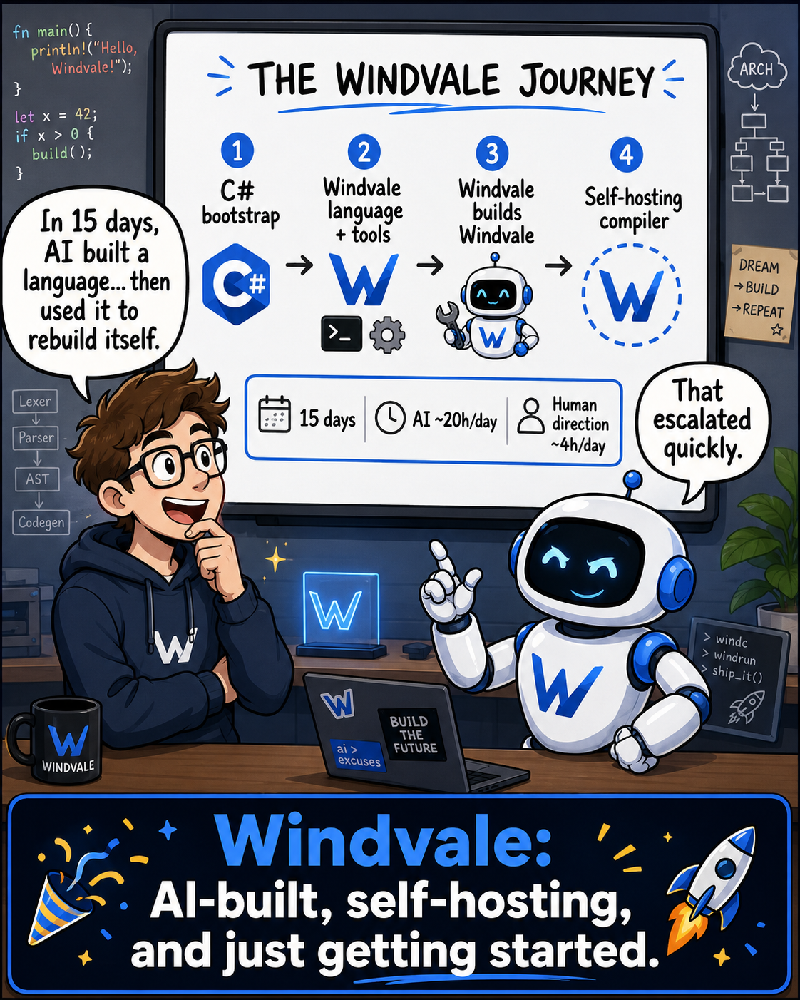

# Windvale



*Day 15: AI systems under human direction grew Windvale from a C# bootstrap into a qualified native, self-hosting stack. The normal Windows and Linux paths no longer require .NET, while C# remains preserved as the Stage 0 recovery oracle.*

Windvale is a source-available [E-Worker Inc](https://eworker.ca) experiment to build an entire, understandable computing stack from the ground up. Its code and documentation are authored entirely by AI systems under human direction and review.

AI systems produce the source and prose. Humans define the objectives, direct the work, review and test the results, decide what the project accepts and publishes, and remain responsible for publication. [E-Worker Inc](https://eworker.ca) provides project stewardship.

At its center is a **new programming language**, together with its compiler, portable bytecode, verified runtime, assembler, object model, linker, and Foundation library. The long-term integration goal is a **new small operating system** capable of loading and running the same verified Windvale programs that run on Windows and Linux. The language and tools remain independently useful before the operating system is complete.

**[Visit windvale.ca](https://windvale.ca/)** · **[Try the browser playground](https://windvale.ca/playground/)** · **[Support Windvale](https://windvale.ca/support/)**

## Project status

Windvale Seed is experimental and not production-stable. This README is the stable public overview; changing implementation detail belongs in the documents that own it:

- [Progress dashboard](Documents/Project/Progress.md) — authoritative current implementation and qualification snapshot
- [Development roadmap](Documents/Project/Roadmap.md) — forward phase gates, sequencing, and next deliverables
- [Seed implementation](Documents/Architecture/Seed-Implementation.md) — component ownership and implemented boundaries
- [Specification index](Specifications/README.md) — current language, format, runtime, native, and OS contracts
- [Qualification evidence](Documents/Project/Seed-Verification-Evidence.md) — exact completed cross-host runs and artifact identities

## Working paths

Several paths already work end to end:

```text
Windvale source -> deterministic WVB -> verification -> execution on Windows or Linux
Windvale assembly -> verified WVO object -> deterministic linked x86-64 image
Portable Sum-Data.wv -> the same canonical WVB -> Windows, Linux, and Windvale OS
Portable Function-Only.wv -> the same canonical WVB -> Windows, Linux, and Windvale OS
```

The Stage 0 toolchain includes the typed language, compiler, bytecode verifier, portable reference runtime, assembler, object model, linker, CLI, editor support, and focused Foundation modules. Windvale-written compiler and native-tool paths are already real, while broader backend transfer, runtime services, and Windvale OS remain active milestones. C# and .NET stay as the explicit bootstrap and recovery path until the documented native-retirement gate is qualified on Windows and Linux, but forward C# source-language expansion is frozen at exact qualified WVB 1.11 baseline `524e84afb6e5bab6bbd95ebc0b9eeaf886af834b`. The ordinary project source-to-WVB build now uses the pinned native build driver and publisher without loading .NET; the remaining commands still identify their Stage 0 role explicitly.

## Browser playground

The normal playground is a static Monaco application over the Windvale-native WebAssembly pipeline. One disposable worker loads the digest-pinned interpreter and portable source compiler, constructs canonical `WVSS 1`, compiles to WVB, verifies the returned module again, and executes its scalar entry point. It starts no Blazor host or .NET runtime, and source stays in the browser.

**[Open the Windvale Playground](https://windvale.ca/playground/)**

Normal browser artifact production is also .NET-free: the native source front door rebuilds both WVB inputs, the pinned native source compiler rebuilds the portable compiler, and the pinned native WebAssembly compiler rebuilds the interpreter Wasm. Stage 0 is retained only for explicit package reconstruction and independent recovery evidence.

Run it locally:

```powershell
cd Website
npm install
npm run dev
```

The [playground host specification](Specifications/Browser-Playground.md) defines its limits and non-claims. This is a browser host for the language, not a browser boot of Windvale OS and not an assertion that WebAssembly defines Windvale semantics.

The [experimental WebAssembly target](Specifications/Windvale-WebAssembly.md) and [playground exploration](Documents/Project/WebAssembly-Playground-Exploration.md) describe the implemented profiles, evidence, limits, and remaining cross-host/browser-hardening work. Those documents own the fast-changing backend detail.

## Quick start

Requirements:

- Windows x64 with the inbox command processor, or Linux x64 with Bash and
  `sha256sum`, for ordinary native source-to-WVB build, verification, and inspection
- .NET SDK 10.0.302 or a compatible later patch in the same feature band for
  the retained Stage 0 runtime execution, tests, packaging, and recovery tools

The repository pins the SDK in `global.json` and uses no external NuGet packages.

Compile the portable example through the ordinary no-.NET front door on Windows:

```bat
Tools\Native\Build-Wvb.cmd Examples\Seed\Sum-Data.wvproj Artifacts\Sum-Data.wvb
```

Or on Linux:

```sh
./Tools/Native/Build-Wvb.sh Examples/Seed/Sum-Data.wvproj Artifacts/Sum-Data.wvb
```

The checked-in native artifacts are digest-verified before use, and the publisher
atomically replaces only a verifier-admitted output. Verify and inspect the result
without .NET on Windows:

```bat
Tools\Native\Verify-Wvb.cmd Artifacts\Sum-Data.wvb
Tools\Native\Inspect-Wvb.cmd Artifacts\Sum-Data.wvb
```

Or on Linux:

```sh
./Tools/Native/Verify-Wvb.sh Artifacts/Sum-Data.wvb
./Tools/Native/Inspect-Wvb.sh Artifacts/Sum-Data.wvb
```

Execution remains on the retained Stage 0 route for now:

```powershell
dotnet run --project Tools/Windvale.Tool -- run Artifacts/Sum-Data.wvb
```

The result is `Result: 29`.

For native build, read-only WVB tooling, and reconstruction details, see the [native source-to-WVB runbook](Documents/Runbooks/Native-Source-To-Wvb.md). For verification tiers, hosted capabilities, Stage 0 commands, bootstrap convergence, assembly, linking, and component examples, continue with the [Seed development runbook](Documents/Runbooks/Seed-Development.md).

## Seed language example

```text
module Sumˉdata profile portable;

data Values: [i32] = [3, 5, 8, 13];

fn Add(Left: i32, Right: i32) -> i32 {
    return Left + Right;
}

export fn Main() -> i32 {
    var Index: i32 = 0;
    var Total: i32 = 0;

    while Index < length(Values) {
        Total = Add(Total, Values[Index]);
        Index = Index + 1;
    }

    return Total;
}
```

## Repository layout

- `Compiler/` — parsing, semantic analysis, Windvale IR, and code generation
- `Assembler/` — Windvale and reference WVA parsing, instruction encoding, and WVO production
- `Object-Model/` — structured sections, symbols, relocations, and serialization
- `Linker/` — symbol resolution, layout, relocation, and image production
- `Runtime/` — bytecode loading, verification, execution, and host adaptation
- `Foundation/` — reusable Windvale APIs and implementations needed by current tools
- `Libraries/` — reusable portable, hosted, protocol, and system-facing Windvale APIs
- `Applications/` — useful deployable Windvale entry points
- `Projects/` — cross-component Workspace 1 / Project 2 build inputs
- `Distribution/` — checked-in package manifests, locks, and future release metadata
- `Operating-System/` — boot, kernel, processes, services, and platform work
- `Tools/` — CLI, editors, website support, inspection, and verification tools
- `Tests/` — conformance, integration, malformed-input, and reproducibility coverage
- `Specifications/` — implemented language, bytecode, module, native, and platform contracts
- `Documents/` — architecture, decisions, project direction, evidence, and runbooks
- `Website/` — the public [windvale.ca](https://windvale.ca/) project site

## Architecture direction

- Windows and Linux are permanent Windvale runtime and development hosts, not the semantic definition of the language.
- Each Windvale part declares its honest platform scope; parts that use shared contracts can cross environments, while Windows-, Linux-, or Windvale OS-specific parts remain valid and explicit.
- Source syntax, typed WIR, distributable bytecode, native IR, object files, and executable images remain distinct contracts.
- Platform scope, authority level, required capabilities, and optional capabilities remain separate metadata dimensions; a requirement never grants authority by itself.
- The durable [Windvale OS architecture](Documents/Architecture/Windvale-Os-Architecture.md) uses a small capability-oriented kernel written primarily in `.wv`, a bounded `.wva` machine layer, and isolated Windvale services.
- [Proposed next integrated defaults](Documents/Decisions/0198-Next-Integrated-Architecture-Defaults.md) connect the next resource-domain, process, console, network, trust, package, and language contracts for product review without claiming implementation.
- C# and .NET remain recoverable Stage 0 until the documented native-retirement gate is qualified on Windows and Linux; the C# source compiler becomes feature-frozen at the next qualified WVB 1.11 baseline.
- Bootstrap dependencies and AI contributions must be documented honestly and reproducibly.

## Documentation

Start with the [documentation guide](Documents/README.md). It separates current status, enduring architecture, specifications, accepted decisions, historical evidence, and operational records.

## License, stewardship, and participation

Windvale-owned work is source-available under the [Windvale Community Source License 1.0](LICENSE.md). Personal, noncommercial, evaluation, and qualifying small-organization uses are free; large-organization production use and Windvale-as-a-product use require a separate commercial agreement with [E-Worker Inc](https://eworker.ca). Independent applications created with Windvale belong to their creators and may use terms of their choice. Third-party components remain under their [separate licenses](THIRD-PARTY-NOTICES.md).

Copyright © 2026 E-Worker Inc and Windvale contributors. “Author” and “authored” describe how the project was produced; they do not assert that an AI system is a legal person or copyright holder. See [Decision 0031](Documents/Decisions/0031-AI-Authorship-And-Vendor-Neutrality.md) for the project-wide attribution policy and [Decision 0114](Documents/Decisions/0114-Community-Source-Licensing-And-Commercial-Stewardship.md) for the licensing decision.

- [Contributing](CONTRIBUTING.md)
- [Contributor License Agreement](CONTRIBUTOR-LICENSE-AGREEMENT.md)
- [Third-party notices](THIRD-PARTY-NOTICES.md)
- [Security](SECURITY.md)
- [Governance](GOVERNANCE.md)
- [Code of conduct](CODE_OF_CONDUCT.md)
- [Support](SUPPORT.md)
- [Project identity](TRADEMARKS.md)
- [Changelog](CHANGELOG.md)

Read [AGENTS.md](AGENTS.md) and [CONTRIBUTING.md](CONTRIBUTING.md) before making non-trivial changes.
